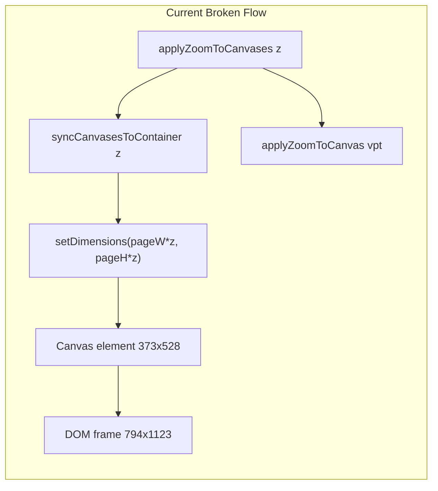
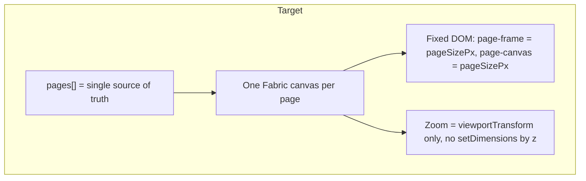

# Editor Architecture Migration Plan

## A. Current Architecture Audit

### useFabricEditor.ts

- **Pages**: `pages` state is the single source of truth (`Array<{ id, objects?, width?, height?, background? }>`). Page IDs are stable. OK.
- **Canvases**: One Fabric canvas per page in `pageCanvasesRef`. Created in `attachCanvasEl` via `initFabricCanvas(el, { width: size.w, height: size.h })` using `pageSizePxRef.current` (e.g. 794×1123). Initial size is correct.
- **Zoom flow**: `applyZoomToCanvases(z)` calls (1) `syncCanvasesToContainer(z)` then (2) for each canvas `applyZoomToCanvas(canvas, z)`.
  - **Broken**: (1) resizes the Fabric canvas **element** by zoom; (2) sets only viewportTransform. These conflict.
- **syncCanvasesToContainer** ([useFabricEditor.ts](src/components/editor/useFabricEditor.ts) ~458–470): Sets `w = pageW * z`, `h = pageH * z`, then `c.setDimensions({ width: w, height: h })` for every canvas. With z≈0.47 the canvas element becomes ~373×528. **Root cause of “content too small”**: DOM frame stays 794×1123; canvas element is shrunk.
- **applyZoomToCanvas** (~472–487): Sets `viewportTransform = [z,0,0,z,0,0]`. Correct.
- **Duplicate path** ([useFabricEditor.ts](src/components/editor/useFabricEditor.ts) ~1974–1989): For `pending.type === "duplicate"`, uses `displayW = pageW * z`, `displayH = pageH * z` and `c.setDimensions({ width: displayW, height: displayH })`. Same bug: canvas size is zoom-scaled.
- **fitViewport** (~893–951): Computes `fit = availableHeight / pageH`, clamps to 1, calls `applyEffectiveZoom(fit)`. Logic is fine; the bug is downstream (syncCanvasesToContainer).
- **Initial zoom**: EditorShell has a mount `useEffect` that also sets zoom from viewport. Two places can set initial zoom (hook’s fitViewport + EditorShell) — duplicate responsibility and possible race.

### EditorShell.tsx

- **Page structure**: `page-shell` → `page-frame` (fixed width/height: `pageSizePx.w`, `pageSizePx.h + PAGE_HEADER_HEIGHT`) → `page-header` (48px) + `page-canvas` (fixed `pageSizePx.w` × `pageSizePx.h`) → canvas. Gap via `
`. Structure is correct; DOM does not scale with zoom.
- **Canvas container**: Fixed size; canvas is 100%×100%. Correct.
- **Initial zoom** ([EditorShell.tsx](src/components/editor/EditorShell.tsx) ~191–207): `useEffect` with `[]` runs once and sets zoom. Duplicates hook’s fit.

---

## B. Root Causes of Current Bugs

| Bug                                     | Root cause                                                                                                                                              |
| --------------------------------------- | ------------------------------------------------------------------------------------------------------------------------------------------------------- |
| **1. Content too small in large frame** | `syncCanvasesToContainer(z)` sets canvas element size to `(pageW*z, pageH*z)`. DOM frame stays 794×1123 → canvas is a small rectangle inside the frame. |
| **2. New page looks attached**          | Same size mismatch + scroll/offset can make the next page’s frame sit right under the previous page’s visible content.                                  |
| **3. Headers disappear**                | Scroll/positioning or overflow; fixing zoom/sizing reduces layout confusion. Keys (`key={\`${page.id}-${idx}}`) already improved reuse.                 |
| **4. DOM vs Fabric conflict**           | DOM is “fixed page size”; Fabric is “resize element by zoom”. They must align: both fixed size; zoom only in viewportTransform.                         |
| **5. Duplicate path**                   | `initCanvasForPage` duplicate branch uses `setDimensions(displayW, displayH)` with zoom-scaled values.                                                  |

---

## C. Final Target Architecture (Lido/Canva Pattern)

1. One `pages` array; one Fabric canvas per page; canvas **element** dimensions always `pageSizePx.w` × `pageSizePx.h`.
2. Zoom only via `viewportTransform` (e.g. `[z,0,0,z,0,0]`). No `setDimensions` that depend on zoom.
3. DOM: fixed frame and page-canvas size; constant `PAGE_GAP`; header inside frame above drawing region.
4. Add Page → blank; Duplicate → loadFromJSON; Delete → dispose that canvas only; saved docs hydrate with same fixed dimensions.
5. Single place for initial fit (hook only); one full page visible at load.

---

## D. File-by-File Rewrite Plan

### [src/components/editor/useFabricEditor.ts](src/components/editor/useFabricEditor.ts)

| Location                                            | Action                                                                                                                                                                                                                                                                                                                                                                            | Leave untouched                                                                                             |
| --------------------------------------------------- | --------------------------------------------------------------------------------------------------------------------------------------------------------------------------------------------------------------------------------------------------------------------------------------------------------------------------------------------------------------------------------- | ----------------------------------------------------------------------------------------------------------- |
| **syncCanvasesToContainer** (~458–470)              | Stop using `z` for dimensions. Set each canvas to `pageSizePxRef.current.w` and `pageSizePxRef.current.h` only (e.g. `w = Math.max(1, Math.round(pageW))`, same for h). Optionally: only call when page size changes or on first attach; do not resize by zoom.                                                                                                                   | Signature can stay `(z: number)` if still called from applyZoomToCanvases; inside, ignore z for dimensions. |
| **applyZoomToCanvases** (~489–498)                  | Keep calling `applyZoomToCanvas(canvas, z)`. Either remove the call to `syncCanvasesToContainer(z)` from the zoom path, or make syncCanvasesToContainer only enforce fixed dimensions (and call it on init/resize, not on every zoom). Preferred: **remove** syncCanvasesToContainer from zoom path; set canvas dimensions only in attachCanvasEl/initCanvasForPage to page size. | Rest of applyEffectiveZoom, setZoom, fitViewport formula, refs.                                             |
| **initCanvasForPage duplicate branch** (~1974–1989) | Remove `displayW`/`displayH` and `c.setDimensions({ width: displayW, height: displayH })`. After loadFromJSON, set dimensions once from `pageSizePxRef.current` (e.g. `c.setDimensions({ width: pageW, height: pageH }, { backstoreOnly: false })`) so duplicate canvas matches frame; keep viewportTransform from pending or `[z,0,0,z,0,0]`.                                    | Reviver, ensureObjectId, ensurePageBackground, scheduleFit after load.                                      |

### [src/components/editor/EditorShell.tsx](src/components/editor/EditorShell.tsx)

| Location                       | Action                                                                                                                                               | Leave untouched                                                                     |
| ------------------------------ | ---------------------------------------------------------------------------------------------------------------------------------------------------- | ----------------------------------------------------------------------------------- |
| **Mount useEffect** (~191–207) | Remove the effect that sets `editor.setZoomPercent` / `editor.setZoom` from viewport height. Hook alone owns initial zoom (fitViewport/scheduleFit). | Page structure, PAGE_HEADER_HEIGHT, PAGE_GAP, scrollToPage, pageRefs, getCanvasRef. |

### Other files

- **[src/lib/editor/zoomController.ts](src/lib/editor/zoomController.ts)**: No changes; keep clampEffectiveZoom.
- **[src/lib/editor/canvasInitializer.ts](src/lib/editor/canvasInitializer.ts)**: No changes.

---

## E. Risk Notes / Rollback

- **Risk**: If syncCanvasesToContainer is only changed to use fixed dimensions (and still called on every zoom), ensure no other path (e.g. duplicate) had set different dimensions. Unify all dimension writes to page size only.
- **Risk**: Removing EditorShell’s initial-zoom effect: ensure fitViewport (or equivalent) runs after viewport and doc are ready (e.g. after isDocDataReady and first paint); otherwise first paint may show 100% until fit runs.
- **Rollback**: Create a branch or tag before edits; revert the commit that changes syncCanvasesToContainer and the duplicate branch if the demo regresses.
- **Verify**: After changes, test: load doc (one full page visible, content fills frame); Add page (blank, header visible); Duplicate (content correct, same size); zoom slider (content scales, frame/gap unchanged); refresh (all pages hydrate).

---

## F. Exact Next Step to Execute in Agent Mode

Execute in this order:

1. **useFabricEditor.ts — syncCanvasesToContainer**
  Replace the dimension calculation so it uses **only** `pageSizePxRef.current` (e.g. `const { w: pageW, h: pageH } = pageSizePxRef.current; const w = Math.max(1, Math.round(pageW)); const h = Math.max(1, Math.round(pageH));`). Keep the forEach that calls `setDimensions` and `calcOffset`. No use of `z` for width/height.
2. **useFabricEditor.ts — initCanvasForPage duplicate branch**
  Remove the two lines that set `displayW`/`displayH` from `pageW * z` / `pageH * z` and `c.setDimensions({ width: displayW, height: displayH }, ...)`. After loadFromJSON (and existing logic), set canvas dimensions once from `pageSizePxRef.current`: `c.setDimensions({ width: pageW, height: pageH }, { backstoreOnly: false });` and keep existing viewportTransform handling.
3. **EditorShell.tsx — remove duplicate initial zoom**
  Delete the `useEffect` with empty dependency array that reads viewport height and calls `editor.setZoomPercent` or `editor.setZoom`. Rely on the hook’s fitViewport/scheduleFit for initial zoom.
4. **Verify**
  Search for any other `setDimensions` or `pageW * z` / `pageH * z` and ensure no path scales canvas element by zoom.

