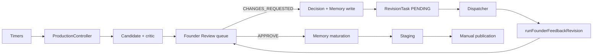
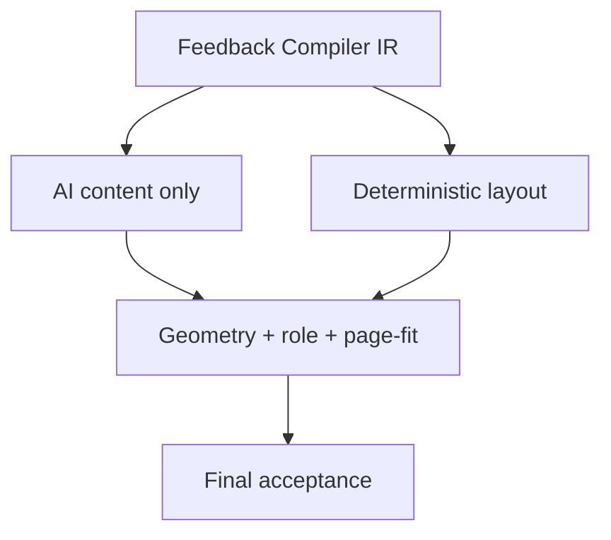

# StudiosisLab AIOS — Resume Template Department Master

## 0. Document Authority

This file is the **canonical human-readable source of truth** for the StudiosisLab AIOS Resume Template Department.

| Surface | Role |
|---|---|
| `SOS/RESUME_TEMPLATE_DEPARTMENT_MASTER.md` | Human-readable complete system truth (this file) |
| `SOS/project-state.json` | Machine-readable current checkpoint |
| Code + runtime evidence | Overrides stale prose |
| Historical tasks / fixtures / evidence JSON | Immutable |

**Rules**

- All future Resume Template Agent work must read this file first, then `SOS/project-state.json`.
- Code and VPS evidence override this file when they disagree.
- Historical evidence is never mutated or rewritten.
- After every audit, implementation, commit, deploy, production proof, failure, Founder decision, or architecture decision, **this file must be updated**.
- Do not treat isolated phase-verifier PASS as department completeness.

### Required working protocol

**BEFORE any future Resume Template Department change:**

1. Read this entire master file.
2. Read `SOS/project-state.json`.
3. Verify relevant code/runtime evidence.
4. State current position in the consolidation roadmap.
5. State whether proposed work advances the business objective.
6. Record the planned action here (Change Log + Current Next Step).
7. Only then implement.

**AFTER every:** audit, Agent run, implementation, commit, deploy, production proof, failure, Founder decision, architecture decision — update this file and `SOS/project-state.json` as required.

Every future Cursor Agent prompt must include:

> Read the canonical Resume Template Department master document and `SOS/project-state.json` before making any change, and update both as required before stopping.

### Older documentation (not deleted)

| File | Class | Recommendation |
|---|---|---|
| `SOS/project-state.json` | CURRENT SUPPORTING | Machine checkpoint; keep |
| `SOS/PROJECT_STATUS.md` | HISTORICAL | Factory overview 2026-07-07; stale vs this master |
| `SOS/01_KNOWLEDGE/SAIOS_KNOWLEDGE_INDEX.md` | SPECIALIZED | Knowledge snapshot index |
| `SOS/SAIOS/ARCHITECTURE.md` / `AIOS_CANONICAL_RUNTIME_REPORT.md` | SPECIALIZED | Platform architecture freeze, not department operations |
| `SOS/09_REPORTS/REVISION_PIPELINE_AUDIT.md` | HISTORICAL | 2026-08-01 dispatcher snapshot |
| `SOS/09_REPORTS/factory-v1/factory-architecture.md` | HISTORICAL | Factory v1 |
| `SOS/09_REPORTS/AIOS_*_V1_REPORT.md` (many) | HISTORICAL / SPECIALIZED | Phase/agent reports; do not treat as current ops |
| `SOS/SAIOS/infra/systemd/README.md` | CURRENT SUPPORTING | Unit inventory |
| `SOS/SAIOS/core/first-production-cycle/README.md` | SPECIALIZED | Generation module notes |
| `SOS/SAIOS/core/founder-revision/RevisionPipelineClassification.ts` | CURRENT SUPPORTING (code) | Production vs legacy entry classification |

No pre-existing Markdown already contained business goal + generation + revision + memory + validation + OA failure chain + 6G–6P + target architecture + living changelog. This file was created as the single canonical master. **Do not create a second master.**

---

## 1. Executive Current State

Snapshot taken **2026-09-23T18:57:52+05:30** / **2026-09-23T13:27:52.000Z**.

| Field | Fresh value |
|---|---|
| LOCAL HEAD | `388895bf90d603f24882eb016841f82b8dad5d46` (`main`) |
| ORIGIN HEAD | `388895bf90d603f24882eb016841f82b8dad5d46` |
| VPS HEAD | `388895bf90d603f24882eb016841f82b8dad5d46` |
| LOCAL STATUS | Dirty Website/e-sign/unrelated untracked SOS folders; Resume Template code at HEAD |
| VPS STATUS | Same HEAD; 33 porcelain items (unrelated/untracked); do not clean |
| ACTIVE RUNTIME | `aios-founder-dashboard.service` active since 2026-09-23 07:36:41 UTC; health `127.0.0.1:4310` `{ok:true,live:false}` |
| DEPARTMENT STATUS | **CONSOLIDATION_REQUIRED** (fragile / partially operational) |
| CORE FACTORY STATUS | **HISTORICAL GOAL MET** — factory can generate, critique, and enqueue templates |
| REVISION STATUS | Production executor exists; live OA Request Changes still fails a new owner after each phase |
| GENERATION STATUS | Timers enabled; service unit disabled as standalone; `SOS_AIOS_LIVE=0` refuses live produce |
| FOUNDER REVIEW STATUS | `waiting_founder=20` / `queue_max=20`; `review_queue_count=51` (includes overlays) |
| MEMORY STATUS | Store exists on VPS; 1242 JSONL rows; 382 active-index; selection often 1 misleading provisional |
| PUBLICATION STATUS | `SOS_AIOS_PUBLICATION_AUTO_APPLY=0`; manual only |
| CURRENT PRIMARY BLOCKERS | Feedback-compiler / 6J completeness fragmentation (`revtask-5d933072-daf`); generation geometry admission gap; no true department E2E harness |
| NEXT AUTHORIZED STEP | **Resume Template Department consolidation planning** — not another OA Request Changes retry |

`OPERATIONALLY_COMPLETE` is **not** currently asserted as live operational truth.

---

## 2. Business Objective

The department must:

1. Generate professional one-page Resume Templates automatically.
2. Produce role-correct content and usable layouts.
3. Fail closed on objective unsafety **before** Founder Review.
4. Send only acceptable templates to Founder Review.
5. Support APPROVE / REQUEST CHANGES / REJECT.
6. On Request Changes: compile feedback, revise only what was asked, preserve the rest, validate, return to Review.
7. Bound OpenAI usage.
8. Turn approved patterns into reusable intelligence without making the Founder re-diagnose overlaps, spacing, role residue, or schema issues.
9. Stage and publish only under explicit Founder/manual publication controls.

Founder should not have to repeatedly explain the same visual rule.

---

## 3. StudiosisLab Project Context

Public SaaS: **Next.js 16, React 19, TypeScript, Tailwind, Fabric.js, Firebase, Vercel**.

AIOS control plane: **Node/tsx under `SOS/SAIOS/`**, Founder Dashboard (Vite) on VPS systemd, bounded OpenAI, JSON/JSONL evidence.

```
src/                          Public website, editor, tools, e-sign
SOS/SAIOS/core/first-production-cycle   Generation orchestration
SOS/SAIOS/core/founder-revision         Request Changes pipeline
SOS/SAIOS/core/founder-memory           Preference memory
SOS/SAIOS/core/founder-review           Review projection
SOS/SAIOS/core/resume-renderer          Fabric render
SOS/SAIOS/core/resume-critic            Generation critic
SOS/SAIOS/core/role-integrity           Role proofs
SOS/SAIOS/core/staging + publication-workflow
SOS/SAIOS/dashboard                     Canonical Founder UI
SOS/SAIOS/runtime/website-department    Separate detect-only Website Dept
SOS/07_LOGS/saios/                      Evidence (VPS authoritative)
SOS/project-state.json                  Machine checkpoint
```

Website Department work is **out of scope** for Resume consolidation. Do not stage `src/` or website-department files with Resume work.

---

## 4. Current Production Architecture



One production generation orchestrator: `ProductionController.runProduction`.  
One production revision executor: `runFounderFeedbackRevision`.  
Publication apply is manual and `AUTO_APPLY=0`.

---

## 5. Current Generation Pipeline

Timer `08:50` / `17:50` Asia/Kolkata → `aios-generation.service` → `npm run aios:autonomous:run -- --size 5 --queue-max 20 --max-iterations 1`.

| Stage | File | Owner | Blocks Review? |
|---|---|---|---|
| Autonomous decision | `AutonomousProductionService.ts` | Health/queue/LIVE | Yes if skip |
| Health | `ProductionHealthGate.ts` | Deterministic | Yes |
| Budget | `ResourceBudgetGovernor.ts` | Deterministic | Yes |
| Batch | `BatchRunner.ts` | Queue + provider budget | Yes |
| Cycle | `runFirstProductionCycle.ts` | Generation spine | Yes on fail |
| Target / family | `selectProductionTarget.ts`, `FounderMemoryContext.ts` | Deterministic | Yes |
| Content | `ResumeKnowledgeGateway.ts` + OpenAI | AI | Yes |
| Memory inject | `selectFounderMemory` via brain | Memory | Fail-open empty |
| DesignBrief | `DesignBriefEngine.ts` | Deterministic + AI brief | Yes |
| Render | `ResumeRenderer.ts` | Deterministic | Yes if validation fail |
| Preview | `ResumeTemplateRuntime.ts` | Deterministic | Yes |
| Critic loop | `RevisionLoop.ts` + `ResumeCritic.ts` | Heuristic scores | Partial |
| Role | `RoleTargetIntegrity.ts` | Deterministic | Yes |
| Gate | `CriticGate.ts` / `FounderReviewGatekeeper.ts` | Score thresholds | Yes |
| Queue | `FounderGateRuntime.pause` + projection | Deterministic | N/A |

**Unresolved:** generation geometry is critic-heuristic, not the revision overlap/OOB owner. Defects can still reach Review if scores pass.

---

## 6. Current Revision Pipeline

Dashboard `POST /api/founder-decision` → `FounderDecisionManager` → memory write (fail-open) → `createRevisionTaskFromDecision` → `dispatchRevisionTick` (60s, founder OpenAI gate) → **`runFounderFeedbackRevision`**.

Ordered gates inside the executor:

1. Intent scope (`RevisionIntentScope.ts`)
2. Inventory
3. Plan (OpenAI ≤ 2 calls) + canonicalize (`RevisionPlanCanonicalization.ts`) + validate
4. Drop unsafe geometry ops
5. Deterministic spacing / header identity (6P owner)
6. Direction / selectors / inventory / plan-geometry
7. **Section replacement completeness (6J) — current live fail**
8. Execute ops
9. Section-unit vertical safety
10. Layout normalizer
11. Overlap / sequential-gap hard gate
12. Acceptance / preservation checks
13. Revision-native role (6I)
14. Feedback coverage (consumes 6P owner)
15. Final acceptance aggregator (6L)
16. Materialize child + preview + advisory critic/gate artifacts
17. `READY_FOR_FOUNDER_REVIEW`

Legacy non-production: `runFounderRevisionBatch`, `reviseOne`. Test-only: `runRevisionPlanGateCircuit`.

---

## 7. Approval → Memory → Staging → Publication

```
APPROVE
  → recordDecision
  → writeFounderPreferenceMemorySafe + evaluateMemoryMaturation
  → autoStageAfterFounderApproval (fail-open; does not revoke APPROVE)
  → StagingService
  → publication plan + verify
  → apply only if SOS_AIOS_PUBLICATION_APPLY=1 + manual confirm
```

Fresh env: `SOS_AIOS_PUBLICATION_AUTO_APPLY=0`. Nightly timer enabled; silent apply refused.

---

## 8. State Machines

**Generation candidate:** running → `WAITING_FOUNDER` / `READY_FOR_FOUNDER_REVIEW` | critic-blocked | role-failed | artifact-failed.

**Founder Review overlay** (`FounderReviewProjection` + `decisions.jsonl`): waiting | approved | rejected | changes_requested | revision_failed.

**Revision task:** `PENDING` → `PLANNING` → `VALIDATING` / `ACCEPTED_FOR_MATERIALIZATION` → `READY_FOR_FOUNDER_REVIEW` | `FAILED` | `FAILED_PROVIDER` | `FAILED_EXECUTION` | `FAILED_GATE` | `FAILED_COVERAGE` | `FAILED_ARTIFACTS`.  
`failure_code` may be more precise (`FAILED_PLAN`, `FAILED_SECTION_COMPLETENESS`, `FAILED_ROLE`, `FAILED_FEEDBACK_COVERAGE`) while Telegram status still often says `FAILED_GATE`.

**Staging / publication:** approved → staged → verified → applied (manual).

**Memory row:** `PROVISIONAL` → `CONFIRMED` | `SUPERSEDED` | `REJECTED`.

Overloaded name: **`FAILED_GATE`** hides section, role, geometry, and other owners.

---

## 9. Founder Feedback Compiler

Current components that independently answer “what is this Founder line?”:

| Question | Functions |
|---|---|
| Classification class | `classifyRequestedChange` |
| Intent / sections | `resolveRevisionIntentScope`, `resolveRevisionIntentForChange` |
| Coverage / empty-plan owner | `resolveItemCoverageMode`, `isCanonicalLayoutOwnedItem` |
| Old layout regex | `isDeterministicLayoutNormalizerOwnedChange` |
| Completeness keep-phrases | `buildFounderIntentIndex` in `SectionReplacementCompleteness.ts` |
| Coverage item proofs | `FeedbackCoverage.ts` + canonical layout proof |

**Duplicated semantic ownership remains.** 6P unified *layout coverage owner*. 6J still applies a replacement ledger to *preservation* sections. That is the 5d933072 failure.

---

## 10. AI vs Deterministic Responsibility

**Current**

| Concern | Today |
|---|---|
| Role writing / section rewrite | AI |
| Plan shape / attribution | AI + deterministic canonicalize |
| Geometry / rhythm / named pair | Deterministic after 6P; AI may emit ops that get superseded |
| Preservation | Acceptance checks + 6J keep-phrases (conflict) |
| Validation | Many sequential owners |
| Memory | Prompt injection, not a measured layout learner |

**Target**

- **AI:** semantic content, role-tailored writing, UNEVALUABLE intent.
- **Deterministic:** geometry, overlap, OOB, clipping, rhythm, dispositions, schemas, preservation hashes, final safety.
- **Memory:** learned taste / family / role voice — never safety invariants.

---

## 11. Validation Ownership Matrix

| Concept | Current owner | Duplicates | Can disagree? | Target owner |
|---|---|---|---|---|
| Role | `evaluateRevisionRoleTargetIntegrity` | Generation `evaluateCanvasRoleTargetIntegrity` | Yes if generation artifacts reused | Revision-native only on revision |
| Section completeness | `evaluateSectionReplacementCompleteness` | Intent preservation list | **Yes — live** | Mutation sections only |
| Preservation | Acceptance + 6J phrases | Intent `CONTENT_PRESERVATION` | Yes | Hash / zero content ops |
| Feedback coverage | `buildFeedbackCoverage` | Item heuristics | Reduced after 6P | IR proofs |
| Spacing / named pair / rhythm | Canonical layout proof + normalizer | AI plan | Transient; 6P prefers deterministic | One layout owner |
| Overlap / OOB | Revision hard gate | Critic spacing | **Yes at generation** | Shared geometry owner |
| Clipping / page fit | Normalizer + critic | LayoutCritic scores | Yes at generation | Shared geometry owner |
| Schema | `validateRevisionPlan` | Canonicalizer | No if 6N used | Keep one prepare pipeline |
| Artifact integrity | `validateCandidateArtifactsForStaging` | — | No | Keep |
| Critic / ATS | Advisory on revision; blocking on generation scores | ReadinessGate | Yes vs revision geometry | Critic advisory; geometry hard |

---

## 12. Founder Memory / Learning System

Classification until proven otherwise: **STATIC PIPELINE WITH MEMORY ATTACHED / PARTIALLY ADAPTIVE**.

```
decision → FounderPreferenceWriter → memory.jsonl + active-index.json
APPROVE/REJECT → evaluateMemoryMaturation
revision/generation prompt → selectFounderMemory (max 8 rules / 600 chars)
evidence → founder-memory-selection.json
```

| Bucket | Belongs in |
|---|---|
| No overlap / OOB / page fit / min rhythm | **DETERMINISTIC INVARIANTS** (not memory) |
| Density vs slack, family taste | **FOUNDER LEARNED PREFERENCES** |
| Role voice / banned source-role residue | **ROLE KNOWLEDGE** |
| Architecture-specific composition | **DESIGN-FAMILY KNOWLEDGE** |
| This template’s Request Changes lines | **TASK-SPECIFIC FEEDBACK** (not retrieved later as design law) |

Parallel stores **not** wired to `selectFounderMemory`: `learning-entries.jsonl`, `design-memory.json`, `founder-preferences.json`, `learned-rules.json`.

---

## 13. Current Memory Evidence

Fresh VPS read **2026-09-23T13:27Z** (`/root/studiosislab.com/SOS/07_LOGS/saios/knowledge/founder-memory/`).

| Metric | Value |
|---|---|
| JSONL rows | 1242 |
| JSONL status | CONFIRMED 19 / PROVISIONAL 990 / SUPERSEDED 233 |
| JSONL REJECTED | 0 observed in `status` |
| Acceptance | accepted 22 / pending 1220 |
| Active-index count | **382** (CONFIRMED 16 / PROVISIONAL 366) at 2026-09-23T12:12:50Z |
| `revtask-5d933072-daf` selection | considered 382, selected **1**: `fpm-6c083f5f-35f` PROVISIONAL “Change … Marketing Manager to Operations Analyst …” |

Memory did **not** carry the sidebar spacing rule into a useful learned constraint. It injected a stale role-change line.

---

## 14. Generation Quality Gap

**Generation can still send geometry defects to Founder Review.**

Reasons: `SpacingCritic` checks consecutive text and skips low horizontal overlap; clipping often only lowers layout score; readiness uses overflow boolean + score floors (overall ≥ 90, ATS ≥ 95, technical = 100); no shared revision overlap/OOB function at admission. Duplicate *text* is not a canvas gate (`DuplicateDetector` is target fingerprinting).

Mark **generation-side hard geometry admission = UNRESOLVED**.

---

## 15. Revision Quality State

**Guarantees (when the run reaches those stages):** overlap/OOB hard fail; 6P layout owner agreed with coverage on the 76a fixture; 6I role-native proof; empty layout-owned plan legal (6O); max 2 provider calls.

**Remaining architectural failure:** 6J completeness on `content_preservation_sections` can fail a layout-only preserve packet before execution (`revtask-5d933072-daf`). Coverage/layout never get a chance.

---

## 16. Historical Operations Analyst Revision Chain

All rows **immutable**. Do not retry or mutate.

| TASK | DATE (UTC) | OWNER / STAGE | ROOT CAUSE | PHASE | IMPROVED | REMAINED |
|---|---|---|---|---|---|---|
| b5339d03-b67 | 2026-08 lineage | PLAN | Malformed plan / values | 6G | Request classes; no dummy ops | Next gate still sequential |
| 9441fe34-4ba | 2026-08/09 | PLAN | Unknown wording → mutation; empty values | 6G | Classification + values contract | Downstream owners |
| b9a65ad0-eb0 | 2026-09-15 | GATE / geometry | Post-content overlap | 6H | Reflow after content | Next owner |
| 33ef5466-f24 | 2026-09-15 | COVERAGE / role | Generation role JSON required | 6I | Revision-native role | Next owner |
| 7a1c0899-4d6 | 2026-09-15 | GATE / section | Skills body object unaccounted | 6J | Object dispositions | **Ledger now applied to preserve** |
| dd26226e-d8b | 2026-09 | COVERAGE | Slack vs visual gap | 6K | Canonical final-state proof | Generation geometry deferred |
| 6ddb8eb8-e9c | 2026-09 | GATE / artifacts | Generation role reused | 6L | One executor + advisory critic | Next owner |
| a0009171-849 | 2026-09-22 | GATE / intent | Preserve vs replace scope | 6M | Intent compiler | Compiler feeds 6J preserve |
| e5cdec1a-40e | 2026-09-22 | PLAN / schema | `set_position`+h | 6N | Shared canonicalize | Next owner |
| 04b14b3d-243 | 2026-09-23 | PLAN | Empty layout plan rejected | 6O | Empty-plan legal | Next owner |
| 76a04a21-6ff | 2026-09-23 | COVERAGE | Two layout owners | 6P | One layout owner | Completeness still split |
| **5d933072-daf** | **2026-09-23T12:12Z** | **section_replacement** | **6J ledger on preserve sections** | **none** | — | **Central compiler problem** |

Ancestry (immutable IDs): `2c9bcf` → `revfb-73c718` → `a44a47` → `6ac511` → `f6c1e7` → `a546e7`. Failed 76a and 5d933072 used prior `…-a546e7` and minted **no** child.

---

## 17. Phase History

| Phase | Intent | Isolated tests | Department-complete? |
|---|---|---|---|
| 6G | Durable request contract | 45/45 | No |
| 6H | Post-content reflow | 43/43 | No |
| 6I | Revision role proof | 34/34 | No |
| 6J | Section object completeness | 43/43 | No — now over-applies |
| 6K | Canonical layout proof | 42/42 | No |
| 6L | One executor + final acceptance | parity PASS | No |
| 6M | Intent scope | PASS | No — feeds 6J |
| 6N | Plan canonicalize | PASS | No |
| 6O | Empty-plan contract | PASS | No |
| 6P | One layout owner | 6P verifier PASS | No — next live proof failed 6J |

Isolated regression PASS is **not** proof the department is operationally complete.

---

## 18. Current Incident

**Task:** `revtask-5d933072-daf` (immutable)  
**Decision:** `fd-29f3e572-06b`  
**Created:** 2026-09-23T12:12:50Z → failed 12:13:55Z  
**Status:** `FAILED_GATE` / `FAILED_SECTION_COMPLETENESS` / owner `section_replacement`  
**Prior:** `…-revfb-a546e7`  
**Evidence (VPS):** `SOS/07_LOGS/saios/founder-revision/evidence/revtask-5d933072-daf/`

Founder asked for **left-sidebar layout-only** refinement and to **preserve** title, Summary, Experience, Education, Projects, Certifications, Languages, and right-column geometry. **28** requested lines. **Plan operations: 0** (“deterministic spacing ownership”).

Intent scope (fresh read):

- `content_mutation_sections`: `[]`
- `content_preservation_sections`: skills, projects, certifications, **summary, experience, education**

6J then required per-object REPLACED / REMOVED / EXPLICITLY_PRESERVED on preserved body objects. Keep-phrases did not match object source text → unaccounted `block-summary-1-t2`, experience `t2–t17`, education `t2–t3`.

**Do not implement a fix in this documentation task.**  
**Do not retry this task.**

---

## 19. Patch-Chain Assessment

**PATCH_CHAIN_EXISTS = YES**

Evidence: 6G–6P each closed one owner and shipped a fixture verifier; the next live OA Request Changes failed a previously unconsolidated owner; `OPERATIONALLY_COMPLETE` was asserted while “one more live proof” remained open; 66 revision verifies vs 1 production executor.

---

## 20. Proven-Good Components (KEEP)

Verified against current code names:

- `runFounderFeedbackRevision` — sole Request Changes executor
- `RevisionTaskDispatcher` / `dispatchRevisionTick`
- Bounded OpenAI (`REVISION_PLANNING_MAX_PROVIDER_CALLS = 2`, founder OpenAI gate)
- `ProductionHealthGate` + `ResourceBudgetGovernor` + `queue_max`
- `ResumeRenderer` + guaranteed preview/thumbnail
- `SOS/SAIOS/dashboard` + `FounderReviewProjection`
- `evaluateRevisionFinalAcceptance`
- `evaluateRevisionRoleTargetIntegrity` (6I)
- `isCanonicalLayoutOwnedItem` / 6P coverage agreement
- Revision overlap/OOB hard gate
- Founder Memory **storage + maturation** (not current selection quality)
- Telegram revision-failure alerts (`SOS_AIOS_NOTIFY_LIVE=1`)
- Manual / `AUTO_APPLY=0` publication

---

## 21. Components Requiring Consolidation

- Classification + intent + coverage-mode + 6J keep-index → **one Feedback Compiler IR**
- FeedbackCoverage heuristics into IR proofs
- Parallel learning stores → one memory lifecycle or archive
- Generation critic geometry + revision geometry → **one geometry owner**
- Phase-specific verifies → one department harness + small unit tests

---

## 22. Legacy / Duplicate / Retirement Candidates

Do **not** delete in this baseline.

| Item | Status | Safe to retire now? |
|---|---|---|
| `runFounderRevisionBatch` / `reviseOne` | Legacy CLI | No — still verified |
| `SOS/SAIOS/runtime/founder-dashboard` | Non-canonical UI | No until registry readers migrate |
| Legacy generation engines | Runtime-guard blocked | No without guard audit |
| `runRevisionPlanGateCircuit` | Test-only | Keep as fast gate test, not release proof |
| Parallel learning stores | Duplicate write | Archive later, do not destroy |
| Agent-era V1 reports | Historical | Keep |

---

## 23. Artifact / Revision Ancestry

Successful revision children are `prior_id-revfb-<6hex>/`.

**Copied:** designbrief, resume-template, renderer, pipeline, canvas-meta, and **LEGACY_ONLY** `brain.json`, `knowledge.json`, `skills.json`, `production-target.json`, research files.

**Regenerated:** canvas, preview/thumbnail, editor-compatibility, critic/gate, revision evidence.

**Stale inheritance risk:** PARTIAL — copied generation JSON can lag canvas text. 6J uses live canvas, not those files. Failed tasks do not create children.

---

## 24. Current Testing Model

- founder-revision `verify-*.ts`: **66**
- first-production-cycle `verify-*.ts`: **24**
- Best revision harness: `verify-revision-production-parity-6l.ts` calling `runFounderFeedbackRevision` with **injected** provider
- Generation verifies mock/live-off

**ONE TRUE BUSINESS-WORKFLOW E2E HARNESS = NO**

Nothing runs generate → Review → Request Changes → revise → approve → memory → staging → publication as one offline harness.

---

## 25. Target Resume Template Department Architecture

```
ONE generation entry
ONE revision entry
ONE Feedback Compiler IR
ONE owner per requirement
ONE semantic Resume Template model
ONE deterministic layout owner
ONE role owner
ONE completeness owner (mutations only)
ONE preservation owner (zero content ops / hashes)
ONE coverage aggregator
ONE final acceptance
ONE materializer
ONE Founder Memory lifecycle
ONE production-parity harness
```



---

## 26. Target Generation Pipeline

```
timer → health/budget/queue
  → target + design context + learned memory only
  → AI content
  → render
  → deterministic layout floors
  → same geometry/role/page-fit as revision
  → preview
  → WAITING_FOUNDER or fail before Review
```

---

## 27. Target Revision Pipeline

```
decision → task → dispatcher
  → Feedback Compiler IR
  → AI only for CONTENT_MUTATION
  → deterministic layout for LAYOUT
  → preservation = unchanged content
  → same geometry/role/page-fit
  → coverage = IR proofs
  → materialize
  → READY or fail with one owner
```

---

## 28. Target Learning Loop

```
feedback → IR → execution → measured outcome
  → APPROVE/REJECT
  → learned-rule candidate (taste/family/voice only)
  → maturation
  → scoped retrieval
  → measurable application
```

Safety outcomes become **deterministic invariants**, not more regex memory.

---

## 29. Consolidation Roadmap

| Stage | STATUS | OBJECTIVE | FILES (indicative) | DEPENDENCIES | PROOF | RISK | ROLLBACK | FOUNDER APPROVAL? |
|---|---|---|---|---|---|---|---|---|
| FREEZE | **ACTIVE** | No more 6Q patches / no OA retry | this file, project-state | — | This baseline | Delay of live OA | n/a | Already implied |
| SNAPSHOT | NEXT | Read-only VPS evidence pack for 5d933072 (done in this baseline; optional sanitized fixture later) | evidence refs only | FREEZE | Task+intent+plan recorded | None | n/a | No |
| COMPILER CONSOLIDATION | PLANNED | One IR; 6J only on mutation sections | IntentScope, SectionReplacementCompleteness, PromptBuilder | SNAPSHOT | 5d933072 sanitized PASS; 6J still fail-closes real incomplete replace | Under-enforcing replace | Flag old 6J | **Yes** before live |
| VALIDATION/GATE CONSOLIDATION | PLANNED | One acceptance model; stop FAILED_GATE soup | FinalAcceptance, Telegram mapping | COMPILER | Owner-accurate Telegram | UI wording | Flag | Yes if user-facing |
| GENERATION QUALITY GATE | PLANNED | Shared overlap/OOB at admission | runFirstProductionCycle, critic vs revision geometry | COMPILER or parallel | Overlap fixture cannot WAITING_FOUNDER | Queue shrinks | Flag | Yes if it blocks Review |
| MEMORY CONSOLIDATION | PLANNED | Selection filter; classify not destroy | FounderMemoryConsumption, Maturation | COMPILER | OA layout task does not select MM→OA title rule | Missed useful rules | Old selector | Yes before rewrite |
| ONE E2E HARNESS | PLANNED | One business-workflow runner | new verify + 6L reuse | COMPILER | Layout+content+approve path | Time | Keep old verifies until green | No |
| SHADOW REPLAY | PLANNED | Replay last N OA decisions offline | fixtures | COMPILER+HARNESS | No new surprise owner | None if write-isolated | n/a | No |
| ONE LIVE PROOF | PLANNED | Founder-authorized one Request Changes | production path | all above | READY + coverage agree | Spend 1–2 calls | No historical mutate | **Yes** |
| RESUME SCHEDULE | LATER | Consider LIVE only after geometry admission + truthful queue + READY Telegram | systemd/env | LIVE PROOF | 7-day autonomy criteria | Cost/queue | LIVE=0 | **Yes** |

---

## 30. Objective Closure Criteria

The department may be marked **OPERATIONALLY_COMPLETE** only when **all** of the following are true in production, not merely in fixtures:

- Generation: schedule + queue work; role-correct; overlap 0; OOB 0; clipping 0; page-fit; cannot enter Review with those defects
- Revision: content-only, layout-only, mixed, preservation, role change, true section replace, already-satisfied, negatives — one executor
- Learning: APPROVE matures only LEARNED rules; repeated visual concepts decline; selection evidence shows the applied rule
- Ops: Telegram names one owner; ≤ 2 provider calls; dashboard matches SoT; no hidden new gate
- Tests: one production-parity harness proves the business workflow

---

## 31. Current Operational Snapshot

Fresh **2026-09-23T13:27Z** unless noted.

| Item | Value |
|---|---|
| LIVE | `SOS_AIOS_LIVE=0` |
| Notify | `SOS_AIOS_NOTIFY_LIVE=1` |
| AUTO_APPLY | 0 / false |
| OpenAI bounded | enabled |
| Spend | daily $0.036 / limit $5; monthly $0.385 / $20 (ops snapshot 13:27:26Z) |
| waiting_founder | 20 |
| queue_max | 20 |
| review_queue_count | 51 |
| revision_task_counts | READY 18 / FAILED_COVERAGE 9 / FAILED 7 / FAILED_GATE 15 / PENDING 0 |
| Timers | morning+evening generation **enabled** (last trigger 03:20Z / 12:20Z); generation **service** disabled as standalone; publication nightly enabled |
| Dashboard | active, PID 4063798, started 07:36:41Z |
| Last revision of note | `revtask-5d933072-daf` FAILED_GATE 12:13:55Z |
| Candidate dirs on VPS | 80 |
| P0 | Compiler/completeness fragmentation (5d933072) |
| P1 | Generation geometry admission; truthful queue vs 51 overlay cards |
| P2 | READY_FOR_FOUNDER_REVIEW success Telegram still listed as missing in prior project-state |

---

## 32. Decision Register

| DATE/TIME | DECISION | WHY | EVIDENCE | ALTERNATIVES REJECTED | COMPONENTS | REVERSIBLE? |
|---|---|---|---|---|---|---|
| 2026-09-23T18:57:52+05:30 | Create `SOS/RESUME_TEMPLATE_DEPARTMENT_MASTER.md` as the single human master; keep `project-state.json` as machine checkpoint | No existing Markdown covered the full living department | Repo MD search + reconstruction audit + fresh VPS snapshot | Reusing stale `PROJECT_STATUS.md` or a V1 report as master; creating multiple new architecture docs | Docs + project-state pointer | Yes (docs only) |
| 2026-09-23T18:57:52+05:30 | Current department status = CONSOLIDATION_REQUIRED; preserve historical core factory goal | Live OA revision still failing; OPERATIONALLY_COMPLETE is not truthful | 5d933072 FAILED_SECTION_COMPLETENESS; patch chain 6G–6P | Another 6Q sentence patch; retry 5d933072 | project-state current fields | Yes |
| 2026-09-23T18:57:52+05:30 | Next authorized step = consolidation planning, not OA Request Changes retry | Retry would hit the same 6J/compiler mismatch | Empty plan + preserve sections + keep-phrase fail | Immediate 5d933072 code fix in this task | Roadmap | Yes |

---

## 33. Change Log

Append-only. Do not overwrite.

### 2026-09-23T18:57:52+05:30 — MASTER BASELINE

- **PHASE/TASK:** Canonical master document / source-of-truth baseline
- **PURPOSE:** Establish one living Markdown + project-state pointer
- **BEFORE STATE:** Department labeled OPERATIONALLY_COMPLETE in prose; no living human master; 5d933072 failed after 6P
- **CHANGE:** Created this file; set current status CONSOLIDATION_REQUIRED; preserved core factory historical goal
- **FILES MODIFIED:** `SOS/RESUME_TEMPLATE_DEPARTMENT_MASTER.md`, `SOS/project-state.json`
- **TESTS:** None (documentation only)
- **COMMIT:** *(filled after commit)*
- **DEPLOY:** FF docs only; no service restart
- **LIVE PROOF:** None
- **RESULT:** Baseline established
- **NEW RISKS:** Agents may still follow stale V1 reports if they skip this file
- **NEXT STEP:** Resume Template Department consolidation planning (Founder reviews this file first)

---

## 34. Current Next Step

**Exactly one authorized next major action:**

# Resume Template Department consolidation

Not another Operations Analyst Request Changes retry.  
Not a 6Q sentence patch.  
Not a 5d933072 mutation.

Founder reviews this master first. Only then authorize a dedicated consolidation Agent, which must read this file and `SOS/project-state.json` before any code change.
