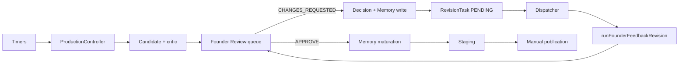
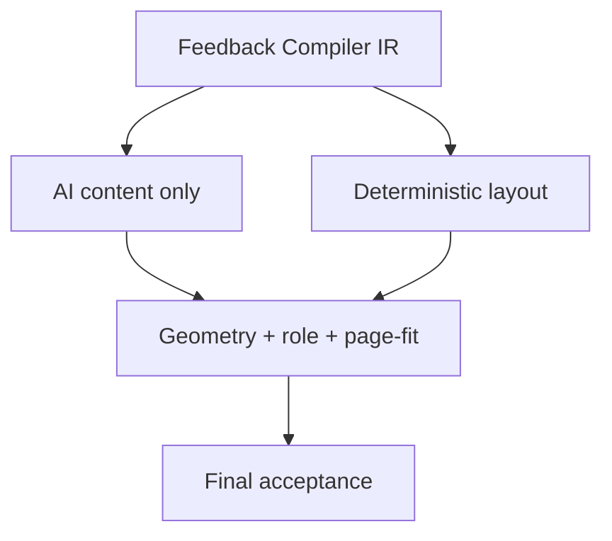

# StudiosisLab AIOS — Resume Template Department Master

## 0. Document Authority

This file is the **canonical human-readable source of truth** for the StudiosisLab AIOS Resume Template Department.

| Surface | Role |
|---|---|
| `SOS/STUDIOSISLAB_PROJECT_MASTER.md` | Project-wide human master (read first for any StudiosisLab task) |
| `SOS/RESUME_TEMPLATE_DEPARTMENT_MASTER.md` | Human-readable complete system truth for this department (this file) |
| `SOS/project-state.json` | Machine-readable current checkpoint |
| Code + runtime evidence | Overrides stale prose |
| Historical tasks / fixtures / evidence JSON | Immutable |

**Rules**

- All future Resume Template Agent work must read the project-wide master, then this file, then `SOS/project-state.json`.
- Code and VPS evidence override this file when they disagree.
- Historical evidence is never mutated or rewritten.
- After every audit, implementation, commit, deploy, production proof, failure, Founder decision, or architecture decision, **this file must be updated**.
- Do not treat isolated phase-verifier PASS as department completeness.

### Required working protocol

**BEFORE any future Resume Template Department change:**

1. Read `SOS/STUDIOSISLAB_PROJECT_MASTER.md`.
2. Read this entire master file.
3. Read `SOS/project-state.json`.
4. Verify relevant code/runtime evidence.
5. State current position in the consolidation roadmap.
6. State whether proposed work advances the business objective.
7. Record the planned action here (Change Log + Current Next Step).
8. Only then implement.

**AFTER every:** audit, Agent run, implementation, commit, deploy, production proof, failure, Founder decision, architecture decision — update this file, the project-wide master when the change is cross-project, and `SOS/project-state.json` as required.

Every future Cursor Agent prompt must include:

> Read `SOS/STUDIOSISLAB_PROJECT_MASTER.md`, this Resume Template Department master, and `SOS/project-state.json` before making any change, and update the appropriate documents before stopping.

### Older documentation (not deleted)

| File | Class | Recommendation |
|---|---|---|
| `SOS/project-state.json` | CURRENT SUPPORTING | Machine checkpoint; keep |
| `SOS/PROJECT_STATUS.md` | HISTORICAL | Factory overview 2026-07-07; stale vs this master |
| `SOS/01_KNOWLEDGE/SAIOS_KNOWLEDGE_INDEX.md` | SPECIALIZED | Knowledge snapshot index |
| `SOS/SAIOS/ARCHITECTURE.md` / `AIOS_CANONICAL_RUNTIME_REPORT.md` | SPECIALIZED | Platform architecture freeze, not department operations |
| `SOS/09_REPORTS/REVISION_PIPELINE_AUDIT.md` | HISTORICAL | 2026-08-01 dispatcher snapshot |
| `SOS/09_REPORTS/factory-v1/factory-architecture.md` | HISTORICAL | Factory v1 |
| `SOS/09_REPORTS/AIOS_*_V1_REPORT.md` (many) | HISTORICAL / SPECIALIZED | Phase/agent reports; do not treat as current ops |
| `SOS/SAIOS/infra/systemd/README.md` | CURRENT SUPPORTING | Unit inventory |
| `SOS/SAIOS/core/first-production-cycle/README.md` | SPECIALIZED | Generation module notes |
| `SOS/SAIOS/core/founder-revision/RevisionPipelineClassification.ts` | CURRENT SUPPORTING (code) | Production vs legacy entry classification |

No pre-existing Markdown already contained business goal + generation + revision + memory + validation + OA failure chain + 6G–6P + target architecture + living changelog. This file was created as the single canonical master. **Do not create a second master.**

---

## 1. Executive Current State

Snapshot taken **2026-10-05T19:08:35+05:30** / **2026-10-05T13:38:35.000Z**. Worktree IR `founder-feedback-ir-1.4.5` is offline-proven and **uncommitted**. Deployed HEAD remains `4eba44defa450c39a02046895b9ed66212e7730a` / IR `founder-feedback-ir-1.4.4`.

| Field | Fresh value |
|---|---|
| LOCAL HEAD | `4eba44defa450c39a02046895b9ed66212e7730a` (`main`; worktree has uncommitted IR 1.4.5) |
| ORIGIN HEAD | `4eba44defa450c39a02046895b9ed66212e7730a` |
| VPS HEAD | `4eba44defa450c39a02046895b9ed66212e7730a` (IR 1.4.4 still deployed) |
| LOCAL STATUS | Dirty Website/src/e-sign files preserved; IR 1.4.5 target-binding offline PASS; no commit/deploy in this run |
| VPS STATUS | Six C5 live proofs immutable; Teaching Assistant `revtask-232a10da-349` immutable `FAILED_GATE`; Dental Hygienist `revtask-f67ce2e4-bb0` immutable `FAILED_COVERAGE`; IR 1.4.4 deployed; false-READY children overlay-blocked; no seventh C5; no Dental/TA live retry |
| ACTIVE RUNTIME | `aios-founder-dashboard.service` `{ok:true,live:false}` |
| DEPARTMENT STATUS | **`OPERATIONALLY_COMPLETE`** — C1–C4 PASS; C5 complete as immutable consolidation evidence; C6 PASS; post-C6 maintenance does not reopen C5–C6 |
| CORE FACTORY STATUS | **HISTORICAL GOAL MET** |
| REVISION ENGINEERING | **`MAINTENANCE_REGRESSION_ONLY`** |
| REVISION STATUS | Historical tasks unchanged: `revtask-863f67a5-790` READY (C5#1 FAIL); `revtask-4a0c006c-507` FAILED_COVERAGE (C5#2 FAIL); `revtask-3f5b2339-73e` FAILED_COVERAGE (C5#3 FAIL); `revtask-0d58e039-326` READY (C5#4 FALSE READY); `revtask-68a5d250-b24` FAILED_GATE / FAILED_GEOMETRY (C5#5 FAIL); `revtask-3a9bcae2-16c` READY (C5#6 FALSE READY); `revtask-232a10da-349` FAILED_GATE (TA post-C6; no child); `revtask-f67ce2e4-bb0` FAILED_COVERAGE (Dental post-IR-1.4.4; no child); `5d933072` / `76a04a21` unchanged |
| GENERATION STATUS | Unchanged; `SOS_AIOS_LIVE=0` |
| FOUNDER REVIEW STATUS | Sixth child `…-revfb-fcfc81`, fourth-C5 child `…-194bdf-revfb-71bd11`, and UI Designer child `…-revfb-f81691` remain overlay `audit_invalid` / NOT_DECISIONABLE. Motion Designer `…-bed721`, Campus Ambassador `…-047495`, and Teaching Assistant remain `revision_failed` / `actionable=false` while UI may still expose Request Changes (P1 maintenance; not a P0). Do not Approve the false-READY children. Do not retry TA. |
| MEMORY STATUS | Unchanged |
| PUBLICATION STATUS | `SOS_AIOS_PUBLICATION_AUTO_APPLY=0` unchanged |
| CURRENT PRIMARY BLOCKERS | **NONE** |
| NEXT AUTHORIZED STEP | **Pre-deploy audit of uncommitted IR 1.4.5, then Resume Founder-to-public E2E.** Do not retry Dental or Teaching Assistant. `LIVE_RETRY_REQUIRED_AFTER_OFFLINE_PASS=NO`. `FOUNDER_E2E_BUSINESS_ACCEPTANCE_STATUS=PENDING_LIVE_E2E_PROOF`. `READY_FOR_SEVENTH_C5_LIVE_PROOF=NO`. C6 = PASS / COMPLETE. |

`OPERATIONALLY_COMPLETE` is the current live operational status. Historical C5 FAIL / FALSE READY outcomes are not rewritten.

---

## 2. Business Objective

The department must:

1. Generate professional one-page Resume Templates automatically.
2. Produce role-correct content and usable layouts.
3. Fail closed on objective unsafety **before** Founder Review.
4. Send only acceptable templates to Founder Review.
5. Support APPROVE / REQUEST CHANGES / REJECT.
6. On Request Changes: compile feedback, revise only what was asked, preserve the rest, validate, return to Review.
7. Bound OpenAI usage.
8. Turn approved patterns into reusable intelligence without making the Founder re-diagnose overlaps, spacing, role residue, or schema issues.
9. Stage and publish only under explicit Founder/manual publication controls.

Founder should not have to repeatedly explain the same visual rule.

---

## 3. StudiosisLab Project Context

Public SaaS: **Next.js 16, React 19, TypeScript, Tailwind, Fabric.js, Firebase, Vercel**.

AIOS control plane: **Node/tsx under `SOS/SAIOS/`**, Founder Dashboard (Vite) on VPS systemd, bounded OpenAI, JSON/JSONL evidence.

```
src/                          Public website, editor, tools, e-sign
SOS/SAIOS/core/first-production-cycle   Generation orchestration
SOS/SAIOS/core/founder-revision         Request Changes pipeline
SOS/SAIOS/core/founder-memory           Preference memory
SOS/SAIOS/core/founder-review           Review projection
SOS/SAIOS/core/resume-renderer          Fabric render
SOS/SAIOS/core/resume-critic            Generation critic
SOS/SAIOS/core/role-integrity           Role proofs
SOS/SAIOS/core/staging + publication-workflow
SOS/SAIOS/dashboard                     Canonical Founder UI
SOS/SAIOS/runtime/website-department    Separate detect-only Website Dept
SOS/07_LOGS/saios/                      Evidence (VPS authoritative)
SOS/project-state.json                  Machine checkpoint
```

Website Department work is **out of scope** for Resume consolidation. Do not stage `src/` or website-department files with Resume work.

---

## 4. Current Production Architecture


```mermaid
flowchart LR
  T[Timers] --> G[ProductionController]
  G --> CAND[Candidate + critic]
  CAND --> Q[Founder Review queue]
  Q -->|CHANGES_REQUESTED| D[Decision + Memory write]
  D --> TASK[RevisionTask PENDING]
  TASK --> DISP[Dispatcher]
  DISP --> REV[runFounderFeedbackRevision]
  REV --> Q
  Q -->|APPROVE| MEM[Memory maturation]
  MEM --> ST[Staging]
  ST --> PUB[Manual publication]
```

One production generation orchestrator: `ProductionController.runProduction`.  
One production revision executor: `runFounderFeedbackRevision`.  
Publication apply is manual and `AUTO_APPLY=0`.

---

## 5. Current Generation Pipeline

Timer `08:50` / `17:50` Asia/Kolkata → `aios-generation.service` → `npm run aios:autonomous:run -- --size 5 --queue-max 20 --max-iterations 1`.

| Stage | File | Owner | Blocks Review? |
|---|---|---|---|
| Autonomous decision | `AutonomousProductionService.ts` | Health/queue/LIVE | Yes if skip |
| Health | `ProductionHealthGate.ts` | Deterministic | Yes |
| Budget | `ResourceBudgetGovernor.ts` | Deterministic | Yes |
| Batch | `BatchRunner.ts` | Queue + provider budget | Yes |
| Cycle | `runFirstProductionCycle.ts` | Generation spine | Yes on fail |
| Target / family | `selectProductionTarget.ts`, `FounderMemoryContext.ts` | Deterministic | Yes |
| Content | `ResumeKnowledgeGateway.ts` + OpenAI | AI | Yes |
| Memory inject | `selectFounderMemory` via brain | Memory | Fail-open empty |
| DesignBrief | `DesignBriefEngine.ts` | Deterministic + AI brief | Yes |
| Render | `ResumeRenderer.ts` | Deterministic | Yes if validation fail |
| Preview | `ResumeTemplateRuntime.ts` | Deterministic | Yes |
| Critic loop | `RevisionLoop.ts` + `ResumeCritic.ts` | Heuristic scores | Partial |
| Role | `RoleTargetIntegrity.ts` | Deterministic | Yes |
| Gate | `CriticGate.ts` / `FounderReviewGatekeeper.ts` | Score thresholds | Yes |
| Queue | `FounderGateRuntime.pause` + projection | Deterministic | N/A |

**Unresolved:** generation geometry is critic-heuristic, not the revision overlap/OOB owner. Defects can still reach Review if scores pass.

---

## 6. Current Revision Pipeline

Dashboard `POST /api/founder-decision` → `FounderDecisionManager` → memory write (fail-open) → `createRevisionTaskFromDecision` → `dispatchRevisionTick` (60s, founder OpenAI gate) → **`runFounderFeedbackRevision`**.

Ordered gates inside the executor:

1. Intent scope (`RevisionIntentScope.ts`)
2. Inventory
3. Plan (OpenAI ≤ 2 calls) + canonicalize (`RevisionPlanCanonicalization.ts`) + validate
4. Drop unsafe geometry ops
5. Deterministic spacing / header identity (6P owner)
6. Direction / selectors / inventory / plan-geometry
7. **Section replacement completeness (6J) — current live fail**
8. Execute ops
9. Section-unit vertical safety
10. Layout normalizer
11. Overlap / sequential-gap hard gate
12. Acceptance / preservation checks
13. Revision-native role (6I)
14. Feedback coverage (consumes 6P owner)
15. Final acceptance aggregator (6L)
16. Materialize child + preview + advisory critic/gate artifacts
17. `READY_FOR_FOUNDER_REVIEW`

Legacy non-production: `runFounderRevisionBatch`, `reviseOne`. Test-only: `runRevisionPlanGateCircuit`.

---

## 7. Approval → Memory → Staging → Publication

```
APPROVE
  → recordDecision
  → writeFounderPreferenceMemorySafe + evaluateMemoryMaturation
  → autoStageAfterFounderApproval (fail-open; does not revoke APPROVE)
  → StagingService
  → publication plan + verify
  → apply only if SOS_AIOS_PUBLICATION_APPLY=1 + manual confirm
```

Fresh env: `SOS_AIOS_PUBLICATION_AUTO_APPLY=0`. Nightly timer enabled; silent apply refused.

---

## 8. State Machines

**Generation candidate:** running → `WAITING_FOUNDER` / `READY_FOR_FOUNDER_REVIEW` | critic-blocked | role-failed | artifact-failed.

**Founder Review overlay** (`FounderReviewProjection` + `decisions.jsonl`): waiting | approved | rejected | changes_requested | revision_failed.

**Revision task:** `PENDING` → `PLANNING` → `VALIDATING` / `ACCEPTED_FOR_MATERIALIZATION` → `READY_FOR_FOUNDER_REVIEW` | `FAILED` | `FAILED_PROVIDER` | `FAILED_EXECUTION` | `FAILED_GATE` | `FAILED_COVERAGE` | `FAILED_ARTIFACTS`.  
`failure_code` may be more precise (`FAILED_PLAN`, `FAILED_SECTION_COMPLETENESS`, `FAILED_ROLE`, `FAILED_FEEDBACK_COVERAGE`) while Telegram status still often says `FAILED_GATE`.

**Staging / publication:** approved → staged → verified → applied (manual).

**Memory row:** `PROVISIONAL` → `CONFIRMED` | `SUPERSEDED` | `REJECTED`.

Overloaded name: **`FAILED_GATE`** hides section, role, geometry, and other owners.

---

## 9. Founder Feedback Compiler

Current components that independently answer “what is this Founder line?”:

| Question | Functions |
|---|---|
| Classification class | `classifyRequestedChange` |
| Intent / sections | `resolveRevisionIntentScope`, `resolveRevisionIntentForChange` |
| Coverage / empty-plan owner | `resolveItemCoverageMode`, `isCanonicalLayoutOwnedItem` |
| Old layout regex | `isDeterministicLayoutNormalizerOwnedChange` |
| Completeness keep-phrases | `buildFounderIntentIndex` in `SectionReplacementCompleteness.ts` |
| Coverage item proofs | `FeedbackCoverage.ts` + canonical layout proof |

**Public semantic owner after C1:** `compileFounderFeedbackIR`. Completeness iterates mutation sections only. 6P layout owner remains the layout-execution predicate consumed by the IR. Historical 5d933072 remains the regression class, not a live retry.

---

## 10. AI vs Deterministic Responsibility

**Current**

| Concern | Today |
|---|---|
| Role writing / section rewrite | AI |
| Plan shape / attribution | AI + deterministic canonicalize |
| Geometry / rhythm / named pair | Deterministic after 6P; AI may emit ops that get superseded |
| Preservation | IR `CONTENT_PRESERVATION` + acceptance checks; 6J keep-phrases only inside authorized mutation sections |
| Validation | Many sequential owners |
| Memory | Prompt injection, not a measured layout learner |

**Target**

- **AI:** semantic content, role-tailored writing, UNEVALUABLE intent.
- **Deterministic:** geometry, overlap, OOB, clipping, rhythm, dispositions, schemas, preservation hashes, final safety.
- **Memory:** learned taste / family / role voice — never safety invariants.

---

## 11. Validation Ownership Matrix

| Concept | Current owner | Duplicates | Can disagree? | Target owner |
|---|---|---|---|---|
| Role | `evaluateRevisionRoleTargetIntegrity` | Generation `evaluateCanvasRoleTargetIntegrity` | Yes if generation artifacts reused | Revision-native only on revision |
| Section completeness | `evaluateSectionReplacementCompleteness` | Intent preservation list | **Yes — live** | Mutation sections only |
| Preservation | Acceptance + 6J phrases | Intent `CONTENT_PRESERVATION` | Yes | Hash / zero content ops |
| Feedback coverage | `buildFeedbackCoverage` | Item heuristics | Reduced after 6P | IR proofs |
| Spacing / named pair / rhythm | Canonical layout proof + normalizer | AI plan | Transient; 6P prefers deterministic | One layout owner |
| Overlap / OOB | Revision hard gate | Critic spacing | **Yes at generation** | Shared geometry owner |
| Clipping / page fit | Normalizer + critic | LayoutCritic scores | Yes at generation | Shared geometry owner |
| Schema | `validateRevisionPlan` | Canonicalizer | No if 6N used | Keep one prepare pipeline |
| Artifact integrity | `validateCandidateArtifactsForStaging` | — | No | Keep |
| Critic / ATS | Advisory on revision; blocking on generation scores | ReadinessGate | Yes vs revision geometry | Critic advisory; geometry hard |

---

## 12. Founder Memory / Learning System

Classification after C3: **STATIC PIPELINE WITH SCOPED MEMORY ATTACHED**. Confirmed layout / design-family / role-voice preferences can be retrieved in scope. This is **not** continuous self-learning and **not** adaptive in the sense of automatically generalizing every Founder packet.

```
decision → FounderPreferenceWriter → memory.jsonl + active-index.json
APPROVE/REJECT → evaluateMemoryMaturation
revision/generation prompt → selectFounderMemory (max 8 rules / 600 chars)
evidence → founder-memory-selection.json
```

| Bucket | Belongs in |
|---|---|
| No overlap / OOB / page fit / min rhythm | **DETERMINISTIC INVARIANTS** (not memory) |
| Density vs slack, family taste | **FOUNDER LEARNED PREFERENCES** |
| Role voice / banned source-role residue | **ROLE KNOWLEDGE** |
| Architecture-specific composition | **DESIGN-FAMILY KNOWLEDGE** |
| This template’s Request Changes lines | **TASK-SPECIFIC FEEDBACK** (not retrieved later as design law) |

Parallel stores **not** wired to `selectFounderMemory`: `learning-entries.jsonl`, `design-memory.json`, `founder-preferences.json`, `learned-rules.json`.

---

## 13. Current Memory Evidence

Fresh VPS read **2026-09-29T09:51:57Z** (`/root/studiosislab.com/SOS/07_LOGS/saios/knowledge/founder-memory/`). Unchanged since the 5d933072 run.

| Metric | Value |
|---|---|
| JSONL rows | 1242 |
| JSONL status | CONFIRMED 19 / PROVISIONAL 990 / SUPERSEDED 233 |
| JSONL `acceptance` field | **Not present** on rows (do not repeat the older “accepted 22 / pending 1220” as current) |
| Active-index count | **382** (mtime 2026-09-23T12:12:50Z) |
| `revtask-5d933072-daf` selection (historical) | considered 382, selected **1**: `fpm-6c083f5f-35f` (then PROVISIONAL HIERARCHY MM→OA title rule) |
| `fpm-6c083f5f-35f` now (VPS 2026-09-29) | SUPERSEDED, `active=false` — JSONL row preserved |
| C3 read-side | That text classifies `TASK_SPECIFIC` and is ineligible for reusable retrieval even if still active |

C3 does **not** delete or rewrite JSONL. Provisionals stay stored. They are not reusable until attributed APPROVE of a non-task-specific layout/family/voice preference.

---

## 14. Generation Quality Gap

**C2 resolved generation-side hard geometry admission.**

`evaluateSharedGeometryAdmission` is the single Founder Review geometry contract: pairwise same-column text overlap (`findTextOverlapFindings`), page OOB (`findOutOfBoundsObjects`), and read-only page-fit (content bottom vs page height, `overflow <= 0.5`). Generation calls it before WAITING_FOUNDER. Revision uses the same function as its fail-closed gate. Critic / Readiness scores remain advisory and cannot override a deterministic fail.

Still not hard-admission (intentionally): intra-box clipping and heading-obscure stay in Founder-requested `COLLISION_BOUNDS` QA; SpacingCritic / LayoutCritic remain heuristic scores; sequential gap findings remain evidence-only; plan-time `PlanGeometrySafety` still inspects mutated objects only.

Duplicate *text* is still not a canvas gate (`DuplicateDetector` is target fingerprinting).

---

## 15. Revision Quality State

**Guarantees (when the run reaches those stages):** shared geometry admission (overlap / OOB / page-fit) fail-closed via the same kernel as generation; 6P layout owner agreed with coverage on the 76a fixture; 6I role-native proof; empty layout-owned plan legal (6O); max 2 provider calls.

**Remaining architectural failure:** 6J completeness on `content_preservation_sections` can fail a layout-only preserve packet before execution (`revtask-5d933072-daf`). Coverage/layout never get a chance.

---

## 16. Historical Operations Analyst Revision Chain

All rows **immutable**. Do not retry or mutate.

| TASK | DATE (UTC) | OWNER / STAGE | ROOT CAUSE | PHASE | IMPROVED | REMAINED |
|---|---|---|---|---|---|---|
| b5339d03-b67 | 2026-08 lineage | PLAN | Malformed plan / values | 6G | Request classes; no dummy ops | Next gate still sequential |
| 9441fe34-4ba | 2026-08/09 | PLAN | Unknown wording → mutation; empty values | 6G | Classification + values contract | Downstream owners |
| b9a65ad0-eb0 | 2026-09-15 | GATE / geometry | Post-content overlap | 6H | Reflow after content | Next owner |
| 33ef5466-f24 | 2026-09-15 | COVERAGE / role | Generation role JSON required | 6I | Revision-native role | Next owner |
| 7a1c0899-4d6 | 2026-09-15 | GATE / section | Skills body object unaccounted | 6J | Object dispositions | **Ledger now applied to preserve** |
| dd26226e-d8b | 2026-09 | COVERAGE | Slack vs visual gap | 6K | Canonical final-state proof | Generation geometry deferred |
| 6ddb8eb8-e9c | 2026-09 | GATE / artifacts | Generation role reused | 6L | One executor + advisory critic | Next owner |
| a0009171-849 | 2026-09-22 | GATE / intent | Preserve vs replace scope | 6M | Intent compiler | Compiler feeds 6J preserve |
| e5cdec1a-40e | 2026-09-22 | PLAN / schema | `set_position`+h | 6N | Shared canonicalize | Next owner |
| 04b14b3d-243 | 2026-09-23 | PLAN | Empty layout plan rejected | 6O | Empty-plan legal | Next owner |
| 76a04a21-6ff | 2026-09-23 | COVERAGE | Two layout owners | 6P | One layout owner | Completeness still split |
| **5d933072-daf** | **2026-09-23T12:12Z** | **section_replacement** | **6J ledger on preserve sections** | **none** | — | **Central compiler problem** |

Ancestry (immutable IDs): `2c9bcf` → `revfb-73c718` → `a44a47` → `6ac511` → `f6c1e7` → `a546e7`. Failed 76a and 5d933072 used prior `…-a546e7` and minted **no** child.

---

## 17. Phase History

| Phase | Intent | Isolated tests | Department-complete? |
|---|---|---|---|
| 6G | Durable request contract | 45/45 | No |
| 6H | Post-content reflow | 43/43 | No |
| 6I | Revision role proof | 34/34 | No |
| 6J | Section object completeness | 43/43 | No — now over-applies |
| 6K | Canonical layout proof | 42/42 | No |
| 6L | One executor + final acceptance | parity PASS | No |
| 6M | Intent scope | PASS | No — feeds 6J |
| 6N | Plan canonicalize | PASS | No |
| 6O | Empty-plan contract | PASS | No |
| 6P | One layout owner | 6P verifier PASS | No — next live proof failed 6J |

Isolated regression PASS is **not** proof the department is operationally complete.

---

## 18. Current Incident

**Task:** `revtask-5d933072-daf` (immutable)  
**Decision:** `fd-29f3e572-06b`  
**Created:** 2026-09-23T12:12:50Z → failed 12:13:55Z  
**Status:** `FAILED_GATE` / `FAILED_SECTION_COMPLETENESS` / owner `section_replacement`  
**Prior:** `…-revfb-a546e7`  
**Evidence (VPS):** `SOS/07_LOGS/saios/founder-revision/evidence/revtask-5d933072-daf/`

Founder asked for **left-sidebar layout-only** refinement and to **preserve** title, Summary, Experience, Education, Projects, Certifications, Languages, and right-column geometry. **28** requested lines. **Plan operations: 0** (“deterministic spacing ownership”).

Intent scope (fresh read):

- `content_mutation_sections`: `[]`
- `content_preservation_sections`: skills, projects, certifications, **summary, experience, education**

6J then required per-object REPLACED / REMOVED / EXPLICITLY_PRESERVED on preserved body objects. Keep-phrases did not match object source text → unaccounted `block-summary-1-t2`, experience `t2–t17`, education `t2–t3`.

**Independently re-verified 2026-09-29T09:51Z** from VPS task JSON, evidence files, and dashboard journal (not from chat):

- 28 Founder lines; clause mix VERIFICATION 5 / CONTENT_PRESERVATION 11 / LAYOUT_PRESERVATION 6 / LAYOUT_MUTATION 26
- `content_mutation_sections`: `[]`
- `content_preservation_sections` and `layout_sections` both include summary / experience / education
- Plan operations: **0** (`normalizer_owned_spacing`)
- Completeness error: keep-instruction exists but does not apply to object source text; **16** unaccounted IDs
- Telegram status still `FAILED_GATE` while `failure_code=FAILED_SECTION_COMPLETENESS`

This task is a **test case** for the consolidation IR (layout-only + preservation must not enter the replacement ledger). It is not a sentence to patch.

**Do not implement a fix in this planning task.**  
**Do not retry this task.**

---

## 19. Patch-Chain Assessment

**PATCH_CHAIN_EXISTS = YES**

Evidence: 6G–6P each closed one owner and shipped a fixture verifier; the next live OA Request Changes failed a previously unconsolidated owner; `OPERATIONALLY_COMPLETE` was asserted while “one more live proof” remained open; 66 revision verifies vs 1 production executor.

---

## 20. Proven-Good Components (KEEP)

Verified against current code names:

- `runFounderFeedbackRevision` — sole Request Changes executor
- `RevisionTaskDispatcher` / `dispatchRevisionTick`
- Bounded OpenAI (`REVISION_PLANNING_MAX_PROVIDER_CALLS = 2`, founder OpenAI gate)
- `ProductionHealthGate` + `ResourceBudgetGovernor` + `queue_max`
- `ResumeRenderer` + guaranteed preview/thumbnail
- `SOS/SAIOS/dashboard` + `FounderReviewProjection`
- `evaluateRevisionFinalAcceptance`
- `evaluateRevisionRoleTargetIntegrity` (6I)
- `isCanonicalLayoutOwnedItem` / 6P coverage agreement
- Revision overlap/OOB hard gate
- Founder Memory **storage + maturation** (not current selection quality)
- Telegram revision-failure alerts (`SOS_AIOS_NOTIFY_LIVE=1`)
- Manual / `AUTO_APPLY=0` publication

---

## 21. Components Requiring Consolidation

- Classification + intent + coverage-mode + 6J keep-index → **one Feedback Compiler IR**
- FeedbackCoverage heuristics into IR proofs
- Parallel learning stores → one memory lifecycle or archive
- Generation critic geometry + revision geometry → **one geometry owner**
- Phase-specific verifies → one department harness + small unit tests

---

## 22. Legacy / Duplicate / Retirement Candidates

Do **not** delete in this baseline.

| Item | Status | Safe to retire now? |
|---|---|---|
| `runFounderRevisionBatch` / `reviseOne` | Legacy CLI | No — still verified |
| `SOS/SAIOS/runtime/founder-dashboard` | Non-canonical UI | No until registry readers migrate |
| Legacy generation engines | Runtime-guard blocked | No without guard audit |
| `runRevisionPlanGateCircuit` | Test-only | Keep as fast gate test, not release proof |
| Parallel learning stores | Duplicate write | Archive later, do not destroy |
| Agent-era V1 reports | Historical | Keep |

---

## 23. Artifact / Revision Ancestry

Successful revision children are `prior_id-revfb-<6hex>/`.

**Copied:** designbrief, resume-template, renderer, pipeline, canvas-meta, and **LEGACY_ONLY** `brain.json`, `knowledge.json`, `skills.json`, `production-target.json`, research files.

**Regenerated:** canvas, preview/thumbnail, editor-compatibility, critic/gate, revision evidence.

**Stale inheritance risk:** PARTIAL — copied generation JSON can lag canvas text. 6J uses live canvas, not those files. Failed tasks do not create children.

---

## 24. Current Testing Model

- founder-revision `verify-*.ts`: **66**
- first-production-cycle `verify-*.ts`: **24**
- Best revision harness: `verify-revision-production-parity-6l.ts` calling `runFounderFeedbackRevision` with **injected** provider
- Generation verifies mock/live-off

**ONE TRUE BUSINESS-WORKFLOW E2E HARNESS = NO**

Nothing runs generate → Review → Request Changes → revise → approve → memory → staging → publication as one offline harness.

---

## 25. Target Resume Template Department Architecture

```
ONE generation entry
ONE revision entry
ONE Feedback Compiler IR
ONE owner per requirement
ONE semantic Resume Template model
ONE deterministic layout owner
ONE role owner
ONE completeness owner (mutations only)
ONE preservation owner (zero content ops / hashes)
ONE coverage aggregator
ONE final acceptance
ONE materializer
ONE Founder Memory lifecycle
ONE production-parity harness
```


```mermaid
flowchart TB
  IR[Feedback Compiler IR]
  AI[AI content only]
  LAY[Deterministic layout]
  GEO[Geometry + role + page-fit]
  ACC[Final acceptance]
  IR --> AI
  IR --> LAY
  AI --> GEO
  LAY --> GEO
  GEO --> ACC
```

---

## 26. Target Generation Pipeline

```
timer → health/budget/queue
  → target + design context + learned memory only
  → AI content
  → render
  → deterministic layout floors
  → same geometry/role/page-fit as revision
  → preview
  → WAITING_FOUNDER or fail before Review
```

---

## 27. Target Revision Pipeline

```
decision → task → dispatcher
  → Feedback Compiler IR
  → AI only for CONTENT_MUTATION
  → deterministic layout for LAYOUT
  → preservation = unchanged content
  → same geometry/role/page-fit
  → coverage = IR proofs
  → materialize
  → READY or fail with one owner
```

---

## 28. Target Learning Loop

```
feedback → IR → execution → measured outcome
  → APPROVE/REJECT
  → learned-rule candidate (taste/family/voice only)
  → maturation
  → scoped retrieval
  → measurable application
```

Safety outcomes become **deterministic invariants**, not more regex memory.

---

## 29. Consolidation Plan (authoritative 2026-09-29)

2026-09-23 conceptual stages (FREEZE → RESUME SCHEDULE) are **superseded as the implementation sequence**. FREEZE remains in force (no OA retry / no 6Q patch). SNAPSHOT of `revtask-5d933072-daf` is **done** (re-verified 2026-09-29). Implementation uses the phases below.

### Architecture decision

Keep the production spine. Consolidate **interpretation and ownership**, do not rewrite the factory.

- **One Feedback Compiler IR** is compiled once per Request Changes packet and consumed by planning, completeness, preservation, layout ownership, coverage, and final acceptance.
- Completeness (today’s 6J) applies **only** to `CONTENT_MUTATION` sections. Preservation is zero content ops + content hash, not a replacement ledger.
- AI writes semantic content only. Deterministic owners own geometry, overlap/OOB/page-fit, schema, and safety.
- Generation and revision must share the **same geometry admission primitives**.
- Founder Memory stays attached storage for now; C4 adds selection/write taxonomy. **No destructive memory migration.**
- Historical tasks remain immutable. Sanitized fixtures may be added; production IDs are never retried.

### Classification (planning pass)

| Action | Components |
|---|---|
| **KEEP** | `runFounderFeedbackRevision`; dispatcher; bounded OpenAI (max 2); health/budget/`queue_max`; `ResumeRenderer`; Founder Dashboard; `evaluateRevisionFinalAcceptance`; 6I revision-native role; 6P `isCanonicalLayoutOwnedItem`; revision overlap/OOB gate; memory JSONL + maturation machinery; Telegram failure alerts; manual `AUTO_APPLY=0` publication |
| **ADAPT** | `RevisionIntentScope`, `classifyRequestedChange`, `resolveItemCoverageMode` — become IR producers, not parallel oracles |
| **MERGE** | Completeness keep-index, coverage item proofs, and intent clauses into the IR; generation critic geometry with revision overlap/OOB into one geometry kernel |
| **RETIRE** (later, not now) | `runFounderRevisionBatch` / `reviseOne` after readers migrate; parallel learning stores after C4 filter is proven; `FAILED_GATE` as a catch-all Telegram status |
| **REWRITE** | None of the production executor. Rewrite only the **compiler contract** (new IR type + single compile function) |
| **LEAVE HISTORICAL** | All `revtask-*` evidence, 6G–6P verifiers as regression until the department harness exists, V1 reports |

### Phases

Do not add a 6Q. Each phase must change the architecture, not a fixture ID.

#### C1 — Feedback Compiler IR *(implemented 2026-09-29; stop before C2)*

| Field | Content |
|---|---|
| BUSINESS PURPOSE | Founder Request Changes is understood once. Layout-only + preserve packets return to Review instead of failing a replacement ledger. |
| ARCHITECTURAL OUTCOME | `compileFounderFeedbackIR(requested_changes)` is the only public semantic owner (`founder-feedback-ir-1.0.0`). Completeness iterates `completeness_sections` = content mutation/removal only. Preservation = no content ops and no replacement ledger. Coverage, prompt coverage mode, plan validation, and acceptance consume IR. |
| CANONICAL MODEL | Per-item `action`: CONTENT_MUTATION / CONTENT_REMOVAL / LAYOUT_MUTATION / CONTENT_PRESERVATION / LAYOUT_PRESERVATION / VERIFICATION / ALREADY_SATISFIED. Packet fields: `content_mutation_sections`, `content_preservation_sections`, `layout_mutation_sections`, `completeness_sections`. Coverage mode remains the 6G/6P execution predicate. |
| COMPONENTS CHANGED | `FounderFeedbackIR.ts` (new); `RevisionIntentScope.ts` (assembler + compatibility `resolveRevisionIntentScope`); `SectionReplacementCompleteness.ts`; `FeedbackCoverage.ts`; `RevisionPromptBuilder.ts`; `RevisionAcceptanceChecks.ts`; `FounderRevisionPipeline.ts` writes `founder-feedback-ir.json`. |
| COMPATIBILITY | `resolveRevisionIntentScope` is the same assembler as IR `intent_scope`. `classifyRequestedChange` remains an IR callee, not a second public answer. `isCanonicalLayoutOwnedItem` remains the layout-execution predicate (loaded lazily from IR). 6J keep-phrase index still runs *inside* authorized mutation sections. Historical verifiers may still call classifiers directly. |
| DEPENDENCIES | None |
| DATA / MEMORY IMPACT | None. No task mutation. No Founder Memory writes. Pipeline evidence file `founder-feedback-ir.json` on new runs only. |
| RISKS | Under-enforcing a real whole-section replace (mitigated: 6J incomplete replace still fails closed); IR still regex-heavy internally; live 5d933072 unchanged |
| OFFLINE PROOF | `npm run aios:revision:founder-feedback-ir-c1:verify` PASS; legacy preservation ledger reproduces 16 unaccounted keep-phrase misses; mutation-only completeness ok; injected empty-plan layout+preserve → `READY_FOR_FOUNDER_REVIEW`; 6G–6P + 6L PASS |
| PRODUCTION-PARITY PROOF | Injected-provider `runFounderFeedbackRevision` on sanitized layout+preserve packet (C1 verifier) |
| ROLLBACK | Revert C1 commit; completeness would again iterate preservation sections |
| LIVE FOUNDER PROOF | **No** (reserved for C5) |
| BEFORE NEXT PHASE | Founder reviews C1; then C2 only |

C1 did **not** absorb Telegram `FAILED_GATE` vs `FAILED_SECTION_COMPLETENESS` honesty. That remains later.

#### C1 architecture (as implemented)

- One compile per Request Changes packet. Downstream must not re-parse Founder language for meaning.
- `completeness_sections` never includes preservation-only sections. Keep-list matching still applies when a section is actually authorized for replacement.
- Layout-only items remain `DETERMINISTIC_LAYOUT_OWNED` / layout execution; they do not enter the replacement ledger.
- True rewrite/removal still sets `completeness_sections` and fails closed if body objects are omitted.
- IR is suitable future memory evidence (C3); C1 does not migrate historical memory.

#### C2 — Shared geometry admission *(implemented 2026-09-29; stop before C3)*

| Field | Content |
|---|---|
| BUSINESS PURPOSE | Objectively broken layouts never reach Founder Review from generation merely because critic scores passed. |
| ARCHITECTURAL OUTCOME | One `evaluateSharedGeometryAdmission(canvas)` kernel (overlap / OOB / page-fit) used by generation admission and revision fail-closed gate. Critic scores remain advisory. |
| COMPONENTS CHANGED | `SharedGeometryAdmission.ts` (new); `runFirstProductionCycle.ts`; `CriticGate` / `FounderQueueGatekeeper` / integrity; `FounderRevisionPipeline.ts`; `RevisionPlanGateCircuit.ts`; candidate `GEOMETRY_BLOCKED` status |
| COMPATIBILITY | Critic `ready` remains score-only. `founder_review_allowed = ready && geometry_pass`. Revision still fail-closes `FAILED_GATE` on kernel fail. Intra-box / heading-obscure stay collision-bounds QA. |
| DEPENDENCIES | C1 offline green |
| DATA / MEMORY IMPACT | None. New evidence files `shared-geometry-admission.json` on new runs only. Historical records not mutated. Queue policy unchanged. |
| RISKS | False-positive block of measurable-but-Founder-acceptable overflow; later LIVE inflow may shrink |
| OFFLINE PROOF | `npm run aios:geometry-admission-c2:verify` PASS; C1 + 5W + 6L + 6P PASS |
| PRODUCTION-PARITY PROOF | Kernel + CriticGate fixture (no LIVE generation); revision pipeline consumes the same function |
| ROLLBACK | Revert C2 commit |
| LIVE FOUNDER PROOF | **No** (reserved for C5) |
| BEFORE NEXT PHASE | Founder reviews C2; then C3 only |

C2 must not wait for another OA task. It is the generation-side half of one quality standard.

#### C2 architecture (as implemented)

- Authoritative contract: pairwise same-column text overlap (gap < -1, overlapX ≥ 20), page object OOB (±0.5px), read-only page-fit (content bottom − page height ≤ 0.5px). Unevaluable canvas fail-closes.
- One kernel. Generation and revision do not keep separate overlap/OOB oracles for Founder Review admission.
- Generation: evaluate canvas after critic; CriticGate cannot queue Review when `geometry_pass=false`; cycle state `GEOMETRY_BLOCKED`.
- Revision: same kernel after normalization, before Founder return; final-acceptance geometry/page-fit counts come from that result.
- Critic / Readiness scores still block when geometry passes and scores fail. They cannot admit a geometrically invalid canvas.

#### C3 — Memory selection discipline *(implemented 2026-09-29; stop before C4)*

| Field | Content |
|---|---|
| BUSINESS PURPOSE | Stop injecting task-specific provisionals (e.g. MM→OA title) into unrelated layout requests. Learn taste/family/voice only after attributed APPROVE. |
| ARCHITECTURAL OUTCOME | Read-side `classifyMemoryLearningClass`. Reusable: CONFIRMED LEARNED_PREFERENCE / DESIGN_FAMILY_PREFERENCE / ROLE_VOICE in scope. Ineligible: TASK_SPECIFIC, DETERMINISTIC_SAFETY, NEGATIVE, UNCLASSIFIED, all PROVISIONAL (except low-confidence stays AMBIGUOUS). Generation and revision share `selectFounderMemory`. |
| COMPONENTS CHANGED | `FounderMemoryLearningClass.ts` (new); `FounderMemoryConsumption.ts`; `FounderMemoryMaturation.ts`; `RevisionPromptBuilder.ts` passes C1 IR; 6F scope-widen test |
| COMPATIBILITY | Historical JSONL unchanged. `resolveConfirmedMemoryScope` no longer widens overlap/clip/OOB to GLOBAL. |
| DEPENDENCIES | C1 IR (layout-only packets exclude ROLE_VOICE); C2 geometry owns safety |
| DATA / MEMORY IMPACT | **No delete / no rewrite of JSONL.** Selection evidence adds `learning_class` + `selection_why`. |
| RISKS | Over-filtering a CONFIRMED preference whose text looks task-specific |
| OFFLINE PROOF | `npm run aios:memory-selection-c3:verify` PASS; 6B/6C/6F + C1 + C2 PASS |
| PRODUCTION-PARITY PROOF | Injected store + IR; no LIVE |
| ROLLBACK | Revert C3 commit |
| LIVE FOUNDER PROOF | **No** |
| BEFORE NEXT PHASE | Founder reviews C3; then C4 only |

#### C3 architecture (as implemented)

- Taxonomy is computed at read time from stored text + status. JSONL is not migrated.
- TASK_SPECIFIC includes professional-title / role-swap instructions even when `issue_type=HIERARCHY` because the line mentions “header”.
- DETERMINISTIC_SAFETY (overlap / clip / OOB / page-fit) is not retrieved; C2 remains the admission owner.
- PROVISIONAL rows remain in the store and active index but are not reusable prompt memory.
- APPROVE + successful revision still promotes attributed layout/family preferences; it does not confirm task-specific title changes.
- Parallel stores (`learning-entries.jsonl`, `design-memory.json`, `founder-preferences.json`, `learned-rules.json`) are still not wired to `selectFounderMemory`.

#### C4 — Department production-parity harness *(implemented 2026-09-29; stop before C5)*

| Field | Content |
|---|---|
| BUSINESS PURPOSE | Prove the real business workflow once, not 66 isolated owners. |
| ARCHITECTURAL OUTCOME | One harness `verify-department-production-parity-c4.ts`. Calls production functions: generation admission spine, `runFounderFeedbackRevision`, C1 IR, C3 `selectFounderMemory` / maturation, staging eligibility. Injected planner. Temp dirs. |
| COMPONENTS CHANGED | New harness + `package.json` script. No runtime production behavior change. |
| DEPENDENCIES | C1 + C2 + C3 |
| DATA / MEMORY IMPACT | Temp dirs only. Evidence JSON under `SOS/07_LOGS/saios/department-parity/`. |
| RISKS | Full `runFirstProductionCycle` persist is not relocatable (`CYCLE_LOG` hardcoded); C4 proves post-render admission, not generate/render/preview persist. |
| OFFLINE PROOF | `npm run aios:department-parity-c4:verify` PASS; C1 + C2 + C3 + 6L PASS |
| PRODUCTION-PARITY PROOF | This phase **is** that proof (offline) |
| ROLLBACK | Delete harness / revert C4 commit |
| LIVE FOUNDER PROOF | **No** |
| BEFORE NEXT PHASE | Founder reviews C4; then C5 only |

#### C4 architecture (as implemented)

- One npm script: `aios:department-parity-c4:verify`.
- Generation: same post-render functions the cycle uses (`evaluateSharedGeometryAdmission`, `evaluateGenerationFounderReviewAdmission`, `CriticGate.evaluate` with `fixture:true`, `FounderReviewGatekeeper.canCreateReview`, `evaluateCanvasRoleTargetIntegrity`). Does **not** call `runFirstProductionCycle` because `CYCLE_LOG` is not injectable without a runtime hook.
- Revision: `runFounderFeedbackRevision` via `setRevisionPipelineRootsForTests` + injected `executePlanner`.
- Approval: `evaluateMemoryMaturation` + temp-root `FounderPreferenceWriter.writeFromDecision`. Staging: `validateCandidateArtifactsForStaging` + `canTransition` + `autoStageAfterFounderApproval` with mock `stageFn`.
- Older verifiers (6G–6P, 6L, C1–C3 unit files) remain. 6L is still the revision-only release harness; C4 is the department workflow harness.
- Known debt: older critic-gate verifier dashboard/OpenAI dependency failures (unchanged; not required for C4).

#### C5 — One authorized live Request Changes *(executed 2026-09-29; FAIL)*

| Field | Content |
|---|---|
| LIVE DECISION | `fd-ef2226ce-0da` CHANGES_REQUESTED `2026-09-29T11:40:25.917Z` on review `founder-review-cycle-creative-ui-designer-20260915T122023Z-79af7d`. Only 2026-09-29 decision. Not OA chain. |
| LIVE TASK | `revtask-863f67a5-790` created `2026-09-29T11:40:25.989Z`; terminal `READY_FOR_FOUNDER_REVIEW` `2026-09-29T11:41:10.104Z`; `failure_code=null`. Child `cand-creative-ui-designer-20260915T122023Z-79af7d-revfb-f81691`. |
| FOUNDER ITEMS | (1) left green vertical line to the bottom; (2) add education content (high school / college / graduation). |
| C1 IR | `founder-feedback-ir-1.0.0` 2 items: item1 `ALREADY_SATISFIED` / `VERIFICATION_ACCEPTANCE`; item2 `LAYOUT_MUTATION` / `DETERMINISTIC_LAYOUT_OWNED` education; `completeness_sections=[]`. |
| PROVIDER | openai `gpt-4.1-mini-2025-04-14`; 1 call; `operations=[]`. Plan notes said item1 needs no ops and item2 is layout-normalizer owned. |
| C3 MEMORY | considered 384; ineligible 145; irrelevant 238; selected 1 `fpm-5ae5b777-910` CONFIRMED `DESIGN_FAMILY_PREFERENCE` ARCHITECTURE/SPACING. No MM→OA / TASK_SPECIFIC selected. |
| C2 GEOMETRY | kernel pass; overlaps 0; OOB 0; page-fit true. Page height 1123; `page-accent-rail` top 40 height 891 (bottom 931; **192px short of page bottom**). |
| ROLE / GATES | Role `ROLE_MATCH` UI Designer. Coverage `all_addressed=true`. Final acceptance overall `PASS`. Preview `preview.png` 395279 bytes. |
| ARTIFACT TRUTH | Prior and revised `canvas.json` are identical (SHA identity). Education text still only `B.A. in Graphic Design, Arcadia University, 2018`. Line not extended. Historical 5d933072 / 76a04a21 not mutated. |
| ARCHITECTURAL GAP | C1 classified a real layout mutation as already-satisfied and a real content add as deterministic-layout-owned. Coverage/acceptance agreed with that IR and returned READY on an empty plan. Inverse of 5d933072 (empty plan used to fail completeness; now empty plan READY). Not a regex patch in this run. |
| C5 RESULT | **FAIL**. Pipeline READY is not C5 PASS. `READY_FOR_C6=NO`. Do not Approve. Do not retry. Immutable regression evidence only. |

#### C1/C4 semantic fulfillment correction *(offline 2026-09-30; not C6; not another live proof)*

| Field | Content |
|---|---|
| C5 ROOT CAUSE | Item 1 desired-state English fell through to `GENERAL_ACCEPTANCE` / `VERIFICATION_ACCEPTANCE` and compiled as `ALREADY_SATISFIED` without canvas proof (rail bottom 931 vs page 1123). Item 2 mutation intent was recognized but clause classification missed natural content-add, so education became `DETERMINISTIC_LAYOUT_OWNED`. Coverage/acceptance certified the wrong IR. C4 missed it because cases used schema-like sentences and asserted pipeline state more than requested-state fulfillment. |
| CORRECTED C1 CONTRACT | Still **one** public semantic owner: `compileFounderFeedbackIR`. Schema `founder-feedback-ir-1.1.0`. Compilation from English **never** emits `ALREADY_SATISFIED`. Desired-state geometry (`should`/`till`/`reach` + visual object + bound) is `LAYOUT_MUTATION`. Natural content-add (`can add` / `more content` + section) stays `CONTENT_MUTATION` with `content_addition_sections`. Layout reflow does not erase content ownership. |
| ALREADY_SATISFIED | Only after `applyAlreadySatisfiedProof(IR, canvas)` proves required predicates on the current canvas. Short/unsatisfied extent stays `LAYOUT_MUTATION`. |
| DESIRED-STATE MODEL | Reach/extend/till/should-be + bound compile to `GEOMETRY_EXTENT`. Mere mention of top/bottom as a problem location does not. |
| CONTENT-ADD MODEL | Additive language keeps `CONTENT_ADD` predicates and education (or named section) in mutation/addition scope, not completeness-as-replace unless the line is a replacement. Embedded examples after `for example:` are illustrative for add; listed examples after remove/such-as are absence targets. |
| TARGET BINDING | Execution-time `bindTargetDescriptor` uses orientation/side/shape/color-family from the Founder line. No canvas IDs, no `page-accent-rail` special case, no UI Designer / green-rail phrase dictionary. |
| FULFILLMENT | IR stores predicates. Coverage evaluates them on before/after canvas and must not re-parse Founder English. Unsatisfied mutation predicates cannot be coverage PASS. Empty mutation plans fail closed (plan schema or coverage), not READY. |
| PROVIDER | Existing bounded planner path unchanged. Limits not increased. Skip-for-cost not added: mutation packets still require the planner unless every item is verification/preservation. |
| C4 STRENGTHENED | Harness now asserts actual canvas fulfillment for C5 sentences and a generalized natural-language matrix (add/remove/rewrite/preserve, move/extend/resize, spacing/alignment/preserve, desired-state, imperative, should-be, can-add, mixed, true/false already-satisfied, negation, embedded examples). |
| C5 OFFLINE REGRESSION | Exact two C5 sentences are permanent offline fixtures. Short rail is not `ALREADY_SATISFIED`. Education keeps `CONTENT_ADD`. Unchanged canvas cannot be declared successful. Historical live task not mutated. |
| GENERALIZED REGRESSION | Alternate natural formulations in C1/C4 matrix prove classes of intent, not memorized C5 wording. |
| KNOWN LIMITATIONS | Empty mutation plans fail at plan-schema (`operations must be a non-empty array`) before coverage; that is fail-closed, not a false PASS. Move/resize/spacing/alignment without a reach-bound have no `GEOMETRY_EXTENT` predicate and still use the existing layout-ownership/coverage path. Provider is not skipped. C2/C3 not redesigned (schema prefix compatibility only). |
| OFFLINE RESULT | C1 PASS; C2 PASS; C3 PASS; C4 PASS; 6J PASS (6I 28/28). No production OpenAI, no new live revision, no Approve. |
| NEXT | Founder reviews this correction. If accepted: **one new** live Request Changes proof. `READY_FOR_C6=NO`. |

#### Second C5 failure investigation *(read-only; 2026-09-30)*

| Field | Content |
|---|---|
| OWNERS | Two independent owners. A = Founder Review actionability/identity for later audit-invalid READY results. B = content-preserving presentation semantics. Telegram was not an owner. |
| OWNER A FINDING | No proven dashboard stale-selection bug. No proven backend rematch. Historical Founder click remains UNKNOWN. Persisted IDs belonged to `…-revfb-f81691`. That child had been technically READY, later C5-audit invalid, still newer/waiting/actionable. No audit-invalid vs historical READY distinction existed. |
| OWNER B FINDING | Item 2 compiled `VERIFICATION` / `GENERAL_ACCEPTANCE` because there was no CONTENT-PRESERVED + PRESENTATION-MUTATED class. Skills stayed inline. Coverage and final acceptance fail-closed correctly. No child/preview. |
| WORKING CONTRACTS KEPT | Education content-add; C2; C3; coverage/acceptance fail-closed; no bad materialization; Telegram failure report; historical immutability. |

#### Second C5 bounded offline correction *(2026-09-30)*

| Field | Content |
|---|---|
| OWNER A | External actionability overlay + identity resolver. Historical task status is not rewritten. Overlay data at `SOS/SAIOS/core/founder-review/actionability-overlay.json` marks the audit-invalid C5 child `NOT_DECISIONABLE`. Projection applies overlay on both registry-only and full paths. Dashboard confirm strip shows title + Resume Template ID; POST payload is bound to the selected card; server rejects rematch/mismatch. After the 2026-09-30 enforcement correction, audit-invalid / NOT_DECISIONABLE blocks Approve, Request Changes, and Reject. |
| OWNER B | IR `founder-feedback-ir-1.2.0`. One public owner remains `compileFounderFeedbackIR`. New actions `PRESENTATION_MUTATION` / `PRESENTATION_PRESERVATION` with measurable `PRESENTATION` predicates (inline / vertical / bullets / stacked / side_by_side / columns). Desired + prohibited presentation compile together. Deterministic apply for inline↔vertical/bullets; side_by_side/columns are measurable, not auto-applied. Unchanged inline cannot PASS a vertical/list request. Zero applicable ops + unsatisfied presentation cannot READY. |
| C4 | Generalized CONTENT-PRESERVING PRESENTATION category added; actual canvas fulfillment asserted; exact second-C5 sentence is a fixture, not the architecture. |
| OFFLINE RESULT | C1 PASS; C2 PASS; C3 PASS; C4 PASS; 6O PASS; Founder Review actionability PASS; projection PASS. |
| IMMUTABLE | `fd-ef2226ce-0da` / `revtask-863f67a5-790`; `fd-87ecc16c-f45` / `revtask-4a0c006c-507`. No candidate-ID blacklist in code. No Skills-only or UI Designer special case. |
| NOT DONE | No live revision. No Founder decision. No C6. Telegram code unchanged. Third-C5 preflight later found REJECT still server-allowed. |

#### C5 live re-proof after correction *(executed 2026-09-30; FAIL)*

| Field | Content |
|---|---|
| AUTHORIZED SOURCE | Preflight selected `cand-creative-motion-designer-20260903T032047Z-bed721`. That review still has **no** Founder decision. |
| ACTUAL LIVE DECISION | `fd-87ecc16c-f45` CHANGES_REQUESTED `2026-09-30T10:16:09.357Z` on `founder-review-cand-creative-ui-designer-20260915T122023Z-79af7d-revfb-f81691`. Newer than `fd-ef2226ce-0da`. **Not** Motion Designer. Uses historical C5 result child. |
| ACTUAL LIVE TASK | `revtask-4a0c006c-507` created `2026-09-30T10:16:09.443Z`; terminal `FAILED_COVERAGE` `2026-09-30T10:17:10.483Z`; owner `feedback_coverage`; code `FAILED_FEEDBACK_COVERAGE`; stage `FEEDBACK_COVERAGE`. No child materialized. |
| SOURCE RESUME TEMPLATE | `cand-creative-ui-designer-20260915T122023Z-79af7d-revfb-f81691` (historical C5 child; role UI Designer). Authorized Motion Designer `…-bed721` still `WAITING_FOUNDER` with zero decisions. |
| RESULT RESUME TEMPLATE | None. Materialization blocked. Preview not created. |
| FOUNDER ITEMS | (1) “Add more content in Education section.” (2) “In skill section display the mentioned skills in pointers like one below another, not one after another.” |
| C1 IR | `founder-feedback-ir-1.1.0`. Item1 `CONTENT_MUTATION` / `CONTENT_ADD` education. Item2 `VERIFICATION` / `VERIFICATION_ACCEPTANCE` / `VERIFICATION_CHECK` (skills display request). `content_addition_sections=["education"]`. Completeness empty. One public owner. |
| FULFILLMENT | Item1: education body `57→162` chars — added honors/coursework. Item2: skills still one inline middot line; unchanged. Coverage item1 addressed / item2 not_addressed. |
| PROVIDER | openai `gpt-4.1-mini-2025-04-14`; 1 request `resp_0663202ec6bf508c006abce1a1b2cc87d2846c5bb4826839ca`; 1 `update_text` on `block-education-3-t2`; 0 ops for item2 (planner treated it as verification). |
| C3 MEMORY | considered 386; ineligible 147; irrelevant 238; selected 1 `fpm-5ae5b777-910` CONFIRMED `DESIGN_FAMILY_PREFERENCE` ARCHITECTURE. No TASK_SPECIFIC / PROVISIONAL selected. |
| C2 GEOMETRY | pass; overlaps 0; OOB 0; page-fit true. |
| ROLE / GATES | ROLE_MATCH UI Designer. Preservation/completeness PASS. Coverage FAIL. Final acceptance FAIL; `may_return_to_founder_review=false`. |
| C4 / LIVE PARITY | Same `compileFounderFeedbackIR` + fulfillment coverage path as C4. No second English parser. Skills-stacking sentence was not in the C4 matrix and compiled as verification. |
| C5 RE-PROOF RESULT | **FAIL**. Wrong source vs authorized Motion Designer. Item2 semantic ownership wrong (display/layout → VERIFICATION). Requested stacked skills absent. Fail-closed (no READY). `READY_FOR_C6=NO`. Do not retry. Do not patch. Do not Approve. |

#### Third C5 preflight and REJECT enforcement *(2026-09-30)*

| Field | Content |
|---|---|
| PREFLIGHT | Third-C5 live-proof preflight on `fb6875f`. Overlay loaded. Historical child projected `audit_invalid` / NOT_DECISIONABLE. Motion Designer remained valid `waiting_founder`. Preflight still reported PASS. |
| STOP RULE | If UI/server actionability disagree, STOP. Preflight PASS was therefore not sufficient for live authorization. |
| DEFECT | `decisionAllowedForValidity("audit_invalid", "REJECTED")` returned true. `/api/founder-decision` would persist a crafted REJECT through `FounderDecisionManager`. UI already blocked Reject. No separate administrative invalidation operation exists. |
| CORRECTION | Generalized: current `audit_invalid` / NOT_DECISIONABLE blocks all ordinary Founder decisions. Shared `evaluateFounderDecisionActionability` is the server gate. UI copy aligned. No candidate-ID blacklist. Historical READY not rewritten. IR 1.2.0 / C2 / C3 / Telegram unchanged. |
| OFFLINE RESULT | Valid waiting Approve/Request Changes/Reject allowed. Audit-invalid Approve/Request Changes/Reject blocked. UI/server agreement PASS. Crafted identity cannot bypass. Motion Designer unaffected. Actionability + identity + C1/C2/C3/C4 PASS. |
| LIVE PROOF | Executed afterward and FAIL. See next subsection. |

#### Third C5 live proof *(executed 2026-09-30; FAIL)*

| Field | Content |
|---|---|
| AUTHORIZED SOURCE | `cand-creative-motion-designer-20260903T032047Z-bed721` / review `founder-review-cycle-creative-motion-designer-20260903T032047Z-bed721`. Owner A identity held. |
| ACTUAL LIVE DECISION | `fd-4e2c7c6a-eaa` CHANGES_REQUESTED `2026-09-30T12:26:58.669Z`. Reason: `Alignment to be redone`. `structured_feedback.candidate_id` = Motion Designer. |
| ACTUAL LIVE TASK | `revtask-3f5b2339-73e` created `2026-09-30T12:26:58.710Z`; terminal `FAILED_COVERAGE` `2026-09-30T12:28:04.598Z`; owner `feedback_coverage`; code `FAILED_FEEDBACK_COVERAGE`; stage `FEEDBACK_COVERAGE`. |
| FOUNDER ITEM (verbatim) | `the below section which includes sections from "Summary" and below till the bottom that whole body I think we should align it to the left as the top name section.` |
| C1 IR | `founder-feedback-ir-1.2.0`. One public owner. Item compiled `LAYOUT_MUTATION` / `MUTATION_REQUIRED` / `GEOMETRY_EXTENT` `side=left` `extent=page_bottom` with `layout_sections=["summary"]` only. Natural meaning was left-align the whole body from Summary down to match name `left=72`. **IR not faithful.** |
| PROVIDER | openai `gpt-4.1-mini-2025-04-14`; 1 call `resp_0d4dcf61f4efc2e9006abd001d2bb887d2b1dc0ee080e909d3`; 32 `set_position` ops toward `left=72`; all dropped by `dropUnsafeGeometryOps`; executed ops=0. |
| BEFORE / AFTER | Name objects `left=72`. Body sections `left=96` / headings `104`. Post-normalization canvas identical. Changed object count=0. |
| C3 MEMORY | considered 387; selected 0; ineligible 141; irrelevant 245; ambiguous 1. No task-specific reusable selection. |
| C2 GEOMETRY | pass; overlaps 0; OOB 0; page-fit true. |
| ROLE | ROLE_MATCH Motion Designer. |
| COVERAGE | not_addressed: `extent page_bottom unsatisfied` on `block-header-0-t0/t1/t2`. Binary fail matches actual unfulfilled alignment; predicate is the miscompiled extent. |
| FINAL ACCEPTANCE | Ran; overall FAIL; `may_return_to_founder_review=false`; failed_owner `feedback_coverage`. |
| MATERIALIZATION | No child. Preview/thumbnail not created. Source now projects `revision_failed`. |
| TELEGRAM | Event `2ae5c15e-3c88-4be5-80d7-3fab53772676` at `2026-09-30T12:28:04.613Z`; message_id 195; delivery sent; body matches task owner/code/stage. |
| C5 THIRD RESULT | **FAIL**. Fail-closed architecture YES. `READY_FOR_C6=NO`. Do not retry. Do not patch. Do not Approve. |

#### Fourth C5 live proof *(executed 2026-10-01; FAIL / false-positive READY)*

| Field | Content |
|---|---|
| AUTHORIZED SOURCE | `cand-student-research-assistant-20261001T032029Z-194bdf` / review `founder-review-cycle-student-research-assistant-20261001T032029Z-194bdf`. |
| ACTUAL LIVE DECISION | `fd-eaa0beaa-6fc` CHANGES_REQUESTED `2026-10-01T10:06:45.105Z`. |
| ACTUAL LIVE TASK | `revtask-0d58e039-326` created then terminal `READY_FOR_FOUNDER_REVIEW` `2026-10-01T10:07:44.884Z`. Child `cand-student-research-assistant-20261001T032029Z-194bdf-revfb-71bd11`. |
| FOUNDER ITEM (verbatim) | `In the skill section, currently the skills are been displayed as horizontal pointers, but I want it to be displayed vertically so that the bottom of the resume template looks empty for this reason we can do vertical pointers, may be 3  pointers in a row and rest 3 we can continue it beside it and so on.` |
| C1 IR | `founder-feedback-ir-1.3.0`. One public owner. Collapsed to categorical `PRESENTATION` `desired=bullets` / `DETERMINISTIC_LAYOUT_OWNED`. Vertical, grouping, beside, and compactness were not retained as simultaneous constraints. |
| EXECUTION | Deterministic presentation rewrite. `Python (Pandas, NumPy)` split on comma. Skills box stored height remained ~47px while rendered ink required ~123px. Intra-box validator existed but was not invoked on this path. |
| C5 FOURTH RESULT | **FAIL observationally**. Task technically reached `READY_FOR_FOUNDER_REVIEW` — this was a **false-positive READY**. Historical technical READY remains immutable. Do not Approve. Do not retry. Do not start C6. |

#### Post-fourth-C5 bounded offline correction *(2026-10-01)*

| Field | Content |
|---|---|
| OWNER 1 | Canonical presentation IR generalized to a multi-constraint structured contract (`founder-feedback-ir-1.4.0`). Compatible constraints survive together. Compactness purpose/context is not a hard metric. One public semantic owner remains `compileFounderFeedbackIR`. IR 1.4 itself did **not** pass the later material-constraint gate: post-deploy verification found that approximate cardinality still shared one grouping-strength with material structure, so vertical bullets could still PASS while continue-beside stayed unresolved. |
| OWNER 2 | Logical items split on true list delimiters with nest-aware internal punctuation. Deterministic executor can apply vertical/inline/bullets and unambiguous columns/row-groups. Presentation path reuses `syncStoredTextHeightsToVisual`. Intra-box overflow from `findIntraBoxTextOverflowFindings` blocks presentation fulfillment. C2 overlap/OOB/page-fit architecture unchanged. Real fourth-C5 parent replay (not the synthetic C1/C4 Research/Literature list) proved atomicity, height 47→107.8, clipping, and normalize geometry. |
| OVERLAY | Existing actionability overlay marks child `…-194bdf-revfb-71bd11` `AUDIT_INVALID` / `NOT_DECISIONABLE`. Historical task `revtask-0d58e039-326` stays READY. Parent/source not blacklisted. |
| MOTION DESIGNER UI DEBT | Unchanged and unresolved: projection `revision_failed` / `actionable=false` while UI may still expose Request Changes. Did not cause fourth C5. Not fixed in IR 1.4.1. |
| OFFLINE | C1 PASS; C2 PASS; C3 PASS; C4 PASS; actionability PASS. First-C5 extent, second-C5 presentation, third-C5 relational remain PASS. |
| LIVE PROOF | Fifth C5 **not run**. `READY_FOR_C6=NO`. |

#### IR 1.4.1 material presentation constraint correction *(2026-10-01)*

| Field | Content |
|---|---|
| GAP | IR 1.4 verification: `"may be 3"` marked the entire grouping approximate, so `"continue it beside it"` was not an independent material obligation. `grouping.executable=false` / `row_and_beside_axis_unresolved` still allowed overall Founder-item PASS from vertical bullets + markers + atomicity + no clipping. |
| FIX | `founder-feedback-ir-1.4.1` distinguishes approximate/soft cardinality from material structural grouping. Illustrative/example language stays non-blocking. Unresolved material structure is recorded on the canonical spec and blocks overall fulfillment. Execution still does not invent a unique 3×N grid. One public semantic owner remains `compileFounderFeedbackIR`. Provider/FeedbackCoverage/FinalAcceptance unchanged as consumers. |
| REAL PARENT PROOF | Read-only copy of `cand-student-research-assistant-20261001T032029Z-194bdf`. Skills: SPSS; Python (Pandas, NumPy); Microsoft Excel; Participant Recruitment; Survey Design; Data Cleaning and Analysis; Research Protocol Development. STATE A original FAIL. STATE B vertical bullets only FAIL (unresolved material). STATE C not fabricated. STATE D `…-revfb-71bd11` FAIL (corruption + clipping). |
| LIVE PROOF | Fifth C5 **not run in that correction**. It later executed and FAILED. `READY_FOR_C6=NO`. |

#### Fifth C5 live proof *(executed 2026-10-01; FAIL)*

| Field | Content |
|---|---|
| AUTHORIZED SOURCE | `cand-student-campus-ambassador-20261001T122020Z-047495` / review `founder-review-cycle-student-campus-ambassador-20261001T122020Z-047495`. |
| ACTUAL LIVE DECISION | `fd-b951abe2-e84` CHANGES_REQUESTED. |
| ACTUAL LIVE TASK | `revtask-68a5d250-b24` terminal `FAILED_GATE` `2026-10-01T13:22:14.321Z`. Owner persisted `final_geometry`. Code `FAILED_GEOMETRY`. Stage `GEOMETRY`. Error `plan geometry safety failed: text_overlaps=3 page_oob=0`. |
| FIRST BLOCKING GATE | Pre-execution `plan_geometry_safety`. Source canvas had zero overlaps. Simulated `update_text` created three transient overlaps (Education t2 vs t3; Skills vs Certifications heading; Skills vs Certifications body) before height-sync / post-content reflow / `normalizeRevisionLayout`. |
| C2 | **NOT_REACHED**. `executeCanvasOperations` NOT_REACHED. No child. No false READY. |
| HEADER IR | Actual intent: move one object completely below a referenced shape while preserving another object's placement. IR 1.4.1: CONTENT_PRESERVATION with no fulfillment relation. Semantic agreement NO. |
| SKILLS IR | Actual intent: content-preserving horizontal → vertical pointer/column/beside presentation with approximate grouping. IR 1.4.1: CONTENT_MUTATION / CONTENT_REWRITE. No PresentationSpec. Semantic agreement NO. |
| EDUCATION IR | CONTENT_ADD compiled correctly. |
| PROVIDER | `gpt-4.1-mini-2025-04-14` followed the IR it received. 1 call. 0 executed ops. |
| TELEGRAM | Event `40589778-3d4a-47ac-a866-755c5c58c2ce` truthful. |
| C5 FIFTH RESULT | **FAIL**. Historical task immutable. Do not retry. Do not Approve. Do not start C6. |

#### Post-fifth-C5 bounded offline correction *(2026-10-01)*

| Field | Content |
|---|---|
| OWNER 1 | `validatePlanGeometrySafety` 1.1.0 reuses `applyPostContentReflow` + `normalizeRevisionLayout` for content-mutation plans, then still fail-closes remaining overlap / OOB / page overflow. Geometry-only plans stay unreflowed. Future pipeline failures persist owner `plan_geometry` (code still `FAILED_GEOMETRY`). Historical fifth-C5 evidence not rewritten. C2 unchanged. |
| OWNER 2 | IR `founder-feedback-ir-1.4.2`. One public owner `compileFounderFeedbackIR`. Relative placement `below` / `above` / `beside` with visual reference + measurable preserve. Presentation compiles before content-replacement; `change … from … to …` with structure language is PresentationSpec, not CONTENT_REWRITE. Approximate cardinality remains independent of material column/beside structure. |
| UI DEBT | Unchanged and unresolved: Motion Designer `…-bed721` and Campus Ambassador `…-047495` project `revision_failed` / `actionable=false` while UI may still expose Request Changes. Not fixed. |
| OFFLINE | C1 PASS; C2 PASS; C3 PASS; C4 PASS; plan-geometry PASS; 6H PASS; 6O PASS; 6P PASS; actionability PASS. First–fourth C5 contracts preserved. Fifth-C5 offline replay: header relation+preserve; Education CONTENT_ADD; Skills PresentationSpec 6 items / columns / approximate / no unresolved material; growth geometry truthful after layout (`text_overlaps=0`, `page_oob=0`, page-fit PASS on the fixture). |
| LIVE PROOF | Sixth C5 **later ran** and produced a false READY. Historical fifth C5 remains FAIL. `READY_FOR_C6=NO`. |

#### Sixth C5 live proof *(executed 2026-10-05; FALSE READY)*

| Field | Content |
|---|---|
| AUTHORIZED SOURCE | `cand-healthcare-physical-therapist-20261002T032111Z-0a635d` / review `founder-review-cycle-healthcare-physical-therapist-20261002T032111Z-0a635d`. |
| ACTUAL LIVE DECISION | `fd-d679f3f8-f03` CHANGES_REQUESTED. |
| ACTUAL LIVE TASK | `revtask-3a9bcae2-16c` terminal historical `READY_FOR_FOUNDER_REVIEW`. Child `cand-healthcare-physical-therapist-20261002T032111Z-0a635d-revfb-fcfc81`. |
| REQUEST 1 HEADER | Move name, job title, and contact slightly right to align with main resume body left; keep the vertical line. Source/final lefts: name/title/contact=64, body=80, rail=50. **HEADER_REQUEST_FULFILLED=NO**. |
| HEADER IR 1.4.2 | LAYOUT_MUTATION; target only job_title; fulfillment=[]; no relational alignment; no header-group target; no rail preserve. Provider emitted 0 ops (deterministic-layout owned). Coverage addressed via generic `LAYOUT_RHYTHM_SATISFIED`. FinalAcceptance accepted a materially unfulfilled request. |
| REQUEST 2 SKILLS | **SUCCEEDED.** PRESENTATION_MUTATION; 8 source / 8 final items; order preserved; bullets; vertical columns; 2 columns; 4+4 grouping; beside; no clipping; no overlaps; C2 PASS. Do not disturb this architecture. |
| C5 SIXTH RESULT | **FALSE READY**. Historical task/decision/canvas immutable. Do not Approve. Do not retry. Do not execute a seventh live proof. |

#### Final C5 offline safety closure *(2026-10-05)*

| Field | Content |
|---|---|
| CONTAINMENT | Existing actionability overlay marks child `…-revfb-fcfc81` `AUDIT_INVALID` / `NOT_DECISIONABLE`. Historical task `revtask-3a9bcae2-16c` stays READY. Parent/source not blacklisted. |
| OWNER 1 | IR `founder-feedback-ir-1.4.3`. One public owner `compileFounderFeedbackIR`. Generalized group move/align-to-reference + explicit preserve. Deterministic `applyRelationalAlignment` binds name/title/contact, body_content left, and vertical rail at execution time. Final-state fulfillment: unchanged / partial / wrong alignment / protected-object movement FAIL; correct group alignment PASS. |
| OWNER 2 | FeedbackCoverage consumes canonical IR fulfillment before generic `LAYOUT_RHYTHM_SATISFIED`. Specific relational predicates cannot be addressed by rhythm-only proof. FinalAcceptance cannot return READY when coverage fails. No second English interpreter. |
| OFFLINE | C1 PASS; C2 PASS; C3 PASS; C4 PASS; plan-geometry PASS; 6H PASS; 6O PASS; 6P PASS; actionability PASS. First–fifth C5 contracts preserved. Sixth Skills presentation preserved. Sixth header replay: IR group+body+rail; unchanged FAIL; partial FAIL; correct PASS; false-READY coverage FAIL; correct-state coverage/acceptance PASS. |
| LIVE PROOF | Seventh C5 **not authorized**. `READY_FOR_SEVENTH_C5_LIVE_PROOF=NO`. `READY_FOR_C6_CLOSURE_AUDIT=YES`. Department **not** declared closed. |

#### C6 — Closure audit (PASS / COMPLETE 2026-10-05)

| Field | Content |
|---|---|
| BUSINESS PURPOSE | Mark `OPERATIONALLY_COMPLETE` only if section 30 is true in production **and** C6 judges six live proofs + corrected offline production-parity evidence sufficient. |
| RESULT | **PASS.** `RESUME_TEMPLATE_DEPARTMENT_STATUS = OPERATIONALLY_COMPLETE`. `REVISION_ENGINEERING_STATUS = MAINTENANCE_REGRESSION_ONLY`. `CURRENT_P0_BLOCKERS = NONE`. `KNOWN_CURRENT_SILENT_SAFETY_BYPASS = NO`. `SEVENTH_C5_REQUIRED = NO`. |
| ARCHITECTURAL OUTCOME | Status change in this master + project master + project-state + `AGENTS.md`. Project priority moves to Website Analysis / QA / Development. |
| DEPENDENCIES | Six immutable C5 live proofs + deployed IR 1.4.3 at `37af692e0353878fd02e2bdabe0b948f58f3daf2`. |
| DATA / MEMORY IMPACT | Docs/state only. No overlays, tasks, decisions, or artifacts mutated. |
| EVIDENCE | C6 read-only audit: HEADs matched `37af692`; dashboard `{ok:true,live:false}`; C1–C4 + actionability re-verified PASS; false-READY children overlay-blocked; historical MM revision `revtask-94df0103-5c3` READY then Founder-approved/staged. |
| C5 HISTORY PRESERVED | #1 FAIL; #2 FAIL; #3 FAIL; #4 FALSE READY; #5 FAIL; #6 FALSE READY. Corrections and containment remain the reason the current system is considered safe. |
| ROLLBACK | Reopen only if a new real production failure appears. Do not retry historical C5 tasks. |
| BEFORE ENABLING `SOS_AIOS_LIVE` | Separate Founder approval. Not part of C6 closure. |

**Total implementation phases: 6.** C1–C4 PASS. C5 complete as immutable consolidation evidence. C6 PASS / CLOSED. Do not execute a seventh live proof.

#### Post-C6 Teaching Assistant maintenance *(offline 2026-10-05; not C5; not C6 rewrite)*

| Field | Content |
|---|---|
| TRIGGER | Real production Request Changes `fd-3eb58dc7-d08` / `revtask-232a10da-349` on Teaching Assistant. Terminal `FAILED_GATE` / C2 `TEXT_OVERLAP` after relational `below` moved title onto contact. Historical task immutable. No child. |
| GAP | Bold never compiled. Named experience pair executed via 6P with empty IR fulfillment. Plan-geometry skipped the post-execute IR world on geometry-only ops. Normalizer had no intra-section sibling cascade. |
| FIX | IR `founder-feedback-ir-1.4.4`: additive `STYLE` + named `SPACING_PAIR`. `applyStyleMutations`. `normalizeRevisionLayout` collision-only cascade of later non-preserved same-section siblings. One `applyPostExecutionLayoutWorld` used by the pipeline and PlanGeometrySafety. Coverage consumes STYLE/SPACING_PAIR; generic `LAYOUT_RHYTHM_SATISFIED` cannot address those predicates. |
| OWNERS | Public semantic owners: **1** (`compileFounderFeedbackIR`). Post-mutation layout owners: **1** (`normalizeRevisionLayout`). Final geometry: **1** (C2). |
| OFFLINE | TA full-intent positive + negatives PASS. C1 PASS; C2 PASS; C3 PASS; C4 PASS; 6H PASS; 6K PASS; 6O PASS; 6P PASS; plan-geometry PASS; role PASS; preservation PASS; actionability PASS. Historical C5/TA outcomes not rewritten. |
| LIVE PROOF | **NO.** `LIVE_RETRY_REQUIRED_AFTER_OFFLINE_PASS=NO`. Do not retry `revtask-232a10da-349`. |
| STATUS | Department remains `OPERATIONALLY_COMPLETE` / `MAINTENANCE_REGRESSION_ONLY`. `FOUNDER_E2E_BUSINESS_ACCEPTANCE_STATUS=PENDING_LIVE_E2E_PROOF`. |

#### Post-Dental target-binding maintenance *(offline 2026-10-05; not C5; not C6 rewrite; not deployed)*

| Field | Content |
|---|---|
| TRIGGER | Real production Request Changes `fd-637ad355-ed7` / `revtask-f67ce2e4-bb0` on Dental Hygienist. Terminal `FAILED_COVERAGE` / `FAILED_FEEDBACK_COVERAGE`. Historical task immutable. No child. |
| GAP | Ordinary-English “contact-details line/row” compiled as a graphical line and unbound. “Light background rectangle” hue-family missed the header band. Explicit keep of name + title + rectangle did not bind all three. One Founder Experience item contained two named spacing relationships; IR emitted one `SPACING_PAIR` and 6P resolved AMBIGUOUS. Education CONTENT_ADD and Skills PRESENTATION already executed. Plan geometry / C2 / role / preservation PASS. IR 1.4.4 still solves the Teaching Assistant class. |
| FIX | IR `founder-feedback-ir-1.4.5`: contact-row vs graphical-line target binding; luminance-aware header-band binding; keep-clause-scoped explicit preserve; N `SPACING_PAIR` predicates + `resolveAllFounderSpacingRelations` needle cardinality. No second English interpreter. No second geometry authority. |
| OWNERS | Public semantic owners: **1** (`compileFounderFeedbackIR`). Target binding: **1** (`compileTargetDescriptor` / `bindTargetDescriptor`). Spacing execution: **1** (`buildSafeNamedSpacingRelationOps`). Final geometry: **1** (C2). |
| OFFLINE | Dental full-intent positive + 11 negatives PASS. TA full-intent PASS. C1 PASS; C2 PASS; C3 PASS; C4 PASS; 6H PASS; 6K PASS; 6O PASS; 6P PASS; plan-geometry PASS; role PASS; preservation PASS; actionability PASS. `NEW_REGRESSION_COUNT=0`. Historical Dental/TA/C5 outcomes not rewritten. |
| LIVE PROOF | **NO.** `LIVE_RETRY_REQUIRED_AFTER_OFFLINE_PASS=NO`. Do not retry `revtask-f67ce2e4-bb0` or `revtask-232a10da-349`. |
| STATUS | Department remains `OPERATIONALLY_COMPLETE` / `MAINTENANCE_REGRESSION_ONLY`. Implementation uncommitted. Ready for pre-deploy audit. `FOUNDER_E2E_BUSINESS_ACCEPTANCE_STATUS=PENDING_LIVE_E2E_PROOF`. |

### Proof strategy (department)

| Workflow | How proven | When |
|---|---|---|
| Layout-only preserve (5d933072-class) | Injected `runFounderFeedbackRevision` | C1 |
| True section replace still fail-closed if incomplete | 6J matrix / harness | C1 |
| Generation overlap cannot enter Review | Shared kernel fixture | C2 |
| Content-only / mixed / already-satisfied / malformed plan | Department harness | C4 |
| Approval → memory taxonomy | Harness + C3 selector | C3–C4 |
| Staging eligibility | Existing staging checks in harness | C4 |
| Live Request Changes | New Founder decision only | C5 **FAIL** — READY with unchanged canvas / C1 IR misclassification |

### Migration

| Store | Required? |
|---|---|
| Founder Memory JSONL | **NO** destructive migration |
| Candidate artifacts | **NO** |
| Revision evidence | **NO** (immutable) |
| State schemas | Additive IR evidence JSON only |
| Legacy modules | Retire later, not in C1 |

---

## 30. Objective Closure Criteria

The department may be marked **OPERATIONALLY_COMPLETE** only when **all** of the following are true in production, not merely in fixtures:

- Generation: schedule + queue work; role-correct; overlap 0; OOB 0; clipping 0; page-fit; cannot enter Review with those defects
- Revision: content-only, layout-only, mixed, preservation, role change, true section replace, already-satisfied, negatives — one executor
- Learning: APPROVE matures only LEARNED rules; repeated visual concepts decline; selection evidence shows the applied rule
- Ops: Telegram names one owner; ≤ 2 provider calls; dashboard matches SoT; no hidden new gate
- Tests: one production-parity harness proves the business workflow

---

## 31. Current Operational Snapshot

C6 audit snapshot **2026-10-05T09:57:16.789Z** (`/api/ops-24-7`) plus administrative closure **2026-10-05T15:36:00+05:30**. Older 2026-09-29 queue rows above this date remain historical.

| Item | Value |
|---|---|
| LIVE | `SOS_AIOS_LIVE=0` |
| Notify | `SOS_AIOS_NOTIFY_LIVE=1` |
| AUTO_APPLY | 0 / false |
| OpenAI bounded | enabled |
| Spend | daily $0.005809 / $5; monthly $0.043897 / $20 |
| waiting_founder | 19 |
| queue_max | 20 |
| review_queue_count | 55 |
| revision_task_counts | READY 21 / FAILED_COVERAGE 11 / FAILED 7 / FAILED_GATE 16 / PENDING 0 |
| Timers | morning last 2026-10-05 03:20 UTC (queue-full no-op); evening next 2026-10-05 12:20 UTC; generation **service** oneshot/disabled between timers; publication nightly last 2026-10-05 02:00 UTC plan/verify only |
| Dashboard | active, started 2026-10-05 09:46:24 UTC after IR 1.4.3 deploy; NRestarts=0 |
| Last revision of note | `revtask-232a10da-349` FAILED_GATE (Teaching Assistant post-C6; no child; do not retry). Prior: `revtask-3a9bcae2-16c` READY (sixth false READY) on Physical Therapist; child `…-revfb-fcfc81` overlay-blocked. Historical `revtask-68a5d250-b24` FAILED_GATE / FAILED_GEOMETRY. `revtask-0d58e039-326` still READY (false-positive). `revtask-863f67a5-790` still READY. `revtask-4a0c006c-507` / `revtask-3f5b2339-73e` still FAILED_COVERAGE. `revtask-5d933072-daf` still FAILED_SECTION_COMPLETENESS |
| Candidate dirs on VPS | Sixth child exists and is overlay `audit_invalid`. Overlay also blocks `…-revfb-71bd11` and `…-revfb-f81691`. Do not Approve |
| P0 | **NONE** — department `OPERATIONALLY_COMPLETE` |
| P1 maintenance | revision_failed Request Changes UI; publication controlled-apply proof (AUTO_APPLY off); role-integrity long-tail spend |
| P2 maintenance | READY Telegram success; FAILED_GATE owner honesty; candidate.json approval-status sync; legacy naming; remaining SoT prose cleanup; verifier/README consolidation |
| Optional | intra-box clipping hard-admission; broader NL Founder-feedback coverage |

---

## 32. Decision Register

| DATE/TIME | DECISION | WHY | EVIDENCE | ALTERNATIVES REJECTED | COMPONENTS | REVERSIBLE? |
|---|---|---|---|---|---|---|
| 2026-09-23T18:57:52+05:30 | Create `SOS/RESUME_TEMPLATE_DEPARTMENT_MASTER.md` as the single human master; keep `project-state.json` as machine checkpoint | No existing Markdown covered the full living department | Repo MD search + reconstruction audit + fresh VPS snapshot | Reusing stale `PROJECT_STATUS.md` or a V1 report as master; creating multiple new architecture docs | Docs + project-state pointer | Yes (docs only) |
| 2026-09-23T18:57:52+05:30 | Current department status = CONSOLIDATION_REQUIRED; preserve historical core factory goal | Live OA revision still failing; OPERATIONALLY_COMPLETE is not truthful | 5d933072 FAILED_SECTION_COMPLETENESS; patch chain 6G–6P | Another 6Q sentence patch; retry 5d933072 | project-state current fields | Yes |
| 2026-09-23T18:57:52+05:30 | Next authorized step = consolidation planning, not OA Request Changes retry | Retry would hit the same 6J/compiler mismatch | Empty plan + preserve sections + keep-phrase fail | Immediate 5d933072 code fix in this task | Roadmap | Yes |
| 2026-09-29T15:22:52+05:30 | Six-phase consolidation C1–C6; first implementation = C1 Feedback Compiler IR | 6G–6P patch chain + independently re-verified 5d933072 (mutation=[], 0 ops, 16 unaccounted preserve objects) | Fresh VPS task/evidence/journal 2026-09-29; HEAD `b1e07bb` matches origin/VPS; no newer live revision | Another OA retry; 6Q regex; rewriting `runFounderFeedbackRevision`; destroying memory; combining C1 with C2/C5 | Resume architecture plan | Yes until C1 ships |
| 2026-09-29T15:22:52+05:30 | No destructive memory/artifact migration | Store is attached-not-learned; 990 provisionals; filter on read | active-index 382 unchanged since 12:12:50Z; 5d933072 selected MM→OA provisional | Rebuild JSONL; retry 5d933072 | Founder Memory | Yes |
| 2026-09-29T15:48:00+05:30 | C1 Feedback Compiler IR is the sole public semantic owner; completeness = mutation sections only | Same Founder sentence was independently reclassified (layout vs preserve vs replace vs verify) | C1 verifier PASS; legacy ledger 16 unaccounted; 6J incomplete replace still fails; 6G–6P+6L PASS | 6Q sentence patch; retry 5d933072; weakening true replace; starting C2 in this run | Feedback compiler + completeness + coverage + prompt + acceptance + pipeline | Yes until C2 ships |
| 2026-09-29T15:56:26+05:30 | C2 shared geometry admission is the sole Founder Review geometry oracle | Generation could enter Review on critic scores while revision already fail-closed on overlap/OOB/page-fit | C2 verifier PASS; C1 + 5W + 6L + 6P PASS; historical good fixture accepted; 5W-class overlap rejected | Second generation checker; turning critic scores into hard geometry; starting C3; enabling LIVE | SharedGeometryAdmission + generation cycle + CriticGate + revision pipeline | Yes until C3 ships |
| 2026-09-29T16:20:00+05:30 | C3 memory selection is read-side learning-class discipline; JSONL is not rewritten | Active/provisional MM→OA title rules were retrieved as layout law; 990 provisionals outnumbered 19 confirmed | C3 verifier PASS; 6B/6C/6F + C1 + C2 PASS; 5d933072-class MM→OA not selected | Deleting provisionals; confirming all rows; a second memory store; starting C4; enabling LIVE | FounderMemoryLearningClass + Consumption + Maturation + RevisionPromptBuilder IR handoff | Yes until C4 ships |
| 2026-09-29T16:52:35+05:30 | C4 is one department harness calling production functions, not a second fake department | Isolated phase tests created false confidence; 6L covers revision only | C4 verifier PASS; C1 + C2 + C3 + 6L PASS | Wrapping 6L only; running live generation; adding CYCLE_LOG hook in this phase; starting C5 | department-parity harness | Yes until C5 |
| 2026-09-29T17:15:30+05:30 | C5 live proof is FAIL; record C1 IR semantic-ownership gap; do not patch or start C6 | Founder asked line-to-bottom + add education content; IR treated those as already-satisfied + layout-owned; empty plan READY; canvases identical | `fd-ef2226ce-0da`; `revtask-863f67a5-790` evidence; prior/rev canvas SHA identity; rail 931 vs page 1123 | Approving READY; retrying; regex-patching C1; starting C6 | Docs/state only | Yes |
| 2026-09-30T15:23:42+05:30 | Correct the one C1 semantic owner and strengthen C4 fulfillment assertions; do not retry C5; do not start C6 | C5 FAIL root cause: English-only already-satisfied + content-add falling to layout ownership; C4 asserted labels not canvas state | Offline C1/C2/C3/C4/6J PASS; C5 sentences as fixtures; generalized matrix | Phrase dictionary for “till the bottom”/education/green rail; second English parser; retry `revtask-863f67a5-790`; C6 | FounderFeedbackIR 1.1.0 + FounderFeedbackFulfillment + coverage + C4 harness | Yes until next live proof |
| 2026-09-30T15:48:31+05:30 | C5 live re-proof is FAIL; do not retry; do not patch; do not start C6 | New decision ran on historical C5 child not Motion Designer; skills-stack request compiled as VERIFICATION and was not fulfilled | `fd-87ecc16c-f45`; `revtask-4a0c006c-507` FAILED_COVERAGE; IR 1.1.0; education 57→162; skills unchanged | Approving; retrying 4a0c/863f; starting another correction; C6 | Docs/state only | Yes |
| 2026-09-30T16:58:00+05:30 | Correct Owner A actionability/identity and Owner B presentation semantics offline; do not run another live proof; do not start C6 | Second C5 FAIL: audit-invalid READY child stayed actionable; presentation request compiled as verification | Overlay + identity bind; IR 1.2.0 PRESENTATION predicates; C4 presentation category; C1/C2/C3/C4/6O/actionability PASS | Candidate blacklist; Skills-only regex; rewriting historical READY; C2/C3/Telegram redesign; C6 | Actionability overlay, Founder Review projection/dashboard/server, IR 1.2.0, fulfillment, C4 | Yes until next live proof |
| 2026-09-30T17:42:00+05:30 | Close audit-invalid REJECT server hole; do not execute third C5; do not start C6 | Third-C5 preflight found UI blocked Reject while server allowed crafted REJECT | `decisionAllowedForValidity` + `evaluateFounderDecisionActionability`; actionability/identity/C1–C4 PASS | Inventing admin-reject; candidate blacklist; rewriting historical READY; IR/C2/C3/Telegram change | Founder Review actionability + dashboard server/UI | Yes until next live proof |
| 2026-09-30T18:27:00+05:30 | Third C5 live proof is FAIL; do not retry; do not patch; do not start C6 | IR 1.2 compiled body left-align as page-bottom extent; all provider alignment ops dropped; coverage fail-closed; no child | `fd-4e2c7c6a-eaa`; `revtask-3f5b2339-73e`; prior/post canvas lefts unchanged; Telegram event `2ae5c15e-3c88-4be5-80d7-3fab53772676` | Approving; retrying 3f5b/4a0c/863f; starting a correction; C6 | Docs/state only | Yes |
| 2026-10-01T15:06:31+05:30 | Implement two proven post-third-C5 owners offline; do not run a fourth live proof; do not start C6 | Range-scoped relational alignment had no IR/fulfillment; layout-only dropUnsafe used a fabricated reflow baseline | IR 1.3.0 RELATIONAL_ALIGNMENT + deterministic group translation; provider contract is compiled IR; no-content reflow skipped; C1/C2/C3/C4/6H/6O PASS | Motion Designer/Summary/left=72 special cases; weakening overlap/OOB; second English parser; retrying historical C5 | FounderFeedbackIR 1.3.0, fulfillment, intent-scope, prompt, pipeline, C1/C4 | Yes |
| 2026-10-01T16:46:19+05:30 | Implement two proven post-fourth-C5 owners offline; do not run a fifth live proof; do not start C6 | Categorical PresentationSpec + comma split + unsynced 47px box + intra-box bypass produced false-positive READY | IR 1.4.0 multi-constraint presentation; nest-aware atomic items; height sync + intra-box on presentation path; overlay on false-READY child; C1/C2/C3/C4/actionability PASS | Research Assistant/Skills/Python/3 special cases; invented 3×N grid; second English parser; rewriting historical READY; C6 | PresentationIntent, FounderFeedbackIR 1.4.0, fulfillment, C1/C4, overlay | Yes |
| 2026-10-01T18:30:42+05:30 | Distinguish approximate cardinality from unresolved material structure; do not invent a grid; do not run fifth C5; do not start C6 | IR 1.4 post-deploy verification: `may be 3` weakened continue-beside; vertical bullets could still PASS | IR 1.4.1 cardinality vs `structure_material`; `unresolved_material` fail-closes overall fulfillment; real fourth-C5 parent replay; C1/C2/C3/C4/actionability PASS | Invented 3×N grid; fourth-C5 phrase special cases; second English parser; rewriting historical READY; C6 | PresentationIntent, FounderFeedbackIR 1.4.1, fulfillment, C1/C4, real-parent fixtures | Yes |
| 2026-10-01T19:21:59+05:30 | Implement two proven post-fifth-C5 owners offline; do not run a sixth live proof; do not start C6 | Plan-geometry rejected transient pre-reflow overlaps; header/Skills IR missed relation and presentation | IR 1.4.2; production-parity plan-geometry; future owner `plan_geometry`; relative placement + presentation precedence; C1/C2/C3/C4/6H/6O/6P/actionability PASS | Weakening C2; Skills/Campus Ambassador special cases; retrying `revtask-68a5d250-b24`; second English parser; C6 | PlanGeometrySafety 1.1.0, FounderFeedbackIR 1.4.2, fulfillment, PresentationIntent, C1/C4 | Yes |
| 2026-10-05T15:13:32+05:30 | Contain sixth false READY and implement IR 1.4.3 group-align + state-true coverage offline; no seventh live proof; do not start C6 | Sixth READY accepted unfulfilled header group via generic rhythm | Overlay on `…-revfb-fcfc81`; IR 1.4.3; coverage consumes IR fulfillment; C1/C2/C3/C4/6H/6O/6P/plan-geometry/actionability PASS | Seventh live proof; PT/left=64 special cases; second English parser; rewriting historical READY; declaring department closed | FounderFeedbackIR 1.4.3, fulfillment, FeedbackCoverage, C1/C4, overlay | Yes |
| 2026-10-05T15:36:00+05:30 | C6 PASS; mark department `OPERATIONALLY_COMPLETE`; revision engineering maintenance-only | C6 audit: no true closure blocker; no current silent safety bypass; seventh C5 not required | C6 read-only audit; HEAD `37af692`; C1–C4 PASS; overlay containment; historical C5 outcomes unchanged | Seventh live proof; rewriting C5 history; implementing maintenance or Website work in this run | Docs/state only | Yes |

---

## 33. Change Log

Append-only. Do not overwrite.

### 2026-09-23T18:57:52+05:30 — MASTER BASELINE

- **PHASE/TASK:** Canonical master document / source-of-truth baseline
- **PURPOSE:** Establish one living Markdown + project-state pointer
- **BEFORE STATE:** Department labeled OPERATIONALLY_COMPLETE in prose; no living human master; 5d933072 failed after 6P
- **CHANGE:** Created this file; set current status CONSOLIDATION_REQUIRED; preserved core factory historical goal
- **FILES MODIFIED:** `SOS/RESUME_TEMPLATE_DEPARTMENT_MASTER.md`, `SOS/project-state.json`
- **TESTS:** None (documentation only)
- **COMMIT:** *(filled after commit)*
- **DEPLOY:** FF docs only; no service restart
- **LIVE PROOF:** None
- **RESULT:** Baseline established
- **NEW RISKS:** Agents may still follow stale V1 reports if they skip this file
- **NEXT STEP:** Resume Template Department consolidation planning (Founder reviews this file first)

### 2026-09-29T15:22:52+05:30 — CONSOLIDATION PLAN

- **PHASE/TASK:** Resume Template Department consolidation planning (docs/state only)
- **PURPOSE:** Replace patch-chain operations with one department architecture and a six-phase implementation sequence
- **BEFORE STATE:** CONSOLIDATION_REQUIRED; conceptual FREEZE/SNAPSHOT roadmap; live failure still 5d933072; docs SHA snapshot stale vs `b1e07bb`
- **CHANGE:** Independently re-verified 5d933072; recorded C1–C6; first implementation C1 Feedback Compiler IR; no code/runtime change
- **FILES MODIFIED:** this file; `SOS/STUDIOSISLAB_PROJECT_MASTER.md`; `SOS/project-state.json`; `AGENTS.md`
- **TESTS:** None (planning only)
- **COMMIT:** *(filled after commit)*
- **DEPLOY:** FF docs only; no service restart
- **LIVE PROOF:** None
- **RESULT:** Plan ready; implementation not started
- **NEW RISKS:** Agent may start C1 without Founder seeing this plan; C1 under-enforcing real replaces
- **NEXT STEP:** C1 Feedback Compiler IR (do not execute in this pass)

### 2026-09-29T15:48:00+05:30 — C1 FEEDBACK COMPILER IR

- **PHASE/TASK:** C1 Feedback Compiler IR
- **PURPOSE:** One canonical interpretation of a Founder Request Changes packet
- **BEFORE STATE:** classify / intent scope / coverage mode / 6J preservation ledger independently answered “what did the Founder ask for?”; 5d933072-class packets failed section completeness
- **CHANGE:** `compileFounderFeedbackIR`; completeness = mutation sections only; coverage/prompt/acceptance/pipeline consume IR; `founder-feedback-ir.json` evidence
- **FILES MODIFIED:** `SOS/SAIOS/core/founder-revision/FounderFeedbackIR.ts` (new) plus completeness, coverage, prompt builder, acceptance, pipeline, intent-scope comments; C1/6M/6P verifiers; package.json script; this file; project master; project-state
- **TESTS:** `aios:revision:founder-feedback-ir-c1:verify` PASS; 6G–6P and 6L PASS
- **COMMIT:** `6f97bb4257baf420d648c252bdb95455b025c84e`
- **DEPLOY:** FF origin + VPS `/root/studiosislab.com`; backup `20260929T101344Z.bundle`; restarted `aios-founder-dashboard.service`; health `{ok:true,live:false}`
- **LIVE PROOF:** None
- **RESULT:** C1 offline proven; live 5d933072 immutable
- **NEW RISKS:** IR still regex-heavy internally; Founder may authorize C2 before reviewing C1
- **NEXT STEP:** C2 Shared geometry admission (after Founder review)

### 2026-09-29T15:56:26+05:30 — C2 SHARED GEOMETRY ADMISSION

- **PHASE/TASK:** C2 Shared geometry admission
- **PURPOSE:** One deterministic geometry/safety contract so generation cannot send objectively broken canvases to Founder Review
- **BEFORE STATE:** Revision fail-closed on `findTextOverlapFindings` + OOB/page-fit mix; generation admitted on CriticGate/Readiness scores
- **CHANGE:** `evaluateSharedGeometryAdmission` reused by generation admission and revision fail-closed; critic scores advisory; `GEOMETRY_BLOCKED` cycle status
- **FILES MODIFIED:** `SOS/SAIOS/core/geometry-admission/*`; critic-gate admission coupling; `runFirstProductionCycle.ts`; `FounderRevisionPipeline.ts`; `RevisionPlanGateCircuit.ts`; candidate/batch/duplicate/runtime status; this file; project master; project-state; `AGENTS.md`
- **TESTS:** `aios:geometry-admission-c2:verify` PASS; C1 + 5W + 6L + 6P PASS
- **COMMIT:** `add19ab7da4fbcfb5d354cc1772d6538f4af655a`
- **DEPLOY:** FF origin + VPS `/root/studiosislab.com`; backup `20260929T102935Z.tar.gz`; restarted `aios-founder-dashboard.service`; health `{ok:true,live:false}`
- **LIVE PROOF:** None
- **RESULT:** C2 offline proven; no production generation/revision
- **NEW RISKS:** False-positive page-fit/OOB blocks; LIVE inflow may shrink later
- **NEXT STEP:** C3 Memory selection discipline (after Founder review)

### 2026-09-29T16:20:00+05:30 — C3 MEMORY SELECTION DISCIPLINE

- **PHASE/TASK:** C3 Founder Memory selection discipline
- **PURPOSE:** Retrieve only memory that is appropriate for the current task, scope, and semantic purpose
- **BEFORE STATE:** Memory persisted and injected; selection treated active/similar rows as reusable law; 5d933072-class layout request selected provisional MM→OA title rule
- **CHANGE:** Read-side `classifyMemoryLearningClass`; reusable only CONFIRMED LEARNED_PREFERENCE / DESIGN_FAMILY_PREFERENCE / ROLE_VOICE in scope; TASK_SPECIFIC / DETERMINISTIC_SAFETY / NEGATIVE / UNCLASSIFIED / PROVISIONAL not reusable; generation and revision share `selectFounderMemory`; APPROVE cannot confirm task-specific title changes; JSONL not deleted or rewritten
- **FILES MODIFIED:** `FounderMemoryLearningClass.ts` (new); `FounderMemoryConsumption.ts`; `FounderMemoryMaturation.ts`; `FounderPreferencePrompt.ts`; `RevisionPromptBuilder.ts`; 6F wiring verifier; C3 verifier; this file; project master; project-state; `AGENTS.md`
- **TESTS:** `aios:memory-selection-c3:verify` PASS; 6B/6C/6F + C1 + C2 PASS
- **COMMIT:** `baf3fe431bdd8d327bb5c107dfdbb4677df02c00`
- **DEPLOY:** FF origin + VPS `/root/studiosislab.com`; backup `20260929T105255Z.tar.gz`; restarted `aios-founder-dashboard.service`; health `{ok:true,live:false}`
- **LIVE PROOF:** None
- **RESULT:** C3 offline proven; historical JSONL intact; not adaptive/self-learning
- **NEW RISKS:** Over-filtering a CONFIRMED preference whose text looks task-specific; parallel design-memory/learned-rules stores still exist but are not `selectFounderMemory` consumers
- **NEXT STEP:** C4 Department production-parity harness (after Founder review)

### 2026-09-29T16:52:35+05:30 — C4 DEPARTMENT PRODUCTION-PARITY HARNESS

- **PHASE/TASK:** C4 Department production-parity harness
- **PURPOSE:** One offline harness that exercises real production orchestration without production side effects
- **BEFORE STATE:** Many isolated verifiers; 6L revision-only; no department workflow harness
- **CHANGE:** `verify-department-production-parity-c4.ts` calls generation admission spine, `runFounderFeedbackRevision`, C1 IR, C3 memory, simulated APPROVE/maturation/staging eligibility. Temp dirs. No runtime production change.
- **FILES MODIFIED:** C4 harness (new); `package.json`; this file; project master; project-state; `AGENTS.md`
- **TESTS:** `aios:department-parity-c4:verify` PASS; C1 + C2 + C3 + 6L PASS
- **COMMIT:** `5068ce36d66458fdfba6c5192195b9906520a92a`
- **DEPLOY:** FF origin; VPS FF if reachable; no service restart
- **LIVE PROOF:** None
- **RESULT:** C4 offline proven. Full generation persist remains a documented isolation gap (`CYCLE_LOG` not relocatable).
- **NEW RISKS:** Agent may treat C4 as live proof; C5 still required
- **NEXT STEP:** C5 one authorized live Request Changes (after Founder review)

### 2026-09-29T17:01:13+05:30 — C5 PREFLIGHT WAITING FOR FOUNDER

- **PHASE/TASK:** C5 live proof preflight
- **PURPOSE:** Confirm C1–C4 on VPS and select one current WAITING_FOUNDER template
- **BEFORE STATE:** Docs still showed C4 SHA `5068ce3` / pending VPS FF
- **CHANGE:** Runtime HEADs are `0d5590b`. No new decision since `fd-29f3e572-06b`. Selected `cand-creative-ui-designer-20260915T122023Z-79af7d`. Agent did not submit feedback.
- **FILES MODIFIED:** this file; project master HEADs; project-state heads
- **TESTS:** Read-only VPS inspect
- **COMMIT:** *(filled after commit)*
- **DEPLOY:** FF docs; no restart
- **LIVE PROOF:** Waiting
- **RESULT:** WAITING_FOR_FOUNDER_REQUEST_CHANGES
- **NEW RISKS:** Founder might open the OA failure-chain template instead
- **NEXT STEP:** Founder submits ONE Request Changes on the selected UI Designer

### 2026-09-29T17:15:30+05:30 — C5 LIVE REQUEST CHANGES PROOF FAIL

- **PHASE/TASK:** C5 one authorized live Request Changes
- **PURPOSE:** Prove C1–C4 on one new Founder decision
- **BEFORE STATE:** Preflight waiting; selected UI Designer `cand-creative-ui-designer-20260915T122023Z-79af7d`
- **CHANGE:** Observation only. Decision `fd-ef2226ce-0da` created task `revtask-863f67a5-790`. Production reached `READY_FOR_FOUNDER_REVIEW`. Artifact truth: identical canvas; C1 IR misclassified both Founder items. No Approve. No retry. No production patch.
- **FILES MODIFIED:** this file; project master; project-state; `AGENTS.md`
- **TESTS:** Production evidence inspect (SSH); no offline verifier rerun required
- **COMMIT:** not created in this run (docs/state update only)
- **DEPLOY:** none; no service restart
- **LIVE PROOF:** YES — FAIL
- **RESULT:** C5 FAIL; READY_FOR_C6=NO
- **NEW RISKS:** Dashboard READY can hide C1 IR empty-plan acceptance
- **NEXT STEP:** Founder reviews C5 failure; do not start C6

### 2026-09-30T15:23:42+05:30 — C1/C4 SEMANTIC FULFILLMENT CORRECTION

- **PHASE/TASK:** Post-C5 offline correction (not C6; not another live proof)
- **PURPOSE:** Stop natural Founder language from being falsely already-satisfied or converted from content-add into layout-only ownership
- **BEFORE STATE:** C5 FAIL; IR 1.0.0; desired-state → VERIFICATION_ACCEPTANCE; `can add` education → DETERMINISTIC_LAYOUT_OWNED; C4 asserted IR labels / READY
- **CHANGE:** IR 1.1.0 + fulfillment predicates; canvas-proven already-satisfied; desired-state extent; content-add ownership; visual target bind; coverage evaluates predicates; C4 asserts canvas fulfillment; C5 sentences are offline fixtures
- **FILES MODIFIED:** `FounderFeedbackIR.ts`, `FounderFeedbackFulfillment.ts` (new), `FeedbackCoverage.ts`, `FounderRevisionPipeline.ts`, classification/intent-scope/prompt-builder, C1/C2/C3/C4 verifiers; this file; project master; project-state; `AGENTS.md`
- **TESTS:** C1 PASS; C2 PASS; C3 PASS; C4 PASS; 6J PASS
- **COMMIT:** *(this implementation commit)*
- **DEPLOY:** FF origin + VPS after this commit; restart dashboard if code deploys
- **LIVE PROOF:** None. Historical C5 task not mutated.
- **RESULT:** Generalized offline correction PASS. `READY_FOR_C6=NO`.
- **NEW RISKS:** Next live packet may still expose unmodeled Founder phrasing; empty mutation plans fail at plan-schema (fail-closed).
- **NEXT STEP:** Founder reviews this correction; then one new live Request Changes proof if authorized

### 2026-09-30T15:48:31+05:30 — C5 LIVE RE-PROOF FAIL

- **PHASE/TASK:** C5 live re-proof after C1/C4 correction
- **PURPOSE:** Prove corrected IR/fulfillment on one new Founder Request Changes
- **BEFORE STATE:** Correction deployed at `63d5278`; Motion Designer preflight selected; historical C5 immutable
- **CHANGE:** Observation only. Actual decision `fd-87ecc16c-f45` targeted `…-revfb-f81691`, not `…-bed721`. Task `revtask-4a0c006c-507` FAILED_COVERAGE. Item1 education add fulfilled. Item2 skills stack compiled as VERIFICATION and unchanged. No child. No Approve. No retry. No patch.
- **FILES MODIFIED:** this file; project master; project-state; `AGENTS.md`
- **TESTS:** Production evidence inspect (SSH)
- **COMMIT:** *(docs checkpoint)*
- **DEPLOY:** FF docs if committed; no service restart
- **LIVE PROOF:** YES — FAIL
- **RESULT:** C5_REPROOF_RESULT=FAIL; READY_FOR_C6=NO
- **NEW RISKS:** Dashboard may present the historical C5 child as the next review card; skills-as-pointers language still falls to VERIFICATION
- **NEXT STEP:** Founder reviews this FAIL; do not retry; do not start C6

### 2026-09-30T16:58:00+05:30 — SECOND C5 BOUNDED OFFLINE CORRECTION

- **PHASE/TASK:** Owner A actionability/identity + Owner B presentation semantics
- **PURPOSE:** Stop audit-invalid READY results from remaining ordinary Founder Review actions; compile content-preserving presentation mutations with measurable fulfillment
- **BEFORE STATE:** Second C5 FAIL recorded; no audit-invalid overlay; IR 1.1.0 had no presentation class
- **CHANGE:** Overlay + identity enforcement; IR 1.2.0 presentation actions/predicates; deterministic apply for list/vertical/inline; C4 presentation category; historical tasks/decisions not mutated
- **FILES MODIFIED:** Founder Review actionability/projection/dashboard/server; FounderFeedbackIR 1.2.0; PresentationIntent; fulfillment; pipeline; C1/C4/actionability verifiers; this file; project master; project-state; `AGENTS.md`
- **TESTS:** C1 PASS; C2 PASS; C3 PASS; C4 PASS; 6O PASS; actionability PASS; projection PASS
- **COMMIT:** *(filled after commit)*
- **DEPLOY:** FF-only if proofs pass; restart only affected dashboard
- **LIVE PROOF:** NO
- **RESULT:** Offline correction PASS. `READY_FOR_C6=NO`. `READY_FOR_NEW_LIVE_PROOF=YES` after deploy.
- **NEW RISKS:** side_by_side/columns are measurable but not auto-applied; next live packet may still expose unmodeled phrasing
- **NEXT STEP:** One fresh controlled live proof if Founder authorizes. Do not retry historical C5 tasks. Do not start C6.

### 2026-09-30T17:42:00+05:30 — AUDIT-INVALID REJECT SERVER ENFORCEMENT

- **PHASE/TASK:** Pre-third-C5 actionability enforcement correction
- **PURPOSE:** Make UI and server agree that NOT_DECISIONABLE blocks every ordinary Founder decision
- **BEFORE STATE:** Overlay + identity bind deployed at `fb6875f`. Third-C5 preflight found crafted REJECT still server-allowed. Preflight PASS was invalid under the UI/server stop rule.
- **CHANGE:** `decisionAllowedForValidity` fail-closes all decisions for `audit_invalid`. Server uses `evaluateFounderDecisionActionability` (overlay + projected validity). UI error copy includes Reject. Historical tasks/decisions not mutated. IR 1.2.0 unchanged.
- **FILES MODIFIED:** FounderReviewActionability; dashboard server + FounderReviewView; actionability verifier; this file; project master; project-state; `AGENTS.md`
- **TESTS:** Actionability PASS; identity PASS; projection PASS; Founder Review UI PASS; C1 PASS; C2 PASS; C3 PASS; C4 PASS
- **COMMIT:** *(this commit)*
- **DEPLOY:** FF-only if proofs pass; restart only affected dashboard
- **LIVE PROOF:** NO
- **RESULT:** Enforcement offline PASS. Third C5 not executed. `READY_FOR_C6=NO`.
- **NEW RISKS:** None in the Founder Review POST path if the shared evaluator is used
- **NEXT STEP:** After deploy, return to Motion Designer `…-bed721` for exactly one Founder-authorized live Request Changes. Do not execute it in this run.

### 2026-09-30T18:27:00+05:30 — THIRD C5 LIVE PROOF FAIL

- **PHASE/TASK:** Third C5 live Request Changes observation
- **PURPOSE:** Prove IR 1.2 + actionability on one natural Motion Designer decision
- **BEFORE STATE:** Enforcement deployed at `afc47be`; Motion Designer waiting_founder; historical C5 child audit-invalid
- **CHANGE:** Observation only. Decision `fd-4e2c7c6a-eaa` on Motion Designer. Task `revtask-3f5b2339-73e` FAILED_COVERAGE. IR compiled left-align body as `GEOMETRY_EXTENT page_bottom`. Provider 32 `set_position` ops dropped. Canvas unchanged. No child. Telegram event `2ae5c15e-3c88-4be5-80d7-3fab53772676` accurate. No Approve. No retry. No patch.
- **FILES MODIFIED:** this file; project master; project-state; `AGENTS.md`
- **TESTS:** Production evidence inspect (SSH)
- **COMMIT:** *(docs checkpoint)*
- **DEPLOY:** FF docs if committed; no service restart
- **LIVE PROOF:** YES — FAIL
- **RESULT:** C5_THIRD_LIVE_PROOF_RESULT=FAIL; FAIL_CLOSED=YES; READY_FOR_C6=NO
- **NEW RISKS:** “till the bottom / align left” compiles as page-bottom extent; `dropUnsafeGeometryOps` can discard a full horizontal alignment plan
- **NEXT STEP:** Read-only failure architecture investigation. Do not implement a correction until reviewed.

### 2026-10-01T15:06:31+05:30 — POST-THIRD-C5 BOUNDED OFFLINE CORRECTION

- **PHASE/TASK:** Owner 1 range/group relational alignment + Owner 2 geometry trial baseline
- **PURPOSE:** Represent range-scoped target/reference alignment in the one public semantic owner; stop layout-only safety trials from running post-content reflow
- **BEFORE STATE:** Third C5 FAIL immutable; IR 1.2.0 compiled body left-align as `GEOMETRY_EXTENT page_bottom`; dropUnsafe reflowed even with zero content ops
- **CHANGE:** IR 1.3.0 `RELATIONAL_ALIGNMENT` with range/reference/edge; `compileExtentBound` stays for visual rails; deterministic group translation preserves heading/body offsets; provider ledger prints canonical IR and geometry ops are dropped when relational IR owns the mutation; `dropUnsafeGeometryOps` skips reflow when there are no content ops. `languages` added to section taxonomy. Historical C5 tasks not mutated.
- **FILES MODIFIED:** FounderFeedbackIR 1.3.0; FounderFeedbackFulfillment; RevisionIntentScope; RevisionPromptBuilder; FounderRevisionPipeline; PostContentReflow; PresentationIntent; C1/C4 verifiers; this file; project master; project-state; `AGENTS.md`
- **TESTS:** C1 PASS; C2 PASS; C3 PASS; C4 PASS; 6H PASS; 6O PASS
- **COMMIT:** *(this implementation commit)*
- **DEPLOY:** FF-only if proofs pass; restart only affected dashboard
- **LIVE PROOF:** NO. Fourth C5 not executed.
- **RESULT:** Offline correction PASS. Third C5 remains FAIL. `READY_FOR_C6=NO`. `READY_FOR_FOURTH_C5_LIVE_PROOF=YES` after healthy deploy.
- **NEW RISKS:** Horizontal-only group translation; unmodeled relational phrasing still fail-closed
- **NEXT STEP:** Read-only preflight for one NEW fourth-C5 live proof if Founder authorizes. Do not retry historical C5 tasks. Do not start C6.

### 2026-10-01T16:46:19+05:30 — POST-FOURTH-C5 BOUNDED OFFLINE CORRECTION

- **PHASE/TASK:** Owner 1 structured presentation contract + Owner 2 atomic/measured presentation execution
- **PURPOSE:** Stop false-positive READY on multi-constraint presentation requests; preserve logical items; sync text-box geometry; fail-close intra-box clipping
- **BEFORE STATE:** Fourth C5 FAIL / false-positive READY on `revtask-0d58e039-326`; IR 1.3.0 categorical PresentationSpec; comma split; height 47px unsynced; intra-box bypassed
- **CHANGE:** IR 1.4.0 multi-constraint PresentationSpec; nest-aware logical items; deterministic columns/row-groups when unambiguous; approximate/ambiguous grouping fail-closed; `syncStoredTextHeightsToVisual` on presentation path; intra-box overflow blocks presentation fulfillment; existing overlay marks child `…-revfb-71bd11` AUDIT_INVALID / NOT_DECISIONABLE. Historical fourth-C5 task not rewritten.
- **FILES MODIFIED:** PresentationIntent; FounderFeedbackIR 1.4.0; FounderFeedbackFulfillment; C1/C4/actionability verifiers; actionability-overlay.json; this file; project master; project-state; `AGENTS.md`
- **TESTS:** C1 PASS; C2 PASS; C3 PASS; C4 PASS; actionability PASS
- **COMMIT:** `b8cf882`
- **DEPLOY:** FF + dashboard restart
- **LIVE PROOF:** NO. Fifth C5 not executed.
- **RESULT:** Offline correction PASS for Owners 1–2 as scoped. IR 1.4 post-deploy verification later found the unresolved-material grouping gap and a synthetic-fixture provenance discrepancy. Fourth C5 remains FAIL / false-positive READY. `READY_FOR_C6=NO`.
- **NEW RISKS:** Approximate cardinality still shared grouping strength with material beside/grouping — corrected in 1.4.1, not by IR 1.4 itself
- **NEXT STEP:** IR 1.4.1 material-constraint correction (this later authorized run)

### 2026-10-01T18:30:42+05:30 — IR 1.4.1 MATERIAL PRESENTATION CONSTRAINT CORRECTION

- **PHASE/TASK:** Bounded offline semantic correction: approximate cardinality ≠ optional structural intent
- **PURPOSE:** Keep unresolved material structure from silently disappearing from overall Founder-item fulfillment
- **BEFORE STATE:** IR 1.4.0 deployed at `b8cf882`. Post-deploy verification: one grouping strength; `may be 3` approximated the whole grouping; continue-beside recorded but not independently required; vertical bullets could PASS. Synthetic C1/C4 list is not the real Research Assistant parent.
- **CHANGE:** IR 1.4.1 splits cardinality strength from `structure_material`. Illustrative examples stay non-blocking. `unresolved_material` blocks `presentationContractSatisfied` / overall fulfillment. Hard vertical+bullets still execute. No invented grid. Real-parent STATE A/B/D proved offline. Overlay unchanged. Historical fourth-C5 task not rewritten.
- **FILES MODIFIED:** PresentationIntent; FounderFeedbackIR 1.4.1; FounderFeedbackFulfillment apply/grouping gate; C1/C4; real-parent fixtures; this file; project master; project-state; `AGENTS.md`
- **TESTS:** C1 PASS; C2 PASS; C3 PASS; C4 PASS; actionability PASS
- **COMMIT:** *(this implementation commit)*
- **DEPLOY:** FF-only if proofs pass; restart only affected dashboard
- **LIVE PROOF:** NO. Fifth C5 not executed.
- **RESULT:** Offline correction PASS. Fourth C5 remains FAIL / false-positive READY. `READY_FOR_C6=NO`. `READY_FOR_FIFTH_C5_LIVE_PROOF=NO`. `READY_FOR_FIFTH_C5_PREFLIGHT=YES` after healthy deploy.
- **NEW RISKS:** Axis-ambiguous material grouping remains unresolved/fail-closed; Motion Designer UI Request Changes exposure remains unresolved
- **NEXT STEP:** Read-only preflight for one NEW fifth-C5 live proof if Founder authorizes. Do not retry historical C5 tasks. Do not start C6.

### 2026-10-01T19:21:59+05:30 — POST-FIFTH-C5 BOUNDED OFFLINE CORRECTION

- **PHASE/TASK:** Owner 1 plan-geometry production parity + Owner 2 generalized relative/presentation IR
- **PURPOSE:** Stop false pre-execution rejection of content growth that production layout owners resolve; encode target/reference/preserve and content-preserving presentation
- **BEFORE STATE:** Fifth C5 FAIL `revtask-68a5d250-b24`; IR 1.4.1; plan-geometry simulated raw `update_text`; owner persisted `final_geometry` though C2 never ran
- **CHANGE:** Plan-geometry 1.1.0 applies post-content reflow + normalize for content-mutation plans; future owner `plan_geometry`; IR 1.4.2 relative placement + presentation precedence; C4 extended. Historical fifth-C5 task not rewritten. revision_failed UI debt recorded, not fixed.
- **FILES MODIFIED:** PlanGeometrySafety; FounderRevisionPipeline; RevisionPlanGateCircuit; FounderFeedbackIR 1.4.2; FounderFeedbackFulfillment; PresentationIntent; RevisionIntentScope; C1/C4/plan-geometry verifiers; this file; project master; project-state; `AGENTS.md`
- **TESTS:** C1 PASS; C2 PASS; C3 PASS; C4 PASS; plan-geometry PASS; 6H PASS; 6O PASS; 6P PASS; actionability PASS
- **COMMIT:** *(this implementation commit)*
- **DEPLOY:** FF-only if proofs pass; restart only affected dashboard
- **LIVE PROOF:** NO. Sixth C5 not executed.
- **RESULT:** Offline correction PASS. Fifth C5 remains FAIL. `READY_FOR_SIXTH_C5_LIVE_PROOF=NO`. `READY_FOR_C6=NO`.
- **NEW RISKS:** Combined packets may still fail-closed after truthful layout; revision_failed UI debt unresolved
- **NEXT STEP:** Fresh STRICT READ-ONLY sixth-C5 production preflight. Do not retry historical C5 tasks. Do not start C6.

### 2026-10-05T15:13:32+05:30 — FINAL C5 OFFLINE SAFETY CLOSURE

- **PHASE/TASK:** Sixth false-READY containment + IR 1.4.3 header-group / state-true coverage
- **PURPOSE:** Stop generic rhythm from accepting an unfulfilled multi-object align+preserve request; block the false-READY child without rewriting history
- **BEFORE STATE:** Deployed `3cc75cd` / IR 1.4.2; `revtask-3a9bcae2-16c` READY; header L64 vs body L80; Skills 8-item columns succeeded
- **CHANGE:** Overlay on `…-revfb-fcfc81`; compile group targets/reference/preserve; per-target final-state fulfillment; coverage evaluates IR fulfillment before `LAYOUT_RHYTHM_SATISFIED`; C1/C4 regressions. Historical sixth task not rewritten.
- **FILES MODIFIED:** FounderFeedbackIR 1.4.3; FounderFeedbackFulfillment; FeedbackCoverage; overlay; C1/C4/actionability verifiers; this file; project master; project-state; `AGENTS.md`
- **TESTS:** C1 PASS; C2 PASS; C3 PASS; C4 PASS; plan-geometry PASS; 6H PASS; 6O PASS; 6P PASS; actionability PASS
- **COMMIT:** `37af692e0353878fd02e2bdabe0b948f58f3daf2`
- **DEPLOY:** FF + dashboard restart
- **LIVE PROOF:** NO seventh C5.
- **RESULT:** Offline correction PASS. Sixth remains false READY. `READY_FOR_SEVENTH_C5_LIVE_PROOF=NO`. `READY_FOR_C6_CLOSURE_AUDIT=YES`. Department not closed.
- **NEW RISKS:** Unmodeled group phrasing remains fail-closed; revision_failed UI debt unresolved
- **NEXT STEP:** C6 Resume Template Department closure audit. Do not execute a seventh live proof. Do not start C6 inside this correction.

### 2026-10-05T15:36:00+05:30 — C6 ADMINISTRATIVE CLOSURE

- **PHASE/TASK:** C6 Resume Template Department closure audit recorded
- **PURPOSE:** Make canonical SoT match the completed C6 decision and deployed IR 1.4.3 baseline
- **BEFORE STATE:** `CONSOLIDATION_REQUIRED`; SoT HEADs still `3cc75cd`; IR 1.4.3 labelled offline; C6 pending
- **CHANGE:** Status `OPERATIONALLY_COMPLETE`; revision `MAINTENANCE_REGRESSION_ONLY`; P0 none; C6 PASS; seventh C5 not required; Website is current project priority; P1/P2/optional maintenance recorded not implemented
- **FILES MODIFIED:** this file; `SOS/STUDIOSISLAB_PROJECT_MASTER.md`; `SOS/project-state.json`; `AGENTS.md`
- **TESTS:** Docs/state consistency only
- **COMMIT:** *(this administrative commit)*
- **DEPLOY:** FF docs; no service restart
- **LIVE PROOF:** NO
- **RESULT:** Department closed. Historical C5 FAIL / FALSE READY outcomes unchanged. False-READY children remain overlay-blocked.
- **NEW RISKS:** Agents may still read stale historical `CONSOLIDATION_REQUIRED` rows
- **NEXT STEP:** Inspect existing Website Analysis / QA / Development state. Do not implement Website work in this run.

### 2026-10-05T17:42:00+05:30 — TA POST-C6 BOUNDED REVISION MAINTENANCE

- **PHASE/TASK:** Teaching Assistant production `FAILED_GATE` offline correction (IR 1.4.4 + shared layout world)
- **PURPOSE:** Fulfill every material Founder clause (title below rect + bold + preserve + contact cascade; named experience pair; Skills 8-item columns) without weakening C2
- **BEFORE STATE:** C6 closed; IR 1.4.3 at `9e80736`; `revtask-232a10da-349` FAILED_GATE; title top 111 = contact top 111
- **CHANGE:** IR 1.4.4 STYLE + SPACING_PAIR; applyStyleMutations; intra-section cascade in normalizeRevisionLayout; applyPostExecutionLayoutWorld for pipeline + plan-geometry; TA fixture + full-intent verifier. Historical TA/C5 tasks not rewritten.
- **FILES MODIFIED:** FounderFeedbackIR; FounderFeedbackFulfillment; FounderSpacingRelation; RevisionLayoutNormalizer; FounderRevisionPipeline; RevisionPlanGateCircuit; PlanGeometrySafety; C1 + plan-geometry + TA verifiers; this file; project master; project-state; `AGENTS.md`
- **TESTS:** TA full-intent PASS; C1 PASS; C2 PASS; C3 PASS; C4 PASS; 6H PASS; 6K PASS; 6O PASS; 6P PASS; plan-geometry PASS; role PASS; preservation PASS; actionability PASS
- **COMMIT:** *(this maintenance; uncommitted)*
- **DEPLOY:** None in this run
- **LIVE PROOF:** NO. `LIVE_RETRY_REQUIRED_AFTER_OFFLINE_PASS=NO`
- **RESULT:** Offline full-intent PASS. Historical TA remains FAILED_GATE. Department remains OPERATIONALLY_COMPLETE. C6 not rewritten.
- **NEW RISKS:** Unmodeled style/spacing phrasing remains fail-closed; VPS still serves IR 1.4.3 until Founder deploys
- **NEXT STEP:** Inspect existing Website Analysis / QA / Development state. Do not retry TA. Do not start a seventh C5.

### 2026-10-05T19:08:35+05:30 — DENTAL TARGET-BINDING CONTRACT (IR 1.4.5 OFFLINE)

- **PHASE/TASK:** Dental Hygienist production `FAILED_COVERAGE` offline correction (IR 1.4.5 target-binding + multi-pair cardinality)
- **PURPOSE:** Bind ordinary contact-row / header-band / explicit-preserve language and represent N named spacing pairs in one Founder item without weakening C2 or TA 1.4.4
- **BEFORE STATE:** Deployed `4eba44d` / IR 1.4.4; `revtask-f67ce2e4-bb0` FAILED_COVERAGE; contact unbound as rail; Experience one AMBIGUOUS pair
- **CHANGE:** IR 1.4.5 contact-row vs graphical line; luminance header-band; keep-clause-scoped explicit preserve; N SPACING_PAIR + 6P needle resolve. Sanitized Dental fixture + full-intent verifier. Historical Dental/TA/C5 tasks not rewritten. No commit/deploy.
- **FILES MODIFIED:** FounderFeedbackIR; FounderFeedbackFulfillment; FounderSpacingRelation; C1 + TA + Dental verifiers; Dental fixture; this file; project master; project-state; `AGENTS.md`
- **TESTS:** Dental full-intent PASS; negatives PASS; TA PASS; C1–C4 PASS; 6H/6K/6O/6P PASS; plan-geometry PASS; role PASS; preservation PASS; actionability PASS. `NEW_REGRESSION_COUNT=0`
- **COMMIT:** NO
- **DEPLOY:** NO
- **LIVE PROOF:** NO. `LIVE_RETRY_REQUIRED_AFTER_OFFLINE_PASS=NO`
- **RESULT:** Offline full-intent PASS. Historical Dental remains FAILED_COVERAGE. Historical TA remains FAILED_GATE. Department remains OPERATIONALLY_COMPLETE. C6 not rewritten.
- **NEW RISKS:** Education add still shares one textbox for two entries (material request satisfied; not redesigned). Unmodeled binding phrasing remains fail-closed.
- **NEXT STEP:** Founder pre-deploy audit of uncommitted IR 1.4.5. Do not retry Dental or TA. Do not start a seventh C5.

---

## 34. Current Next Step

**Exactly one authorized next major action:**

**Pre-deploy audit of uncommitted IR 1.4.5.** Then continue Resume Founder-to-public E2E business acceptance. Do not retry Dental Hygienist or Teaching Assistant. Do not start Website automation or SEO in this stream.

Resume Template Department is `OPERATIONALLY_COMPLETE`. C6 = PASS / COMPLETE. Seventh C5 is not required. Dental and Teaching Assistant live retries are not required. Founder-directed successor after E2E is SEO (recorded, not activated).

Do not Approve or Reject `revtask-863f67a5-790`, `revtask-4a0c006c-507`, `revtask-3f5b2339-73e`, `revtask-0d58e039-326`, `revtask-68a5d250-b24`, `revtask-3a9bcae2-16c`, `revtask-232a10da-349`, or `revtask-f67ce2e4-bb0`.  
Do not retry `revtask-f67ce2e4-bb0`, `revtask-232a10da-349`, `revtask-3a9bcae2-16c`, `revtask-68a5d250-b24`, `revtask-0d58e039-326`, `revtask-3f5b2339-73e`, `revtask-4a0c006c-507`, `revtask-863f67a5-790`, `revtask-5d933072-daf`, or `revtask-76a04a21-6ff`.  
Do not reopen Resume revision engineering unless a new real production failure occurs.  
Do not enable `SOS_AIOS_LIVE`.  
Do not implement Website architecture or enable Website automation in the same step as this maintenance.
