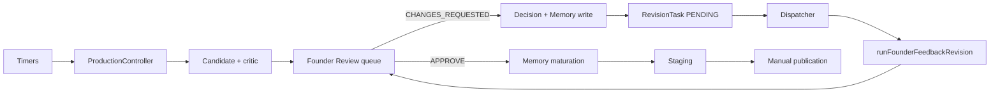
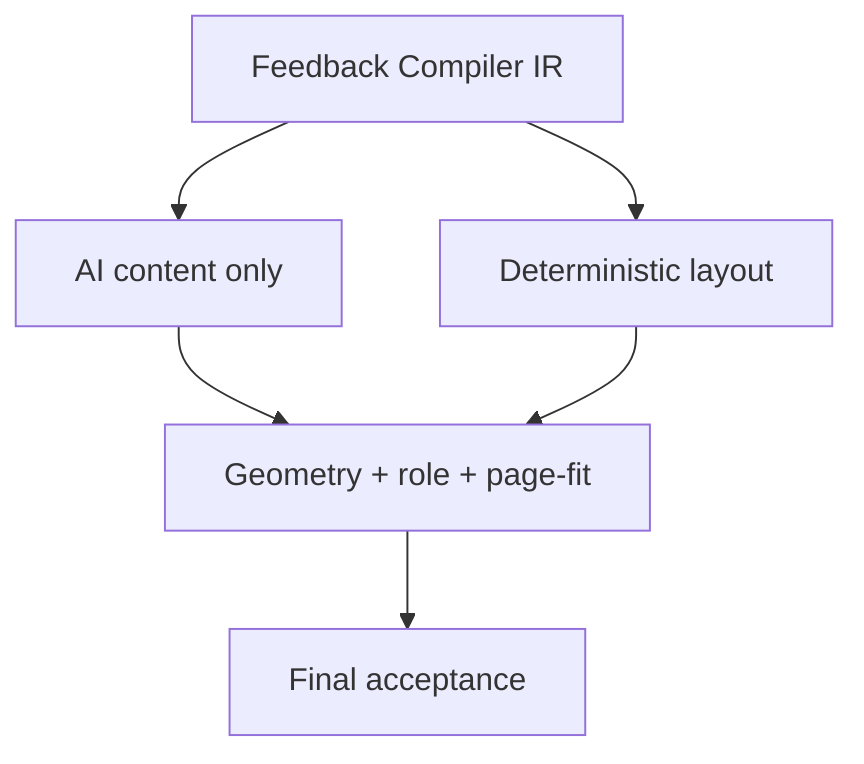

# StudiosisLab AIOS — Resume Template Department Master

## 0. Document Authority

This file is the **canonical human-readable source of truth** for the StudiosisLab AIOS Resume Template Department.

| Surface | Role |
|---|---|
| `SOS/STUDIOSISLAB_PROJECT_MASTER.md` | Project-wide human master (read first for any StudiosisLab task) |
| `SOS/RESUME_TEMPLATE_DEPARTMENT_MASTER.md` | Human-readable complete system truth for this department (this file) |
| `SOS/project-state.json` | Machine-readable current checkpoint |
| Code + runtime evidence | Overrides stale prose |
| Historical tasks / fixtures / evidence JSON | Immutable |

**Rules**

- All future Resume Template Agent work must read the project-wide master, then this file, then `SOS/project-state.json`.
- Code and VPS evidence override this file when they disagree.
- Historical evidence is never mutated or rewritten.
- After every audit, implementation, commit, deploy, production proof, failure, Founder decision, or architecture decision, **this file must be updated**.
- Do not treat isolated phase-verifier PASS as department completeness.

### Required working protocol

**BEFORE any future Resume Template Department change:**

1. Read `SOS/STUDIOSISLAB_PROJECT_MASTER.md`.
2. Read this entire master file.
3. Read `SOS/project-state.json`.
4. Verify relevant code/runtime evidence.
5. State current position in the consolidation roadmap.
6. State whether proposed work advances the business objective.
7. Record the planned action here (Change Log + Current Next Step).
8. Only then implement.

**AFTER every:** audit, Agent run, implementation, commit, deploy, production proof, failure, Founder decision, architecture decision — update this file, the project-wide master when the change is cross-project, and `SOS/project-state.json` as required.

Every future Cursor Agent prompt must include:

> Read `SOS/STUDIOSISLAB_PROJECT_MASTER.md`, this Resume Template Department master, and `SOS/project-state.json` before making any change, and update the appropriate documents before stopping.

### Older documentation (not deleted)

| File | Class | Recommendation |
|---|---|---|
| `SOS/project-state.json` | CURRENT SUPPORTING | Machine checkpoint; keep |
| `SOS/PROJECT_STATUS.md` | HISTORICAL | Factory overview 2026-07-07; stale vs this master |
| `SOS/01_KNOWLEDGE/SAIOS_KNOWLEDGE_INDEX.md` | SPECIALIZED | Knowledge snapshot index |
| `SOS/SAIOS/ARCHITECTURE.md` / `AIOS_CANONICAL_RUNTIME_REPORT.md` | SPECIALIZED | Platform architecture freeze, not department operations |
| `SOS/09_REPORTS/REVISION_PIPELINE_AUDIT.md` | HISTORICAL | 2026-08-01 dispatcher snapshot |
| `SOS/09_REPORTS/factory-v1/factory-architecture.md` | HISTORICAL | Factory v1 |
| `SOS/09_REPORTS/AIOS_*_V1_REPORT.md` (many) | HISTORICAL / SPECIALIZED | Phase/agent reports; do not treat as current ops |
| `SOS/SAIOS/infra/systemd/README.md` | CURRENT SUPPORTING | Unit inventory |
| `SOS/SAIOS/core/first-production-cycle/README.md` | SPECIALIZED | Generation module notes |
| `SOS/SAIOS/core/founder-revision/RevisionPipelineClassification.ts` | CURRENT SUPPORTING (code) | Production vs legacy entry classification |

No pre-existing Markdown already contained business goal + generation + revision + memory + validation + OA failure chain + 6G–6P + target architecture + living changelog. This file was created as the single canonical master. **Do not create a second master.**

---

## 1. Executive Current State

Snapshot taken **2026-09-29T16:52:35+05:30** / **2026-09-29T11:22:35.000Z**. C4 offline harness recorded; no live generation/revision.

| Field | Fresh value |
|---|---|
| LOCAL HEAD | `059a0fa5d964249156526ccd7384ebced2340fca` before C4 commit (`main`) |
| ORIGIN HEAD | `059a0fa5d964249156526ccd7384ebced2340fca` |
| VPS HEAD | `059a0fa5d964249156526ccd7384ebced2340fca` (last verified C3 SHA-record; C4 is test-only) |
| LOCAL STATUS | Dirty Website department files preserved; C4 harness staged explicitly |
| VPS STATUS | FF sync of offline harness if push succeeds; no service restart required |
| ACTIVE RUNTIME | `aios-founder-dashboard.service`; last live claim still `revtask-5d933072-daf` |
| DEPARTMENT STATUS | **CONSOLIDATION_REQUIRED** — C1 + C2 + C3 + C4 implemented offline |
| CORE FACTORY STATUS | **HISTORICAL GOAL MET** |
| REVISION STATUS | Department harness calls `runFounderFeedbackRevision`; latest live task still `revtask-5d933072-daf` (immutable) |
| GENERATION STATUS | Admission spine proven in C4; full `runFirstProductionCycle` persist still not relocatable; `SOS_AIOS_LIVE=0` |
| FOUNDER REVIEW STATUS | Unchanged queue; no live Request Changes |
| MEMORY STATUS | JSONL intact. C4 uses temp-root `selectFounderMemory` / maturation. |
| PUBLICATION STATUS | `SOS_AIOS_PUBLICATION_AUTO_APPLY=0` unchanged |
| CURRENT PRIMARY BLOCKERS | C5 live Founder proof; live 5d933072 remains historical |
| NEXT AUTHORIZED STEP | **C5 One authorized live Request Changes** — Founder review of C4 first; do not retry 5d933072 |

`OPERATIONALLY_COMPLETE` is **not** currently asserted as live operational truth.

---

## 2. Business Objective

The department must:

1. Generate professional one-page Resume Templates automatically.
2. Produce role-correct content and usable layouts.
3. Fail closed on objective unsafety **before** Founder Review.
4. Send only acceptable templates to Founder Review.
5. Support APPROVE / REQUEST CHANGES / REJECT.
6. On Request Changes: compile feedback, revise only what was asked, preserve the rest, validate, return to Review.
7. Bound OpenAI usage.
8. Turn approved patterns into reusable intelligence without making the Founder re-diagnose overlaps, spacing, role residue, or schema issues.
9. Stage and publish only under explicit Founder/manual publication controls.

Founder should not have to repeatedly explain the same visual rule.

---

## 3. StudiosisLab Project Context

Public SaaS: **Next.js 16, React 19, TypeScript, Tailwind, Fabric.js, Firebase, Vercel**.

AIOS control plane: **Node/tsx under `SOS/SAIOS/`**, Founder Dashboard (Vite) on VPS systemd, bounded OpenAI, JSON/JSONL evidence.

```
src/                          Public website, editor, tools, e-sign
SOS/SAIOS/core/first-production-cycle   Generation orchestration
SOS/SAIOS/core/founder-revision         Request Changes pipeline
SOS/SAIOS/core/founder-memory           Preference memory
SOS/SAIOS/core/founder-review           Review projection
SOS/SAIOS/core/resume-renderer          Fabric render
SOS/SAIOS/core/resume-critic            Generation critic
SOS/SAIOS/core/role-integrity           Role proofs
SOS/SAIOS/core/staging + publication-workflow
SOS/SAIOS/dashboard                     Canonical Founder UI
SOS/SAIOS/runtime/website-department    Separate detect-only Website Dept
SOS/07_LOGS/saios/                      Evidence (VPS authoritative)
SOS/project-state.json                  Machine checkpoint
```

Website Department work is **out of scope** for Resume consolidation. Do not stage `src/` or website-department files with Resume work.

---

## 4. Current Production Architecture


```mermaid
flowchart LR
  T[Timers] --> G[ProductionController]
  G --> CAND[Candidate + critic]
  CAND --> Q[Founder Review queue]
  Q -->|CHANGES_REQUESTED| D[Decision + Memory write]
  D --> TASK[RevisionTask PENDING]
  TASK --> DISP[Dispatcher]
  DISP --> REV[runFounderFeedbackRevision]
  REV --> Q
  Q -->|APPROVE| MEM[Memory maturation]
  MEM --> ST[Staging]
  ST --> PUB[Manual publication]
```

One production generation orchestrator: `ProductionController.runProduction`.  
One production revision executor: `runFounderFeedbackRevision`.  
Publication apply is manual and `AUTO_APPLY=0`.

---

## 5. Current Generation Pipeline

Timer `08:50` / `17:50` Asia/Kolkata → `aios-generation.service` → `npm run aios:autonomous:run -- --size 5 --queue-max 20 --max-iterations 1`.

| Stage | File | Owner | Blocks Review? |
|---|---|---|---|
| Autonomous decision | `AutonomousProductionService.ts` | Health/queue/LIVE | Yes if skip |
| Health | `ProductionHealthGate.ts` | Deterministic | Yes |
| Budget | `ResourceBudgetGovernor.ts` | Deterministic | Yes |
| Batch | `BatchRunner.ts` | Queue + provider budget | Yes |
| Cycle | `runFirstProductionCycle.ts` | Generation spine | Yes on fail |
| Target / family | `selectProductionTarget.ts`, `FounderMemoryContext.ts` | Deterministic | Yes |
| Content | `ResumeKnowledgeGateway.ts` + OpenAI | AI | Yes |
| Memory inject | `selectFounderMemory` via brain | Memory | Fail-open empty |
| DesignBrief | `DesignBriefEngine.ts` | Deterministic + AI brief | Yes |
| Render | `ResumeRenderer.ts` | Deterministic | Yes if validation fail |
| Preview | `ResumeTemplateRuntime.ts` | Deterministic | Yes |
| Critic loop | `RevisionLoop.ts` + `ResumeCritic.ts` | Heuristic scores | Partial |
| Role | `RoleTargetIntegrity.ts` | Deterministic | Yes |
| Gate | `CriticGate.ts` / `FounderReviewGatekeeper.ts` | Score thresholds | Yes |
| Queue | `FounderGateRuntime.pause` + projection | Deterministic | N/A |

**Unresolved:** generation geometry is critic-heuristic, not the revision overlap/OOB owner. Defects can still reach Review if scores pass.

---

## 6. Current Revision Pipeline

Dashboard `POST /api/founder-decision` → `FounderDecisionManager` → memory write (fail-open) → `createRevisionTaskFromDecision` → `dispatchRevisionTick` (60s, founder OpenAI gate) → **`runFounderFeedbackRevision`**.

Ordered gates inside the executor:

1. Intent scope (`RevisionIntentScope.ts`)
2. Inventory
3. Plan (OpenAI ≤ 2 calls) + canonicalize (`RevisionPlanCanonicalization.ts`) + validate
4. Drop unsafe geometry ops
5. Deterministic spacing / header identity (6P owner)
6. Direction / selectors / inventory / plan-geometry
7. **Section replacement completeness (6J) — current live fail**
8. Execute ops
9. Section-unit vertical safety
10. Layout normalizer
11. Overlap / sequential-gap hard gate
12. Acceptance / preservation checks
13. Revision-native role (6I)
14. Feedback coverage (consumes 6P owner)
15. Final acceptance aggregator (6L)
16. Materialize child + preview + advisory critic/gate artifacts
17. `READY_FOR_FOUNDER_REVIEW`

Legacy non-production: `runFounderRevisionBatch`, `reviseOne`. Test-only: `runRevisionPlanGateCircuit`.

---

## 7. Approval → Memory → Staging → Publication

```
APPROVE
  → recordDecision
  → writeFounderPreferenceMemorySafe + evaluateMemoryMaturation
  → autoStageAfterFounderApproval (fail-open; does not revoke APPROVE)
  → StagingService
  → publication plan + verify
  → apply only if SOS_AIOS_PUBLICATION_APPLY=1 + manual confirm
```

Fresh env: `SOS_AIOS_PUBLICATION_AUTO_APPLY=0`. Nightly timer enabled; silent apply refused.

---

## 8. State Machines

**Generation candidate:** running → `WAITING_FOUNDER` / `READY_FOR_FOUNDER_REVIEW` | critic-blocked | role-failed | artifact-failed.

**Founder Review overlay** (`FounderReviewProjection` + `decisions.jsonl`): waiting | approved | rejected | changes_requested | revision_failed.

**Revision task:** `PENDING` → `PLANNING` → `VALIDATING` / `ACCEPTED_FOR_MATERIALIZATION` → `READY_FOR_FOUNDER_REVIEW` | `FAILED` | `FAILED_PROVIDER` | `FAILED_EXECUTION` | `FAILED_GATE` | `FAILED_COVERAGE` | `FAILED_ARTIFACTS`.  
`failure_code` may be more precise (`FAILED_PLAN`, `FAILED_SECTION_COMPLETENESS`, `FAILED_ROLE`, `FAILED_FEEDBACK_COVERAGE`) while Telegram status still often says `FAILED_GATE`.

**Staging / publication:** approved → staged → verified → applied (manual).

**Memory row:** `PROVISIONAL` → `CONFIRMED` | `SUPERSEDED` | `REJECTED`.

Overloaded name: **`FAILED_GATE`** hides section, role, geometry, and other owners.

---

## 9. Founder Feedback Compiler

Current components that independently answer “what is this Founder line?”:

| Question | Functions |
|---|---|
| Classification class | `classifyRequestedChange` |
| Intent / sections | `resolveRevisionIntentScope`, `resolveRevisionIntentForChange` |
| Coverage / empty-plan owner | `resolveItemCoverageMode`, `isCanonicalLayoutOwnedItem` |
| Old layout regex | `isDeterministicLayoutNormalizerOwnedChange` |
| Completeness keep-phrases | `buildFounderIntentIndex` in `SectionReplacementCompleteness.ts` |
| Coverage item proofs | `FeedbackCoverage.ts` + canonical layout proof |

**Public semantic owner after C1:** `compileFounderFeedbackIR`. Completeness iterates mutation sections only. 6P layout owner remains the layout-execution predicate consumed by the IR. Historical 5d933072 remains the regression class, not a live retry.

---

## 10. AI vs Deterministic Responsibility

**Current**

| Concern | Today |
|---|---|
| Role writing / section rewrite | AI |
| Plan shape / attribution | AI + deterministic canonicalize |
| Geometry / rhythm / named pair | Deterministic after 6P; AI may emit ops that get superseded |
| Preservation | IR `CONTENT_PRESERVATION` + acceptance checks; 6J keep-phrases only inside authorized mutation sections |
| Validation | Many sequential owners |
| Memory | Prompt injection, not a measured layout learner |

**Target**

- **AI:** semantic content, role-tailored writing, UNEVALUABLE intent.
- **Deterministic:** geometry, overlap, OOB, clipping, rhythm, dispositions, schemas, preservation hashes, final safety.
- **Memory:** learned taste / family / role voice — never safety invariants.

---

## 11. Validation Ownership Matrix

| Concept | Current owner | Duplicates | Can disagree? | Target owner |
|---|---|---|---|---|
| Role | `evaluateRevisionRoleTargetIntegrity` | Generation `evaluateCanvasRoleTargetIntegrity` | Yes if generation artifacts reused | Revision-native only on revision |
| Section completeness | `evaluateSectionReplacementCompleteness` | Intent preservation list | **Yes — live** | Mutation sections only |
| Preservation | Acceptance + 6J phrases | Intent `CONTENT_PRESERVATION` | Yes | Hash / zero content ops |
| Feedback coverage | `buildFeedbackCoverage` | Item heuristics | Reduced after 6P | IR proofs |
| Spacing / named pair / rhythm | Canonical layout proof + normalizer | AI plan | Transient; 6P prefers deterministic | One layout owner |
| Overlap / OOB | Revision hard gate | Critic spacing | **Yes at generation** | Shared geometry owner |
| Clipping / page fit | Normalizer + critic | LayoutCritic scores | Yes at generation | Shared geometry owner |
| Schema | `validateRevisionPlan` | Canonicalizer | No if 6N used | Keep one prepare pipeline |
| Artifact integrity | `validateCandidateArtifactsForStaging` | — | No | Keep |
| Critic / ATS | Advisory on revision; blocking on generation scores | ReadinessGate | Yes vs revision geometry | Critic advisory; geometry hard |

---

## 12. Founder Memory / Learning System

Classification after C3: **STATIC PIPELINE WITH SCOPED MEMORY ATTACHED**. Confirmed layout / design-family / role-voice preferences can be retrieved in scope. This is **not** continuous self-learning and **not** adaptive in the sense of automatically generalizing every Founder packet.

```
decision → FounderPreferenceWriter → memory.jsonl + active-index.json
APPROVE/REJECT → evaluateMemoryMaturation
revision/generation prompt → selectFounderMemory (max 8 rules / 600 chars)
evidence → founder-memory-selection.json
```

| Bucket | Belongs in |
|---|---|
| No overlap / OOB / page fit / min rhythm | **DETERMINISTIC INVARIANTS** (not memory) |
| Density vs slack, family taste | **FOUNDER LEARNED PREFERENCES** |
| Role voice / banned source-role residue | **ROLE KNOWLEDGE** |
| Architecture-specific composition | **DESIGN-FAMILY KNOWLEDGE** |
| This template’s Request Changes lines | **TASK-SPECIFIC FEEDBACK** (not retrieved later as design law) |

Parallel stores **not** wired to `selectFounderMemory`: `learning-entries.jsonl`, `design-memory.json`, `founder-preferences.json`, `learned-rules.json`.

---

## 13. Current Memory Evidence

Fresh VPS read **2026-09-29T09:51:57Z** (`/root/studiosislab.com/SOS/07_LOGS/saios/knowledge/founder-memory/`). Unchanged since the 5d933072 run.

| Metric | Value |
|---|---|
| JSONL rows | 1242 |
| JSONL status | CONFIRMED 19 / PROVISIONAL 990 / SUPERSEDED 233 |
| JSONL `acceptance` field | **Not present** on rows (do not repeat the older “accepted 22 / pending 1220” as current) |
| Active-index count | **382** (mtime 2026-09-23T12:12:50Z) |
| `revtask-5d933072-daf` selection (historical) | considered 382, selected **1**: `fpm-6c083f5f-35f` (then PROVISIONAL HIERARCHY MM→OA title rule) |
| `fpm-6c083f5f-35f` now (VPS 2026-09-29) | SUPERSEDED, `active=false` — JSONL row preserved |
| C3 read-side | That text classifies `TASK_SPECIFIC` and is ineligible for reusable retrieval even if still active |

C3 does **not** delete or rewrite JSONL. Provisionals stay stored. They are not reusable until attributed APPROVE of a non-task-specific layout/family/voice preference.

---

## 14. Generation Quality Gap

**C2 resolved generation-side hard geometry admission.**

`evaluateSharedGeometryAdmission` is the single Founder Review geometry contract: pairwise same-column text overlap (`findTextOverlapFindings`), page OOB (`findOutOfBoundsObjects`), and read-only page-fit (content bottom vs page height, `overflow <= 0.5`). Generation calls it before WAITING_FOUNDER. Revision uses the same function as its fail-closed gate. Critic / Readiness scores remain advisory and cannot override a deterministic fail.

Still not hard-admission (intentionally): intra-box clipping and heading-obscure stay in Founder-requested `COLLISION_BOUNDS` QA; SpacingCritic / LayoutCritic remain heuristic scores; sequential gap findings remain evidence-only; plan-time `PlanGeometrySafety` still inspects mutated objects only.

Duplicate *text* is still not a canvas gate (`DuplicateDetector` is target fingerprinting).

---

## 15. Revision Quality State

**Guarantees (when the run reaches those stages):** shared geometry admission (overlap / OOB / page-fit) fail-closed via the same kernel as generation; 6P layout owner agreed with coverage on the 76a fixture; 6I role-native proof; empty layout-owned plan legal (6O); max 2 provider calls.

**Remaining architectural failure:** 6J completeness on `content_preservation_sections` can fail a layout-only preserve packet before execution (`revtask-5d933072-daf`). Coverage/layout never get a chance.

---

## 16. Historical Operations Analyst Revision Chain

All rows **immutable**. Do not retry or mutate.

| TASK | DATE (UTC) | OWNER / STAGE | ROOT CAUSE | PHASE | IMPROVED | REMAINED |
|---|---|---|---|---|---|---|
| b5339d03-b67 | 2026-08 lineage | PLAN | Malformed plan / values | 6G | Request classes; no dummy ops | Next gate still sequential |
| 9441fe34-4ba | 2026-08/09 | PLAN | Unknown wording → mutation; empty values | 6G | Classification + values contract | Downstream owners |
| b9a65ad0-eb0 | 2026-09-15 | GATE / geometry | Post-content overlap | 6H | Reflow after content | Next owner |
| 33ef5466-f24 | 2026-09-15 | COVERAGE / role | Generation role JSON required | 6I | Revision-native role | Next owner |
| 7a1c0899-4d6 | 2026-09-15 | GATE / section | Skills body object unaccounted | 6J | Object dispositions | **Ledger now applied to preserve** |
| dd26226e-d8b | 2026-09 | COVERAGE | Slack vs visual gap | 6K | Canonical final-state proof | Generation geometry deferred |
| 6ddb8eb8-e9c | 2026-09 | GATE / artifacts | Generation role reused | 6L | One executor + advisory critic | Next owner |
| a0009171-849 | 2026-09-22 | GATE / intent | Preserve vs replace scope | 6M | Intent compiler | Compiler feeds 6J preserve |
| e5cdec1a-40e | 2026-09-22 | PLAN / schema | `set_position`+h | 6N | Shared canonicalize | Next owner |
| 04b14b3d-243 | 2026-09-23 | PLAN | Empty layout plan rejected | 6O | Empty-plan legal | Next owner |
| 76a04a21-6ff | 2026-09-23 | COVERAGE | Two layout owners | 6P | One layout owner | Completeness still split |
| **5d933072-daf** | **2026-09-23T12:12Z** | **section_replacement** | **6J ledger on preserve sections** | **none** | — | **Central compiler problem** |

Ancestry (immutable IDs): `2c9bcf` → `revfb-73c718` → `a44a47` → `6ac511` → `f6c1e7` → `a546e7`. Failed 76a and 5d933072 used prior `…-a546e7` and minted **no** child.

---

## 17. Phase History

| Phase | Intent | Isolated tests | Department-complete? |
|---|---|---|---|
| 6G | Durable request contract | 45/45 | No |
| 6H | Post-content reflow | 43/43 | No |
| 6I | Revision role proof | 34/34 | No |
| 6J | Section object completeness | 43/43 | No — now over-applies |
| 6K | Canonical layout proof | 42/42 | No |
| 6L | One executor + final acceptance | parity PASS | No |
| 6M | Intent scope | PASS | No — feeds 6J |
| 6N | Plan canonicalize | PASS | No |
| 6O | Empty-plan contract | PASS | No |
| 6P | One layout owner | 6P verifier PASS | No — next live proof failed 6J |

Isolated regression PASS is **not** proof the department is operationally complete.

---

## 18. Current Incident

**Task:** `revtask-5d933072-daf` (immutable)  
**Decision:** `fd-29f3e572-06b`  
**Created:** 2026-09-23T12:12:50Z → failed 12:13:55Z  
**Status:** `FAILED_GATE` / `FAILED_SECTION_COMPLETENESS` / owner `section_replacement`  
**Prior:** `…-revfb-a546e7`  
**Evidence (VPS):** `SOS/07_LOGS/saios/founder-revision/evidence/revtask-5d933072-daf/`

Founder asked for **left-sidebar layout-only** refinement and to **preserve** title, Summary, Experience, Education, Projects, Certifications, Languages, and right-column geometry. **28** requested lines. **Plan operations: 0** (“deterministic spacing ownership”).

Intent scope (fresh read):

- `content_mutation_sections`: `[]`
- `content_preservation_sections`: skills, projects, certifications, **summary, experience, education**

6J then required per-object REPLACED / REMOVED / EXPLICITLY_PRESERVED on preserved body objects. Keep-phrases did not match object source text → unaccounted `block-summary-1-t2`, experience `t2–t17`, education `t2–t3`.

**Independently re-verified 2026-09-29T09:51Z** from VPS task JSON, evidence files, and dashboard journal (not from chat):

- 28 Founder lines; clause mix VERIFICATION 5 / CONTENT_PRESERVATION 11 / LAYOUT_PRESERVATION 6 / LAYOUT_MUTATION 26
- `content_mutation_sections`: `[]`
- `content_preservation_sections` and `layout_sections` both include summary / experience / education
- Plan operations: **0** (`normalizer_owned_spacing`)
- Completeness error: keep-instruction exists but does not apply to object source text; **16** unaccounted IDs
- Telegram status still `FAILED_GATE` while `failure_code=FAILED_SECTION_COMPLETENESS`

This task is a **test case** for the consolidation IR (layout-only + preservation must not enter the replacement ledger). It is not a sentence to patch.

**Do not implement a fix in this planning task.**  
**Do not retry this task.**

---

## 19. Patch-Chain Assessment

**PATCH_CHAIN_EXISTS = YES**

Evidence: 6G–6P each closed one owner and shipped a fixture verifier; the next live OA Request Changes failed a previously unconsolidated owner; `OPERATIONALLY_COMPLETE` was asserted while “one more live proof” remained open; 66 revision verifies vs 1 production executor.

---

## 20. Proven-Good Components (KEEP)

Verified against current code names:

- `runFounderFeedbackRevision` — sole Request Changes executor
- `RevisionTaskDispatcher` / `dispatchRevisionTick`
- Bounded OpenAI (`REVISION_PLANNING_MAX_PROVIDER_CALLS = 2`, founder OpenAI gate)
- `ProductionHealthGate` + `ResourceBudgetGovernor` + `queue_max`
- `ResumeRenderer` + guaranteed preview/thumbnail
- `SOS/SAIOS/dashboard` + `FounderReviewProjection`
- `evaluateRevisionFinalAcceptance`
- `evaluateRevisionRoleTargetIntegrity` (6I)
- `isCanonicalLayoutOwnedItem` / 6P coverage agreement
- Revision overlap/OOB hard gate
- Founder Memory **storage + maturation** (not current selection quality)
- Telegram revision-failure alerts (`SOS_AIOS_NOTIFY_LIVE=1`)
- Manual / `AUTO_APPLY=0` publication

---

## 21. Components Requiring Consolidation

- Classification + intent + coverage-mode + 6J keep-index → **one Feedback Compiler IR**
- FeedbackCoverage heuristics into IR proofs
- Parallel learning stores → one memory lifecycle or archive
- Generation critic geometry + revision geometry → **one geometry owner**
- Phase-specific verifies → one department harness + small unit tests

---

## 22. Legacy / Duplicate / Retirement Candidates

Do **not** delete in this baseline.

| Item | Status | Safe to retire now? |
|---|---|---|
| `runFounderRevisionBatch` / `reviseOne` | Legacy CLI | No — still verified |
| `SOS/SAIOS/runtime/founder-dashboard` | Non-canonical UI | No until registry readers migrate |
| Legacy generation engines | Runtime-guard blocked | No without guard audit |
| `runRevisionPlanGateCircuit` | Test-only | Keep as fast gate test, not release proof |
| Parallel learning stores | Duplicate write | Archive later, do not destroy |
| Agent-era V1 reports | Historical | Keep |

---

## 23. Artifact / Revision Ancestry

Successful revision children are `prior_id-revfb-<6hex>/`.

**Copied:** designbrief, resume-template, renderer, pipeline, canvas-meta, and **LEGACY_ONLY** `brain.json`, `knowledge.json`, `skills.json`, `production-target.json`, research files.

**Regenerated:** canvas, preview/thumbnail, editor-compatibility, critic/gate, revision evidence.

**Stale inheritance risk:** PARTIAL — copied generation JSON can lag canvas text. 6J uses live canvas, not those files. Failed tasks do not create children.

---

## 24. Current Testing Model

- founder-revision `verify-*.ts`: **66**
- first-production-cycle `verify-*.ts`: **24**
- Best revision harness: `verify-revision-production-parity-6l.ts` calling `runFounderFeedbackRevision` with **injected** provider
- Generation verifies mock/live-off

**ONE TRUE BUSINESS-WORKFLOW E2E HARNESS = NO**

Nothing runs generate → Review → Request Changes → revise → approve → memory → staging → publication as one offline harness.

---

## 25. Target Resume Template Department Architecture

```
ONE generation entry
ONE revision entry
ONE Feedback Compiler IR
ONE owner per requirement
ONE semantic Resume Template model
ONE deterministic layout owner
ONE role owner
ONE completeness owner (mutations only)
ONE preservation owner (zero content ops / hashes)
ONE coverage aggregator
ONE final acceptance
ONE materializer
ONE Founder Memory lifecycle
ONE production-parity harness
```


```mermaid
flowchart TB
  IR[Feedback Compiler IR]
  AI[AI content only]
  LAY[Deterministic layout]
  GEO[Geometry + role + page-fit]
  ACC[Final acceptance]
  IR --> AI
  IR --> LAY
  AI --> GEO
  LAY --> GEO
  GEO --> ACC
```

---

## 26. Target Generation Pipeline

```
timer → health/budget/queue
  → target + design context + learned memory only
  → AI content
  → render
  → deterministic layout floors
  → same geometry/role/page-fit as revision
  → preview
  → WAITING_FOUNDER or fail before Review
```

---

## 27. Target Revision Pipeline

```
decision → task → dispatcher
  → Feedback Compiler IR
  → AI only for CONTENT_MUTATION
  → deterministic layout for LAYOUT
  → preservation = unchanged content
  → same geometry/role/page-fit
  → coverage = IR proofs
  → materialize
  → READY or fail with one owner
```

---

## 28. Target Learning Loop

```
feedback → IR → execution → measured outcome
  → APPROVE/REJECT
  → learned-rule candidate (taste/family/voice only)
  → maturation
  → scoped retrieval
  → measurable application
```

Safety outcomes become **deterministic invariants**, not more regex memory.

---

## 29. Consolidation Plan (authoritative 2026-09-29)

2026-09-23 conceptual stages (FREEZE → RESUME SCHEDULE) are **superseded as the implementation sequence**. FREEZE remains in force (no OA retry / no 6Q patch). SNAPSHOT of `revtask-5d933072-daf` is **done** (re-verified 2026-09-29). Implementation uses the phases below.

### Architecture decision

Keep the production spine. Consolidate **interpretation and ownership**, do not rewrite the factory.

- **One Feedback Compiler IR** is compiled once per Request Changes packet and consumed by planning, completeness, preservation, layout ownership, coverage, and final acceptance.
- Completeness (today’s 6J) applies **only** to `CONTENT_MUTATION` sections. Preservation is zero content ops + content hash, not a replacement ledger.
- AI writes semantic content only. Deterministic owners own geometry, overlap/OOB/page-fit, schema, and safety.
- Generation and revision must share the **same geometry admission primitives**.
- Founder Memory stays attached storage for now; C4 adds selection/write taxonomy. **No destructive memory migration.**
- Historical tasks remain immutable. Sanitized fixtures may be added; production IDs are never retried.

### Classification (planning pass)

| Action | Components |
|---|---|
| **KEEP** | `runFounderFeedbackRevision`; dispatcher; bounded OpenAI (max 2); health/budget/`queue_max`; `ResumeRenderer`; Founder Dashboard; `evaluateRevisionFinalAcceptance`; 6I revision-native role; 6P `isCanonicalLayoutOwnedItem`; revision overlap/OOB gate; memory JSONL + maturation machinery; Telegram failure alerts; manual `AUTO_APPLY=0` publication |
| **ADAPT** | `RevisionIntentScope`, `classifyRequestedChange`, `resolveItemCoverageMode` — become IR producers, not parallel oracles |
| **MERGE** | Completeness keep-index, coverage item proofs, and intent clauses into the IR; generation critic geometry with revision overlap/OOB into one geometry kernel |
| **RETIRE** (later, not now) | `runFounderRevisionBatch` / `reviseOne` after readers migrate; parallel learning stores after C4 filter is proven; `FAILED_GATE` as a catch-all Telegram status |
| **REWRITE** | None of the production executor. Rewrite only the **compiler contract** (new IR type + single compile function) |
| **LEAVE HISTORICAL** | All `revtask-*` evidence, 6G–6P verifiers as regression until the department harness exists, V1 reports |

### Phases

Do not add a 6Q. Each phase must change the architecture, not a fixture ID.

#### C1 — Feedback Compiler IR *(implemented 2026-09-29; stop before C2)*

| Field | Content |
|---|---|
| BUSINESS PURPOSE | Founder Request Changes is understood once. Layout-only + preserve packets return to Review instead of failing a replacement ledger. |
| ARCHITECTURAL OUTCOME | `compileFounderFeedbackIR(requested_changes)` is the only public semantic owner (`founder-feedback-ir-1.0.0`). Completeness iterates `completeness_sections` = content mutation/removal only. Preservation = no content ops and no replacement ledger. Coverage, prompt coverage mode, plan validation, and acceptance consume IR. |
| CANONICAL MODEL | Per-item `action`: CONTENT_MUTATION / CONTENT_REMOVAL / LAYOUT_MUTATION / CONTENT_PRESERVATION / LAYOUT_PRESERVATION / VERIFICATION / ALREADY_SATISFIED. Packet fields: `content_mutation_sections`, `content_preservation_sections`, `layout_mutation_sections`, `completeness_sections`. Coverage mode remains the 6G/6P execution predicate. |
| COMPONENTS CHANGED | `FounderFeedbackIR.ts` (new); `RevisionIntentScope.ts` (assembler + compatibility `resolveRevisionIntentScope`); `SectionReplacementCompleteness.ts`; `FeedbackCoverage.ts`; `RevisionPromptBuilder.ts`; `RevisionAcceptanceChecks.ts`; `FounderRevisionPipeline.ts` writes `founder-feedback-ir.json`. |
| COMPATIBILITY | `resolveRevisionIntentScope` is the same assembler as IR `intent_scope`. `classifyRequestedChange` remains an IR callee, not a second public answer. `isCanonicalLayoutOwnedItem` remains the layout-execution predicate (loaded lazily from IR). 6J keep-phrase index still runs *inside* authorized mutation sections. Historical verifiers may still call classifiers directly. |
| DEPENDENCIES | None |
| DATA / MEMORY IMPACT | None. No task mutation. No Founder Memory writes. Pipeline evidence file `founder-feedback-ir.json` on new runs only. |
| RISKS | Under-enforcing a real whole-section replace (mitigated: 6J incomplete replace still fails closed); IR still regex-heavy internally; live 5d933072 unchanged |
| OFFLINE PROOF | `npm run aios:revision:founder-feedback-ir-c1:verify` PASS; legacy preservation ledger reproduces 16 unaccounted keep-phrase misses; mutation-only completeness ok; injected empty-plan layout+preserve → `READY_FOR_FOUNDER_REVIEW`; 6G–6P + 6L PASS |
| PRODUCTION-PARITY PROOF | Injected-provider `runFounderFeedbackRevision` on sanitized layout+preserve packet (C1 verifier) |
| ROLLBACK | Revert C1 commit; completeness would again iterate preservation sections |
| LIVE FOUNDER PROOF | **No** (reserved for C5) |
| BEFORE NEXT PHASE | Founder reviews C1; then C2 only |

C1 did **not** absorb Telegram `FAILED_GATE` vs `FAILED_SECTION_COMPLETENESS` honesty. That remains later.

#### C1 architecture (as implemented)

- One compile per Request Changes packet. Downstream must not re-parse Founder language for meaning.
- `completeness_sections` never includes preservation-only sections. Keep-list matching still applies when a section is actually authorized for replacement.
- Layout-only items remain `DETERMINISTIC_LAYOUT_OWNED` / layout execution; they do not enter the replacement ledger.
- True rewrite/removal still sets `completeness_sections` and fails closed if body objects are omitted.
- IR is suitable future memory evidence (C3); C1 does not migrate historical memory.

#### C2 — Shared geometry admission *(implemented 2026-09-29; stop before C3)*

| Field | Content |
|---|---|
| BUSINESS PURPOSE | Objectively broken layouts never reach Founder Review from generation merely because critic scores passed. |
| ARCHITECTURAL OUTCOME | One `evaluateSharedGeometryAdmission(canvas)` kernel (overlap / OOB / page-fit) used by generation admission and revision fail-closed gate. Critic scores remain advisory. |
| COMPONENTS CHANGED | `SharedGeometryAdmission.ts` (new); `runFirstProductionCycle.ts`; `CriticGate` / `FounderQueueGatekeeper` / integrity; `FounderRevisionPipeline.ts`; `RevisionPlanGateCircuit.ts`; candidate `GEOMETRY_BLOCKED` status |
| COMPATIBILITY | Critic `ready` remains score-only. `founder_review_allowed = ready && geometry_pass`. Revision still fail-closes `FAILED_GATE` on kernel fail. Intra-box / heading-obscure stay collision-bounds QA. |
| DEPENDENCIES | C1 offline green |
| DATA / MEMORY IMPACT | None. New evidence files `shared-geometry-admission.json` on new runs only. Historical records not mutated. Queue policy unchanged. |
| RISKS | False-positive block of measurable-but-Founder-acceptable overflow; later LIVE inflow may shrink |
| OFFLINE PROOF | `npm run aios:geometry-admission-c2:verify` PASS; C1 + 5W + 6L + 6P PASS |
| PRODUCTION-PARITY PROOF | Kernel + CriticGate fixture (no LIVE generation); revision pipeline consumes the same function |
| ROLLBACK | Revert C2 commit |
| LIVE FOUNDER PROOF | **No** (reserved for C5) |
| BEFORE NEXT PHASE | Founder reviews C2; then C3 only |

C2 must not wait for another OA task. It is the generation-side half of one quality standard.

#### C2 architecture (as implemented)

- Authoritative contract: pairwise same-column text overlap (gap < -1, overlapX ≥ 20), page object OOB (±0.5px), read-only page-fit (content bottom − page height ≤ 0.5px). Unevaluable canvas fail-closes.
- One kernel. Generation and revision do not keep separate overlap/OOB oracles for Founder Review admission.
- Generation: evaluate canvas after critic; CriticGate cannot queue Review when `geometry_pass=false`; cycle state `GEOMETRY_BLOCKED`.
- Revision: same kernel after normalization, before Founder return; final-acceptance geometry/page-fit counts come from that result.
- Critic / Readiness scores still block when geometry passes and scores fail. They cannot admit a geometrically invalid canvas.

#### C3 — Memory selection discipline *(implemented 2026-09-29; stop before C4)*

| Field | Content |
|---|---|
| BUSINESS PURPOSE | Stop injecting task-specific provisionals (e.g. MM→OA title) into unrelated layout requests. Learn taste/family/voice only after attributed APPROVE. |
| ARCHITECTURAL OUTCOME | Read-side `classifyMemoryLearningClass`. Reusable: CONFIRMED LEARNED_PREFERENCE / DESIGN_FAMILY_PREFERENCE / ROLE_VOICE in scope. Ineligible: TASK_SPECIFIC, DETERMINISTIC_SAFETY, NEGATIVE, UNCLASSIFIED, all PROVISIONAL (except low-confidence stays AMBIGUOUS). Generation and revision share `selectFounderMemory`. |
| COMPONENTS CHANGED | `FounderMemoryLearningClass.ts` (new); `FounderMemoryConsumption.ts`; `FounderMemoryMaturation.ts`; `RevisionPromptBuilder.ts` passes C1 IR; 6F scope-widen test |
| COMPATIBILITY | Historical JSONL unchanged. `resolveConfirmedMemoryScope` no longer widens overlap/clip/OOB to GLOBAL. |
| DEPENDENCIES | C1 IR (layout-only packets exclude ROLE_VOICE); C2 geometry owns safety |
| DATA / MEMORY IMPACT | **No delete / no rewrite of JSONL.** Selection evidence adds `learning_class` + `selection_why`. |
| RISKS | Over-filtering a CONFIRMED preference whose text looks task-specific |
| OFFLINE PROOF | `npm run aios:memory-selection-c3:verify` PASS; 6B/6C/6F + C1 + C2 PASS |
| PRODUCTION-PARITY PROOF | Injected store + IR; no LIVE |
| ROLLBACK | Revert C3 commit |
| LIVE FOUNDER PROOF | **No** |
| BEFORE NEXT PHASE | Founder reviews C3; then C4 only |

#### C3 architecture (as implemented)

- Taxonomy is computed at read time from stored text + status. JSONL is not migrated.
- TASK_SPECIFIC includes professional-title / role-swap instructions even when `issue_type=HIERARCHY` because the line mentions “header”.
- DETERMINISTIC_SAFETY (overlap / clip / OOB / page-fit) is not retrieved; C2 remains the admission owner.
- PROVISIONAL rows remain in the store and active index but are not reusable prompt memory.
- APPROVE + successful revision still promotes attributed layout/family preferences; it does not confirm task-specific title changes.
- Parallel stores (`learning-entries.jsonl`, `design-memory.json`, `founder-preferences.json`, `learned-rules.json`) are still not wired to `selectFounderMemory`.

#### C4 — Department production-parity harness *(implemented 2026-09-29; stop before C5)*

| Field | Content |
|---|---|
| BUSINESS PURPOSE | Prove the real business workflow once, not 66 isolated owners. |
| ARCHITECTURAL OUTCOME | One harness `verify-department-production-parity-c4.ts`. Calls production functions: generation admission spine, `runFounderFeedbackRevision`, C1 IR, C3 `selectFounderMemory` / maturation, staging eligibility. Injected planner. Temp dirs. |
| COMPONENTS CHANGED | New harness + `package.json` script. No runtime production behavior change. |
| DEPENDENCIES | C1 + C2 + C3 |
| DATA / MEMORY IMPACT | Temp dirs only. Evidence JSON under `SOS/07_LOGS/saios/department-parity/`. |
| RISKS | Full `runFirstProductionCycle` persist is not relocatable (`CYCLE_LOG` hardcoded); C4 proves post-render admission, not generate/render/preview persist. |
| OFFLINE PROOF | `npm run aios:department-parity-c4:verify` PASS; C1 + C2 + C3 + 6L PASS |
| PRODUCTION-PARITY PROOF | This phase **is** that proof (offline) |
| ROLLBACK | Delete harness / revert C4 commit |
| LIVE FOUNDER PROOF | **No** |
| BEFORE NEXT PHASE | Founder reviews C4; then C5 only |

#### C4 architecture (as implemented)

- One npm script: `aios:department-parity-c4:verify`.
- Generation: same post-render functions the cycle uses (`evaluateSharedGeometryAdmission`, `evaluateGenerationFounderReviewAdmission`, `CriticGate.evaluate` with `fixture:true`, `FounderReviewGatekeeper.canCreateReview`, `evaluateCanvasRoleTargetIntegrity`). Does **not** call `runFirstProductionCycle` because `CYCLE_LOG` is not injectable without a runtime hook.
- Revision: `runFounderFeedbackRevision` via `setRevisionPipelineRootsForTests` + injected `executePlanner`.
- Approval: `evaluateMemoryMaturation` + temp-root `FounderPreferenceWriter.writeFromDecision`. Staging: `validateCandidateArtifactsForStaging` + `canTransition` + `autoStageAfterFounderApproval` with mock `stageFn`.
- Older verifiers (6G–6P, 6L, C1–C3 unit files) remain. 6L is still the revision-only release harness; C4 is the department workflow harness.
- Known debt: older critic-gate verifier dashboard/OpenAI dependency failures (unchanged; not required for C4).

#### C5 — One authorized live Request Changes

| Field | Content |
|---|---|
| BUSINESS PURPOSE | Prove C1–C4 on a **new** Founder decision, not a mutated historical task. |
| ARCHITECTURAL OUTCOME | One production `runFounderFeedbackRevision` with real bounded OpenAI reaches `READY_FOR_FOUNDER_REVIEW`; coverage agrees with IR; Telegram names the true owner on failure. |
| COMPONENTS AFFECTED | Production path only (no code required if C1–C4 already shipped) |
| DEPENDENCIES | C1–C4 deployed FF; `SOS_AIOS_LIVE` still 0 unless Founder says otherwise |
| DATA / MEMORY IMPACT | New decision + new `revtask-*` only |
| RISKS | 1–2 provider calls; new owner could still fail — then stop, do not patch-chain |
| OFFLINE PROOF | Already done in C4 |
| PRODUCTION-PARITY PROOF | This phase |
| ROLLBACK | Leave failed new task immutable |
| LIVE FOUNDER PROOF | **Yes — Founder must authorize the decision** |
| BEFORE NEXT PHASE | READY + IR/coverage agree **or** a precise new architectural gap is recorded (not a regex patch) |

#### C6 — Closure audit (schedule remains later)

| Field | Content |
|---|---|
| BUSINESS PURPOSE | Mark `OPERATIONALLY_COMPLETE` only if section 30 is true in production. |
| ARCHITECTURAL OUTCOME | Status change in this master + project-state; Website remains next major department. |
| DEPENDENCIES | C5 pass |
| DATA / MEMORY IMPACT | Docs/state only |
| RISKS | Premature completeness label (the 6G–6P failure mode) |
| OFFLINE / LIVE | Audit checklist vs section 30 |
| ROLLBACK | Remain `CONSOLIDATION_REQUIRED` |
| LIVE FOUNDER PROOF | Founder accepts the audit |
| BEFORE ENABLING `SOS_AIOS_LIVE` | Section 30 generation bullets + truthful queue + READY Telegram — **separate Founder approval** |

**Combinable:** C1 + small Telegram `failure_code` honesty. **Not combinable with C1:** C2 generation gate, C3 memory, C5 live proof.

**Total implementation phases: 6.** C1–C4 shipped offline. Next: **C5**.

### Proof strategy (department)

| Workflow | How proven | When |
|---|---|---|
| Layout-only preserve (5d933072-class) | Injected `runFounderFeedbackRevision` | C1 |
| True section replace still fail-closed if incomplete | 6J matrix / harness | C1 |
| Generation overlap cannot enter Review | Shared kernel fixture | C2 |
| Content-only / mixed / already-satisfied / malformed plan | Department harness | C4 |
| Approval → memory taxonomy | Harness + C3 selector | C3–C4 |
| Staging eligibility | Existing staging checks in harness | C4 |
| Live Request Changes | New Founder decision only | C5 |

### Migration

| Store | Required? |
|---|---|
| Founder Memory JSONL | **NO** destructive migration |
| Candidate artifacts | **NO** |
| Revision evidence | **NO** (immutable) |
| State schemas | Additive IR evidence JSON only |
| Legacy modules | Retire later, not in C1 |

---

## 30. Objective Closure Criteria

The department may be marked **OPERATIONALLY_COMPLETE** only when **all** of the following are true in production, not merely in fixtures:

- Generation: schedule + queue work; role-correct; overlap 0; OOB 0; clipping 0; page-fit; cannot enter Review with those defects
- Revision: content-only, layout-only, mixed, preservation, role change, true section replace, already-satisfied, negatives — one executor
- Learning: APPROVE matures only LEARNED rules; repeated visual concepts decline; selection evidence shows the applied rule
- Ops: Telegram names one owner; ≤ 2 provider calls; dashboard matches SoT; no hidden new gate
- Tests: one production-parity harness proves the business workflow

---

## 31. Current Operational Snapshot

Fresh **2026-09-29T09:52:52.100Z** (`/api/ops-24-7`) unless noted.

| Item | Value |
|---|---|
| LIVE | `SOS_AIOS_LIVE=0` |
| Notify | `SOS_AIOS_NOTIFY_LIVE=1` |
| AUTO_APPLY | 0 / false |
| OpenAI bounded | enabled |
| Spend | daily $0 / $5; monthly $0.385 / $20 |
| waiting_founder | 20 |
| queue_max | 20 |
| review_queue_count | 51 |
| revision_task_counts | READY 18 / FAILED_COVERAGE 9 / FAILED 7 / FAILED_GATE 15 / PENDING 0 |
| Timers | morning last 2026-09-29 03:20 UTC; evening last 2026-09-28 12:20 UTC; next morning 2026-09-30 03:20 UTC; generation **service** disabled; publication nightly last 2026-09-29 02:00 UTC |
| Dashboard | active, PID 4063798, started 2026-09-23 07:36:41 UTC; NRestarts=0 |
| Last revision of note | `revtask-5d933072-daf` FAILED_GATE 2026-09-23T12:13:55Z — still latest; no new live revision since |
| Candidate dirs on VPS | 80 (WAITING_FOUNDER files 46 ≠ projection waiting 20) |
| P0 | C5 one authorized live Request Changes (C1–C4 shipped offline) |
| P1 | Live Founder proof (C5); closure audit remains C6 |
| P2 | READY_FOR_FOUNDER_REVIEW success Telegram; overlay vs capacity honesty |

---

## 32. Decision Register

| DATE/TIME | DECISION | WHY | EVIDENCE | ALTERNATIVES REJECTED | COMPONENTS | REVERSIBLE? |
|---|---|---|---|---|---|---|
| 2026-09-23T18:57:52+05:30 | Create `SOS/RESUME_TEMPLATE_DEPARTMENT_MASTER.md` as the single human master; keep `project-state.json` as machine checkpoint | No existing Markdown covered the full living department | Repo MD search + reconstruction audit + fresh VPS snapshot | Reusing stale `PROJECT_STATUS.md` or a V1 report as master; creating multiple new architecture docs | Docs + project-state pointer | Yes (docs only) |
| 2026-09-23T18:57:52+05:30 | Current department status = CONSOLIDATION_REQUIRED; preserve historical core factory goal | Live OA revision still failing; OPERATIONALLY_COMPLETE is not truthful | 5d933072 FAILED_SECTION_COMPLETENESS; patch chain 6G–6P | Another 6Q sentence patch; retry 5d933072 | project-state current fields | Yes |
| 2026-09-23T18:57:52+05:30 | Next authorized step = consolidation planning, not OA Request Changes retry | Retry would hit the same 6J/compiler mismatch | Empty plan + preserve sections + keep-phrase fail | Immediate 5d933072 code fix in this task | Roadmap | Yes |
| 2026-09-29T15:22:52+05:30 | Six-phase consolidation C1–C6; first implementation = C1 Feedback Compiler IR | 6G–6P patch chain + independently re-verified 5d933072 (mutation=[], 0 ops, 16 unaccounted preserve objects) | Fresh VPS task/evidence/journal 2026-09-29; HEAD `b1e07bb` matches origin/VPS; no newer live revision | Another OA retry; 6Q regex; rewriting `runFounderFeedbackRevision`; destroying memory; combining C1 with C2/C5 | Resume architecture plan | Yes until C1 ships |
| 2026-09-29T15:22:52+05:30 | No destructive memory/artifact migration | Store is attached-not-learned; 990 provisionals; filter on read | active-index 382 unchanged since 12:12:50Z; 5d933072 selected MM→OA provisional | Rebuild JSONL; retry 5d933072 | Founder Memory | Yes |
| 2026-09-29T15:48:00+05:30 | C1 Feedback Compiler IR is the sole public semantic owner; completeness = mutation sections only | Same Founder sentence was independently reclassified (layout vs preserve vs replace vs verify) | C1 verifier PASS; legacy ledger 16 unaccounted; 6J incomplete replace still fails; 6G–6P+6L PASS | 6Q sentence patch; retry 5d933072; weakening true replace; starting C2 in this run | Feedback compiler + completeness + coverage + prompt + acceptance + pipeline | Yes until C2 ships |
| 2026-09-29T15:56:26+05:30 | C2 shared geometry admission is the sole Founder Review geometry oracle | Generation could enter Review on critic scores while revision already fail-closed on overlap/OOB/page-fit | C2 verifier PASS; C1 + 5W + 6L + 6P PASS; historical good fixture accepted; 5W-class overlap rejected | Second generation checker; turning critic scores into hard geometry; starting C3; enabling LIVE | SharedGeometryAdmission + generation cycle + CriticGate + revision pipeline | Yes until C3 ships |
| 2026-09-29T16:20:00+05:30 | C3 memory selection is read-side learning-class discipline; JSONL is not rewritten | Active/provisional MM→OA title rules were retrieved as layout law; 990 provisionals outnumbered 19 confirmed | C3 verifier PASS; 6B/6C/6F + C1 + C2 PASS; 5d933072-class MM→OA not selected | Deleting provisionals; confirming all rows; a second memory store; starting C4; enabling LIVE | FounderMemoryLearningClass + Consumption + Maturation + RevisionPromptBuilder IR handoff | Yes until C4 ships |
| 2026-09-29T16:52:35+05:30 | C4 is one department harness calling production functions, not a second fake department | Isolated phase tests created false confidence; 6L covers revision only | C4 verifier PASS; C1 + C2 + C3 + 6L PASS | Wrapping 6L only; running live generation; adding CYCLE_LOG hook in this phase; starting C5 | department-parity harness | Yes until C5 |

---

## 33. Change Log

Append-only. Do not overwrite.

### 2026-09-23T18:57:52+05:30 — MASTER BASELINE

- **PHASE/TASK:** Canonical master document / source-of-truth baseline
- **PURPOSE:** Establish one living Markdown + project-state pointer
- **BEFORE STATE:** Department labeled OPERATIONALLY_COMPLETE in prose; no living human master; 5d933072 failed after 6P
- **CHANGE:** Created this file; set current status CONSOLIDATION_REQUIRED; preserved core factory historical goal
- **FILES MODIFIED:** `SOS/RESUME_TEMPLATE_DEPARTMENT_MASTER.md`, `SOS/project-state.json`
- **TESTS:** None (documentation only)
- **COMMIT:** *(filled after commit)*
- **DEPLOY:** FF docs only; no service restart
- **LIVE PROOF:** None
- **RESULT:** Baseline established
- **NEW RISKS:** Agents may still follow stale V1 reports if they skip this file
- **NEXT STEP:** Resume Template Department consolidation planning (Founder reviews this file first)

### 2026-09-29T15:22:52+05:30 — CONSOLIDATION PLAN

- **PHASE/TASK:** Resume Template Department consolidation planning (docs/state only)
- **PURPOSE:** Replace patch-chain operations with one department architecture and a six-phase implementation sequence
- **BEFORE STATE:** CONSOLIDATION_REQUIRED; conceptual FREEZE/SNAPSHOT roadmap; live failure still 5d933072; docs SHA snapshot stale vs `b1e07bb`
- **CHANGE:** Independently re-verified 5d933072; recorded C1–C6; first implementation C1 Feedback Compiler IR; no code/runtime change
- **FILES MODIFIED:** this file; `SOS/STUDIOSISLAB_PROJECT_MASTER.md`; `SOS/project-state.json`; `AGENTS.md`
- **TESTS:** None (planning only)
- **COMMIT:** *(filled after commit)*
- **DEPLOY:** FF docs only; no service restart
- **LIVE PROOF:** None
- **RESULT:** Plan ready; implementation not started
- **NEW RISKS:** Agent may start C1 without Founder seeing this plan; C1 under-enforcing real replaces
- **NEXT STEP:** C1 Feedback Compiler IR (do not execute in this pass)

### 2026-09-29T15:48:00+05:30 — C1 FEEDBACK COMPILER IR

- **PHASE/TASK:** C1 Feedback Compiler IR
- **PURPOSE:** One canonical interpretation of a Founder Request Changes packet
- **BEFORE STATE:** classify / intent scope / coverage mode / 6J preservation ledger independently answered “what did the Founder ask for?”; 5d933072-class packets failed section completeness
- **CHANGE:** `compileFounderFeedbackIR`; completeness = mutation sections only; coverage/prompt/acceptance/pipeline consume IR; `founder-feedback-ir.json` evidence
- **FILES MODIFIED:** `SOS/SAIOS/core/founder-revision/FounderFeedbackIR.ts` (new) plus completeness, coverage, prompt builder, acceptance, pipeline, intent-scope comments; C1/6M/6P verifiers; package.json script; this file; project master; project-state
- **TESTS:** `aios:revision:founder-feedback-ir-c1:verify` PASS; 6G–6P and 6L PASS
- **COMMIT:** `6f97bb4257baf420d648c252bdb95455b025c84e`
- **DEPLOY:** FF origin + VPS `/root/studiosislab.com`; backup `20260929T101344Z.bundle`; restarted `aios-founder-dashboard.service`; health `{ok:true,live:false}`
- **LIVE PROOF:** None
- **RESULT:** C1 offline proven; live 5d933072 immutable
- **NEW RISKS:** IR still regex-heavy internally; Founder may authorize C2 before reviewing C1
- **NEXT STEP:** C2 Shared geometry admission (after Founder review)

### 2026-09-29T15:56:26+05:30 — C2 SHARED GEOMETRY ADMISSION

- **PHASE/TASK:** C2 Shared geometry admission
- **PURPOSE:** One deterministic geometry/safety contract so generation cannot send objectively broken canvases to Founder Review
- **BEFORE STATE:** Revision fail-closed on `findTextOverlapFindings` + OOB/page-fit mix; generation admitted on CriticGate/Readiness scores
- **CHANGE:** `evaluateSharedGeometryAdmission` reused by generation admission and revision fail-closed; critic scores advisory; `GEOMETRY_BLOCKED` cycle status
- **FILES MODIFIED:** `SOS/SAIOS/core/geometry-admission/*`; critic-gate admission coupling; `runFirstProductionCycle.ts`; `FounderRevisionPipeline.ts`; `RevisionPlanGateCircuit.ts`; candidate/batch/duplicate/runtime status; this file; project master; project-state; `AGENTS.md`
- **TESTS:** `aios:geometry-admission-c2:verify` PASS; C1 + 5W + 6L + 6P PASS
- **COMMIT:** `add19ab7da4fbcfb5d354cc1772d6538f4af655a`
- **DEPLOY:** FF origin + VPS `/root/studiosislab.com`; backup `20260929T102935Z.tar.gz`; restarted `aios-founder-dashboard.service`; health `{ok:true,live:false}`
- **LIVE PROOF:** None
- **RESULT:** C2 offline proven; no production generation/revision
- **NEW RISKS:** False-positive page-fit/OOB blocks; LIVE inflow may shrink later
- **NEXT STEP:** C3 Memory selection discipline (after Founder review)

### 2026-09-29T16:20:00+05:30 — C3 MEMORY SELECTION DISCIPLINE

- **PHASE/TASK:** C3 Founder Memory selection discipline
- **PURPOSE:** Retrieve only memory that is appropriate for the current task, scope, and semantic purpose
- **BEFORE STATE:** Memory persisted and injected; selection treated active/similar rows as reusable law; 5d933072-class layout request selected provisional MM→OA title rule
- **CHANGE:** Read-side `classifyMemoryLearningClass`; reusable only CONFIRMED LEARNED_PREFERENCE / DESIGN_FAMILY_PREFERENCE / ROLE_VOICE in scope; TASK_SPECIFIC / DETERMINISTIC_SAFETY / NEGATIVE / UNCLASSIFIED / PROVISIONAL not reusable; generation and revision share `selectFounderMemory`; APPROVE cannot confirm task-specific title changes; JSONL not deleted or rewritten
- **FILES MODIFIED:** `FounderMemoryLearningClass.ts` (new); `FounderMemoryConsumption.ts`; `FounderMemoryMaturation.ts`; `FounderPreferencePrompt.ts`; `RevisionPromptBuilder.ts`; 6F wiring verifier; C3 verifier; this file; project master; project-state; `AGENTS.md`
- **TESTS:** `aios:memory-selection-c3:verify` PASS; 6B/6C/6F + C1 + C2 PASS
- **COMMIT:** `baf3fe431bdd8d327bb5c107dfdbb4677df02c00`
- **DEPLOY:** FF origin + VPS `/root/studiosislab.com`; backup `20260929T105255Z.tar.gz`; restarted `aios-founder-dashboard.service`; health `{ok:true,live:false}`
- **LIVE PROOF:** None
- **RESULT:** C3 offline proven; historical JSONL intact; not adaptive/self-learning
- **NEW RISKS:** Over-filtering a CONFIRMED preference whose text looks task-specific; parallel design-memory/learned-rules stores still exist but are not `selectFounderMemory` consumers
- **NEXT STEP:** C4 Department production-parity harness (after Founder review)

### 2026-09-29T16:52:35+05:30 — C4 DEPARTMENT PRODUCTION-PARITY HARNESS

- **PHASE/TASK:** C4 Department production-parity harness
- **PURPOSE:** One offline harness that exercises real production orchestration without production side effects
- **BEFORE STATE:** Many isolated verifiers; 6L revision-only; no department workflow harness
- **CHANGE:** `verify-department-production-parity-c4.ts` calls generation admission spine, `runFounderFeedbackRevision`, C1 IR, C3 memory, simulated APPROVE/maturation/staging eligibility. Temp dirs. No runtime production change.
- **FILES MODIFIED:** C4 harness (new); `package.json`; this file; project master; project-state; `AGENTS.md`
- **TESTS:** `aios:department-parity-c4:verify` PASS; C1 + C2 + C3 + 6L PASS
- **COMMIT:** *(filled after commit)*
- **DEPLOY:** FF docs/tests only; no service restart
- **LIVE PROOF:** None
- **RESULT:** C4 offline proven. Full generation persist remains a documented isolation gap (`CYCLE_LOG` not relocatable).
- **NEW RISKS:** Agent may treat C4 as live proof; C5 still required
- **NEXT STEP:** C5 one authorized live Request Changes (after Founder review)

---

## 34. Current Next Step

**Exactly one authorized next major action:**

**C5 — One authorized live Request Changes**

Do not start C5 until the Founder reviews C4.  
Do not retry `revtask-5d933072-daf` or `revtask-76a04a21-6ff`.  
Do not enable `SOS_AIOS_LIVE` unless the Founder explicitly authorizes C5.
