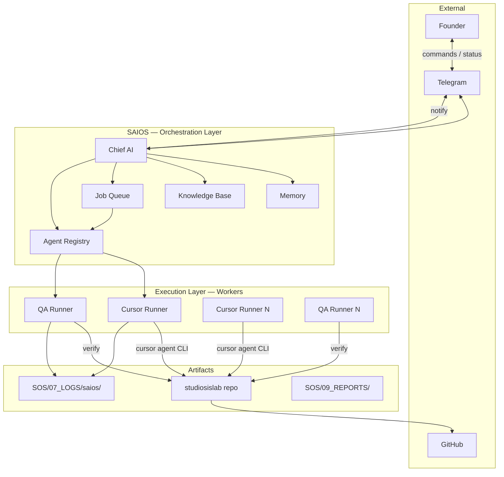

# SAIOS Architecture — Version 1

## Mission

Enable a **24/7 AI software company** dedicated to StudiosisLab where:

- The **Founder** communicates only with **Chief AI**
- **Chief AI** never writes production code
- **Cursor Agents** perform all implementation
- **QA Runners** perform verification
- Progress and outcomes flow back to the Founder via established notification channels

---

## System context



---

## Layer model

| Layer | Components | May write `src/`? |
|-------|------------|-------------------|
| **Intake** | Telegram → Chief AI | No |
| **Orchestration** | Chief AI, Job Queue, Agent Registry, Memory | No |
| **Execution** | Cursor Runner, QA Runner | Yes (via Cursor Agent only) |
| **Persistence** | Job store, registry store, memory store, logs | Metadata only |
| **Knowledge** | Knowledge Base (markdown corpus) | Chief AI curates; workers read |

---

## Component responsibilities

### Chief AI

Single brain for founder-facing operations. Translates natural language into **jobs** and **execution plans**. Monitors job state. Emits founder notifications. Does not spawn processes directly — delegates to Job Queue and Agent Registry.

### Agent Registry

Catalog of **worker types** (cursor-dev, cursor-qa, future: research, seo-audit) and **worker instances** (running, idle, retired). Maps capabilities to job requirements.

### Job Queue

Authoritative store of work. States: `pending`, `running`, `blocked`, `completed`, `cancelled`. Supports parent/child jobs and dependency edges.

### Cursor Runner

Only component allowed to invoke **Cursor Agent CLI** for implementation. Reads job prompt artifact, runs `cursor agent --print`, writes execution report. Never interprets founder intent — executes assigned job spec.

### QA Runner

Verification-only. Consumes completed implementation jobs, runs verification profile (build, lint, checklist, or Cursor verify pass). Produces pass/fail report. Multiple QA worker types supported via registry.

### Memory

Three tiers: **session** (conversation), **project** (StudiosisLab state), **long-term** (durable founder preferences and decisions). Chief AI reads/writes; workers receive scoped snapshots in job context.

### Knowledge Base

Filesystem-indexed corpus (existing `SOS/01_KNOWLEDGE/` + extensions). Injected into job prompts by Chief AI. Not executable.

---

## Job lifecycle (summary)

See [LIFECYCLE.md](./LIFECYCLE.md) for full state machines.

```
pending → running → completed
         ↘ blocked → pending (unblock)
         ↘ cancelled
```

Typical implementation flow:

1. Founder message → Chief AI creates parent job `JOB-…-plan`
2. Chief AI decomposes → child jobs `JOB-…-impl`, `JOB-…-qa`
3. Registry assigns `cursor-dev` worker → Cursor Runner claims job
4. On impl complete → QA Runner claims verify job
5. Chief AI aggregates → notifies Founder

---

## Trust boundaries

| Boundary | Rule |
|----------|------|
| Chief AI ↔ Repo | Read-only except `SOS/SAIOS/`, `SOS/07_LOGS/saios/`, job artifacts |
| Cursor Runner ↔ Repo | Full write via Cursor Agent within job scope |
| QA Runner ↔ Repo | Read + run commands; no feature implementation |
| Founder ↔ Telegram | Intake and notify only in target architecture |

---

## ID conventions (v1)

| Entity | Format | Example |
|--------|--------|---------|
| Job | `JOB-YYYYMMDD-HHMMSS-{slug}` | `JOB-20260706-143000-mobile-hub` |
| Worker instance | `WRK-{type}-{shortid}` | `WRK-cursor-dev-a1b2` |
| Worker type | kebab-case | `cursor-dev`, `cursor-qa` |
| Execution report | `RPT-{job_id}.json` | under `07_LOGS/saios/reports/` |
| Prompt artifact | `PRM-{job_id}.md` | under `07_LOGS/saios/prompts/` |

---

## Non-goals (v1 foundation)

- Implementing runners or Chief AI runtime code
- Modifying `SOS/runtime/` PM/Developer/QA
- Product features (resume, SEO, templates)
- PostgreSQL/Redis (documented in EXPANSION.md only)
- GitHub automation (documented as phase 2)

---

## Version history

| Version | Date | Change |
|---------|------|--------|
| 1.0.0 | 2026-07-06 | Initial architecture foundation (AGENT #037) |

---

## Authoritative model & execution strategy (Agent #115)

Operational model routing, OpenAI/provider-neutral adapter policy, Resume Department enablement, Website Department disablement, approval channels, cost controls, and VPS process plan are locked in:

**[`SOS/SAIOS/AIOS_MODEL_AND_EXECUTION_STRATEGY.md`](./AIOS_MODEL_AND_EXECUTION_STRATEGY.md)**

This architecture document remains the v1 foundation. Where they differ on model/execution policy, the strategy document above is authoritative.
