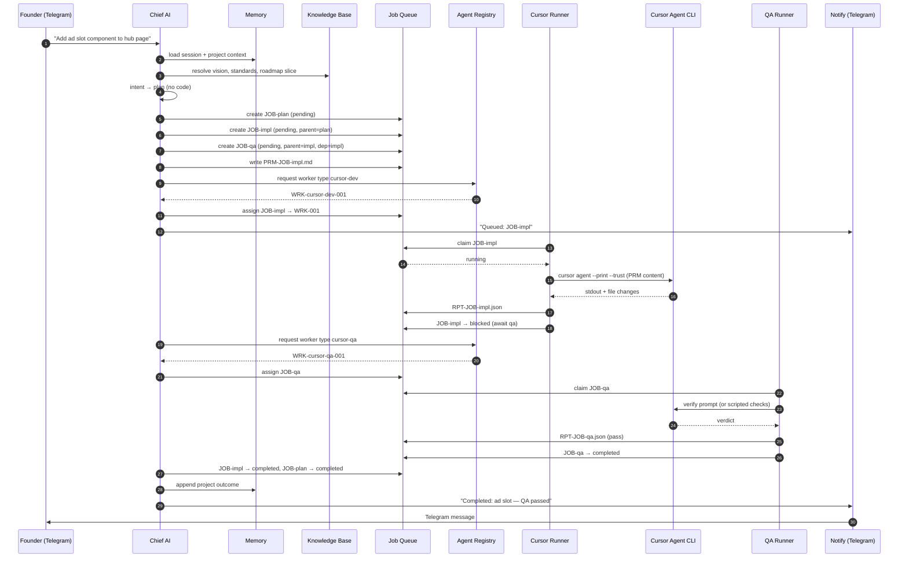
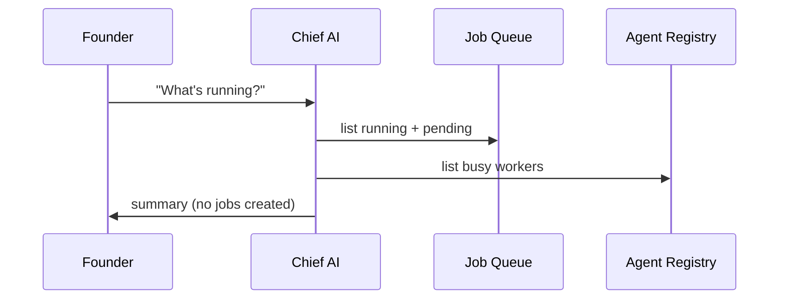
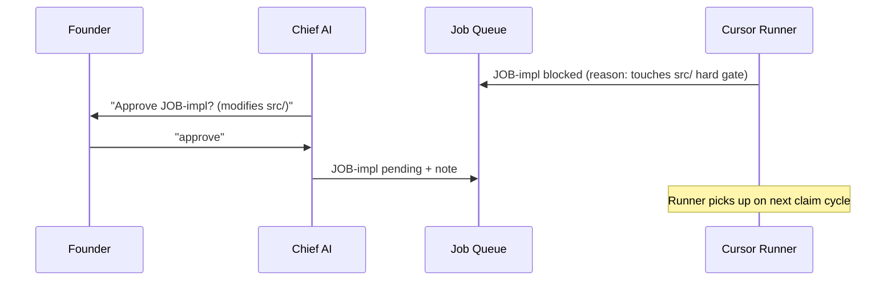
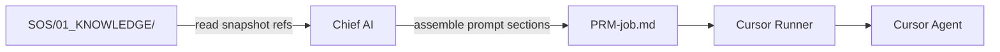
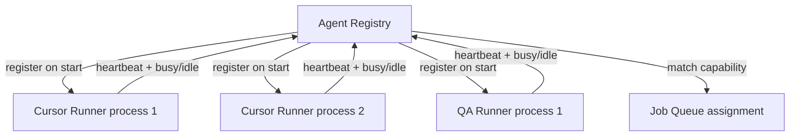

# SAIOS Interaction Flows — Version 1

## Flow 1 — Founder command → implementation → notification

---

## Flow 2 — Status query (no execution)

Chief AI **does not** spawn Cursor for status queries.

---

## Flow 3 — Approval gate (blocked job)

Approvals are orchestration decisions. Chief AI unblocks; runners resume.

---

## Flow 4 — Knowledge injection into worker prompt

Prompt sections (mandatory):

1. Job metadata (id, priority, parent)
2. Founder instruction (verbatim)
3. Knowledge appendix (paths + excerpts)
4. Memory snapshot (session + project relevant lines)
5. Safety rules (scope, no secrets, no unrelated files)
6. Expected report format

---

## Flow 5 — Memory read/write boundaries

| Actor | Session | Project | Long-term |
|-------|---------|---------|-----------|
| Chief AI | R/W | R/W | R/W (curated) |
| Cursor Runner | R | R (append outcome) | R |
| QA Runner | — | R (append verify) | R |
| Founder | via Chief AI | via Chief AI | via Chief AI |

Workers never write long-term memory directly.

---

## Flow 6 — Agent Registry ↔ Runners

One runner process registers one worker instance. Multiple instances of same type allowed (parallel jobs in v2).

---

## Anti-patterns (forbidden in SAIOS)

| Anti-pattern | Correct pattern |
|--------------|-----------------|
| Chief AI edits `src/` | Create implement job → Cursor Runner |
| Cursor Runner prioritizes queue | Chief AI sets priority at create |
| QA Runner implements fixes | Fail → new implement child job |
| Worker writes founder memory | Report → Chief AI curates long-term |
| Telegram triggers Developer runtime | Telegram → Chief AI → Job Queue only |

---

## Interface touchpoints

All cross-module calls use contracts in `interfaces/types.ts`:

- `ChiefAI.createJobsFromIntent()`
- `JobQueue.create()`, `claim()`, `transition()`
- `AgentRegistry.register()`, `assign()`, `heartbeat()`
- `CursorRunner.execute()` (future)
- `QARunner.verify()` (future)
- `MemoryStore.read()`, `append()`
- `KnowledgeBase.resolveSnapshot()`

No implementation in v1 — signatures document the seams.
