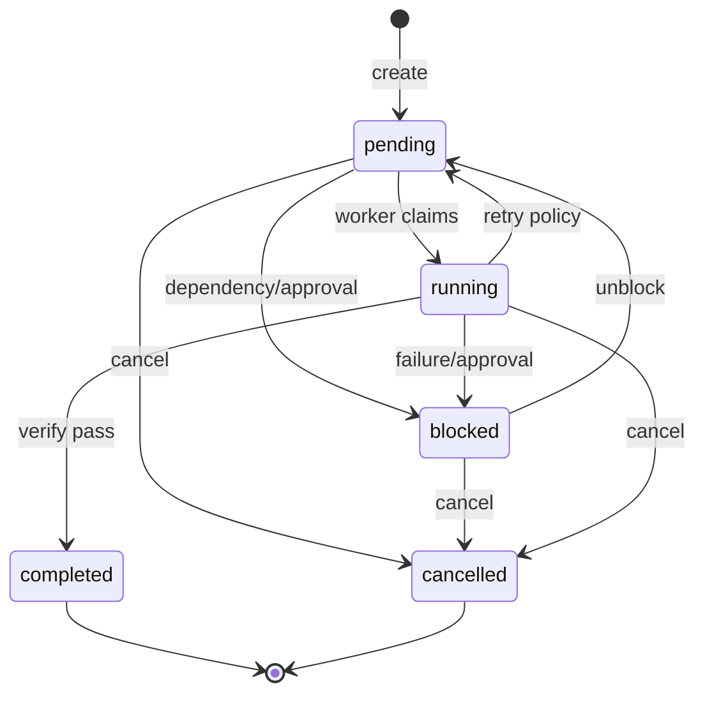
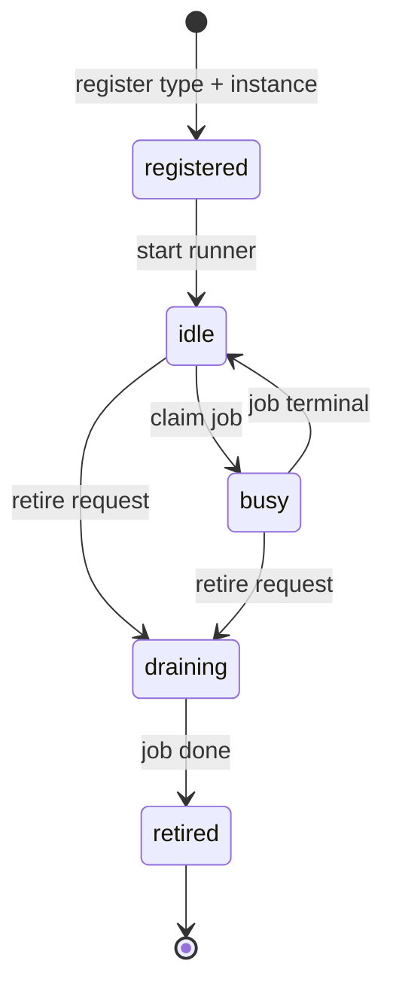
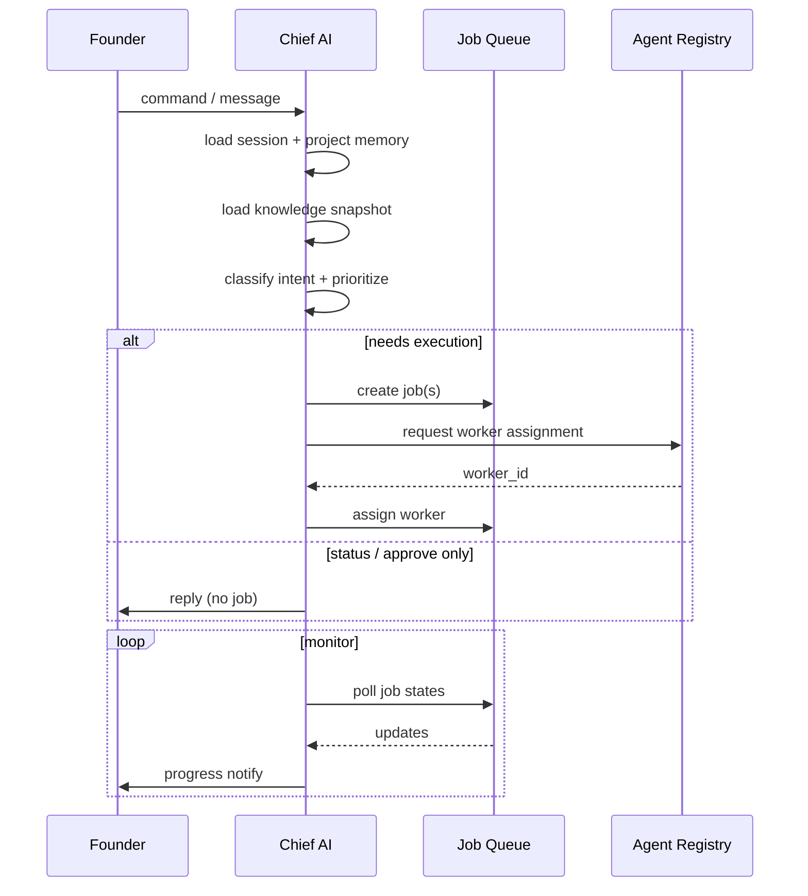

# SAIOS Lifecycles — Version 1

## Job lifecycle

### States

| State | Meaning | Entered by |
|-------|---------|------------|
| `pending` | Queued, dependencies satisfied, awaiting worker | Chief AI, unblock, retry |
| `running` | Assigned worker actively executing | Runner claim |
| `blocked` | Cannot proceed (dependency, approval, error policy) | Chief AI, Runner, QA |
| `completed` | Success criteria met | QA pass or Chief AI close |
| `cancelled` | Founder or Chief AI aborted | Founder command |

### State diagram



### Job types (v1)

| `job_type` | Runner | Parent typical |
|------------|--------|----------------|
| `plan` | Chief AI (orchestration only) | — |
| `implement` | Cursor Runner | plan job |
| `verify` | QA Runner | implement job |
| `research` | Cursor Runner (ask/plan mode) | plan job |
| `notify` | Chief AI | any terminal job |

### Timestamps (required on every job)

- `created_at` — job record created
- `updated_at` — any field change
- `started_at` — first transition to `running` (nullable)
- `completed_at` — terminal state (nullable)
- `blocked_at` — optional, last block entry

---

## Worker instance lifecycle

### States

| State | Meaning |
|-------|---------|
| `registered` | Known to registry, not running |
| `idle` | Ready to accept jobs |
| `busy` | Executing a job |
| `draining` | Finishing current job, no new claims |
| `retired` | Permanently removed |



---

## Chief AI decision cycle



---

## Implementation job lifecycle (Cursor Runner)

1. **Claim** — Runner polls `pending` jobs where `job_type=implement` and `assigned_worker` matches
2. **Prepare** — Load `PRM-{job_id}.md`, knowledge appendix, memory snapshot
3. **Execute** — `cursor agent --print --trust --workspace {repo}`
4. **Report** — Write `RPT-{job_id}.json`; transition job to `blocked` (await QA) or spawn child `verify` job
5. **Release** — Worker returns to `idle`

Chief AI never enters steps 3–4.

---

## Verification job lifecycle (QA Runner)

1. **Claim** — `job_type=verify`, parent implement job `completed` or `running→handoff`
2. **Load** — Parent report + diff scope + acceptance criteria from job metadata
3. **Verify** — Scripted checks and/or Cursor Agent verify pass
4. **Report** — `RPT-{job_id}.json` with `verdict: pass|fail`
5. **Handoff** — On pass: parent chain `completed`; on fail: child `implement` retry job or `blocked`

---

## Dependency resolution

Job B depends on Job A:

- B stays `pending` until A is `completed`
- If A is `cancelled`, Chief AI policy decides: cancel B or unblock with note
- Circular dependencies rejected at create time

---

## Parent / child jobs

```
JOB-…-epic (plan)
├── JOB-…-impl-1 (implement)
│   └── JOB-…-qa-1 (verify)
├── JOB-…-impl-2 (implement)
│   └── JOB-…-qa-2 (verify)
└── JOB-…-notify (notify)  ← depends on all qa children
```

Parent job remains `running` until all required children terminal. Chief AI aggregates progress for Founder status.
