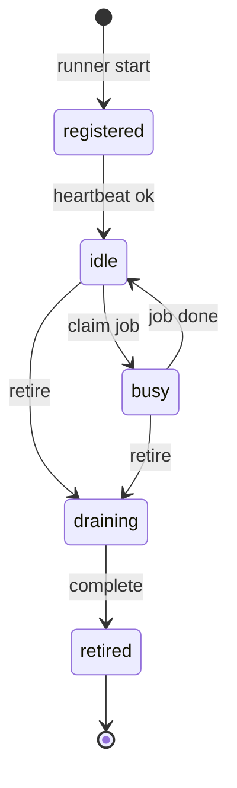

# Agent Registry Module

**Role:** Authoritative catalog of worker **types** and **instances**. Matches jobs to capable workers.

---

## Responsibilities

| Responsibility | Description |
|----------------|-------------|
| Register worker types | Define capabilities, version, owner |
| Create worker instances | On runner process start |
| Retire workers | Graceful drain + deregister |
| Track capabilities | What each type can execute |
| Track status | idle, busy, draining, retired |
| Track owner | Process/service that registered instance |
| Version workers | Type schema version for prompt compatibility |

---

## Concepts

### Worker type (template)

A **class** of worker. Examples:

| `type_id` | Capabilities | Runner binary |
|-----------|--------------|---------------|
| `cursor-dev` | `implement`, `research` | Cursor Runner |
| `cursor-qa` | `verify` | QA Runner |
| `script-qa` | `verify` (build/lint only) | QA Runner (script mode) |

### Worker instance (runtime)

A **running registration** tied to one OS process.

```
WRK-cursor-dev-a1b2c3
  type_id: cursor-dev
  status: busy
  owner: cursor-runner@pid-12345
  version: 1.0.0
  current_job_id: JOB-20260706-143000-impl
  last_heartbeat: ISO8601
```

---

## Registry storage (v1.1+)

```
SOS/07_LOGS/saios/registry/
├── types/
│   ├── cursor-dev.json
│   └── cursor-qa.json
└── instances/
    ├── WRK-cursor-dev-a1b2c3.json
    └── WRK-cursor-qa-d4e5f6.json
```

---

## Lifecycle



---

## Assignment algorithm (v1)

1. Chief AI creates job with `required_capabilities[]`
2. Registry finds `idle` instances where `type.capabilities` ⊇ required
3. Prefer lowest `current_load`; tie-break oldest idle
4. Write `assigned_worker` on job; runner claims on next poll

Future: capability tags (`src-allowed`, `sos-only`, `read-only`).

---

## Heartbeat

Instances must heartbeat every 30s (configurable). Missing 3 intervals → `stale` → Chief AI may reassign job to new instance.

---

## Versioning

| Field | Purpose |
|-------|---------|
| `type_version` | Schema of worker type definition |
| `runner_version` | `SOS/SAIOS/runtime` package version |
| `cursor_agent_version` | From `cursor agent --version` |

Mismatch may block assignment for jobs requiring new features.

---

## Interfaces

See `WorkerType`, `WorkerInstance`, `AgentRegistry` in `interfaces/types.ts`.

---

## Expansion

- Pool workers (`cursor agent worker` cloud bridge)
- Geographic labels for VPS selection
- Founder-approved worker allowlist per job priority
