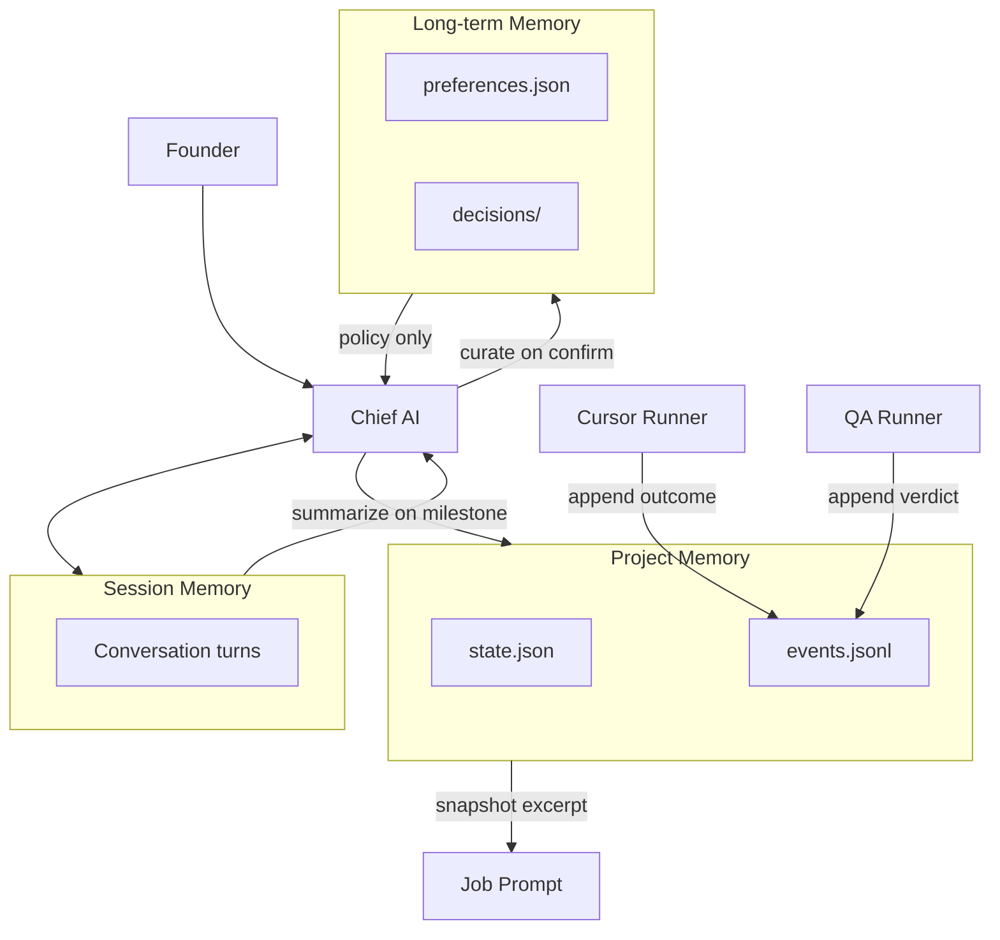

# Memory Module

**Role:** Layered retention of context across founder sessions, project evolution, and durable preferences.

---

## Three tiers

| Tier | Scope | TTL | Primary writer | Primary reader |
|------|-------|-----|----------------|----------------|
| **Session** | Current Telegram conversation | Hours–days | Chief AI | Chief AI |
| **Project** | StudiosisLab operational state | Weeks–months | Chief AI, runners (append) | Chief AI, prompt builder |
| **Long-term** | Founder preferences, ratified decisions | Indefinite | Chief AI (curated) | Chief AI, planner |

---

## Storage layout

```
SOS/07_LOGS/saios/memory/
├── session/
│   └── {chat_id}-{date}.jsonl      # append-only turns
├── project/
│   ├── state.json                  # current project snapshot
│   └── events.jsonl                # job outcomes, blockers
└── long-term/
    ├── preferences.json            # structured prefs
    └── decisions/                  # mirrors SOS/07_LOGS/decisions/
        └── {date}-{slug}.md
```

---

## Session memory

**Contents:**

- Recent founder messages + Chief AI replies
- Pending confirmations
- Last referenced job IDs
- Conversation subject (`last_intent`, `last_job_id`)

**Lifecycle:** Rotates daily or on explicit `/clear` (future). Not injected wholesale into worker prompts — Chief AI summarizes relevant lines.

**Legacy overlap:** `SOS/07_LOGS/commander/inbox-conversation.json` → migrate to session tier (future).

---

## Project memory

**Contents:**

- Active job summary (counts by state)
- Recent completions and failures
- Current worker utilization snapshot
- Roadmap slice in progress (refs only, not full backlog)
- Last known good deploy / build status (optional v1.2)

**Writers:**

- Chief AI — summary updates after state changes
- Runners — append-only outcome lines to `events.jsonl` (no direct `state.json` write)

**Readers:**

- Chief AI for status replies and planning
- Prompt builder — short "project context" section (max ~50 lines)

---

## Long-term memory

**Contents:**

- Founder communication preferences
- Ratified architecture decisions (SAIOS, stack choices)
- Repeated corrections ("never touch X")
- Stable business priorities (launch before revenue features)

**Curation rule:** Only Chief AI promotes session/project facts to long-term after explicit founder confirm or repeated pattern (3+ occurrences).

**Readers:** Planner and prioritizer only — not full dump to Cursor prompts.

---

## Interaction diagram



---

## Prompt injection rules

| Tier | In worker prompt? |
|------|-------------------|
| Session | Summary only (Chief AI filtered) |
| Project | Yes — short operational context |
| Long-term | Policy bullets only (safety, scope) |

Never inject raw session logs into Cursor Agent (token noise + leakage risk).

---

## Relation to Knowledge Base

| Memory | Knowledge |
|--------|-----------|
| Mutable, operational | Stable, documentary |
| Job outcomes, chat | Vision, standards, roadmap |
| `07_LOGS/saios/memory/` | `SOS/01_KNOWLEDGE/` |

Knowledge Base is **read-mostly**; Memory is **read-write** operational state.

---

## Interfaces

See `MemoryTier`, `MemoryStore`, `SessionRecord`, `ProjectState` in `interfaces/types.ts`.

---

## Expansion

- Vector search over long-term (optional v3)
- Founder memory export for audit
- Encrypted session store for multi-user future
