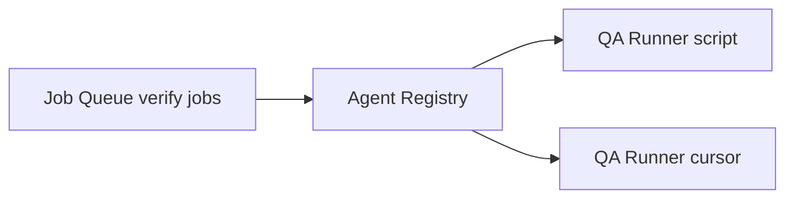

# QA Runner Module

**Role:** Verification only. Confirms implementation jobs meet acceptance criteria. **Never implements features.**

---

## Responsibilities

| Responsibility | Description |
|----------------|-------------|
| Claim verify jobs | `job_type=verify` from Job Queue |
| Load parent context | Implement job report + prompt + acceptance criteria |
| Run verification profile | Script checks and/or Cursor verify agent |
| Produce verdict | `pass` \| `fail` \| `inconclusive` |
| Write QA report | `RPT-{job_id}.json` |
| Support multiple QA workers | Registry types: `cursor-qa`, `script-qa` |

---

## Non-responsibilities

- Writing product code to fix failures
- Changing job priority
- Direct founder communication (reports → Chief AI)

On **fail**: QA Runner sets verdict; Chief AI creates retry implement job or escalates.

---

## Verification profiles (v1)

| Profile | Worker type | Checks |
|---------|-------------|--------|
| `founder-file` | script-qa | File exists, content match, allowlist |
| `sos-only` | script-qa | SOS path scope, report exists |
| `product` | cursor-qa | build, lint, acceptance criteria via agent |
| `full` | cursor-qa + script | build + agent review |

Profile selected in job `metadata.verify_profile`.

---

## Multi-worker architecture



Chief AI assigns `verify` jobs by required capability:

- `script-qa` — fast, deterministic CI checks
- `cursor-qa` — semantic review, complex acceptance

Same Job Queue, different worker types.

---

## QA report schema

```json
{
  "job_id": "JOB-…-qa",
  "parent_job_id": "JOB-…-impl",
  "worker_id": "WRK-cursor-qa-…",
  "verdict": "pass",
  "checks": [
    { "id": "build", "passed": true, "notes": "npm run build exit 0" }
  ],
  "finished_at": "ISO8601"
}
```

---

## Handoff to Chief AI

| Verdict | Chief AI action |
|---------|-----------------|
| `pass` | Complete parent chain; notify founder |
| `fail` | Retry or block; notify with summary |
| `inconclusive` | Block; request founder decision |

---

## Relation to legacy

| Legacy | QA Runner |
|--------|-----------|
| `SOS/runtime/src/qa/verifier.ts` | Replaced for product work |
| `qa/strategies/founder-file.ts` | Becomes `script-qa` profile |
| PM `reviewQaWork` | Chief AI `CompletionVerifier` |

---

## Interfaces

See `QARunner`, `QAReport`, `VerifyProfile` in `interfaces/types.ts`.

---

## Expansion

- Playwright E2E profile
- Separate security audit worker type
- QA parallelism independent of impl parallelism
