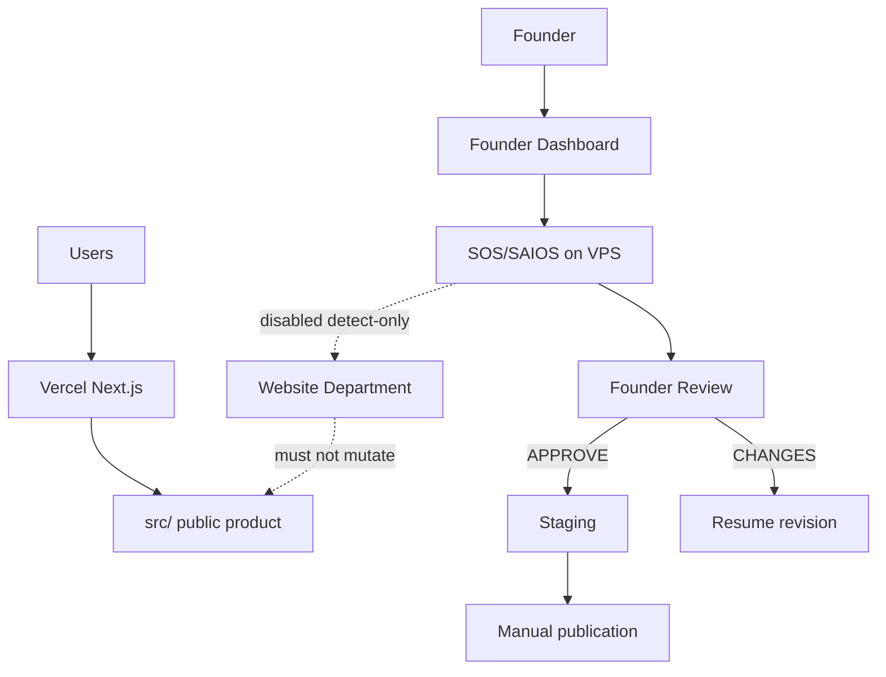

# StudiosisLab — Project Master

## 0. Document Authority

This file is the **canonical human-readable source of truth for the entire StudiosisLab project**.

It is not a department architecture document. It does not replace department masters or the machine checkpoint.

| Surface | Role |
|---|---|
| `SOS/STUDIOSISLAB_PROJECT_MASTER.md` | Human-readable project-wide truth (this file) |
| `SOS/RESUME_TEMPLATE_DEPARTMENT_MASTER.md` | Canonical deep master for the Resume Template Department |
| Other `SOS/*_DEPARTMENT_MASTER.md` | Created only when that department is active and needs one |
| `SOS/project-state.json` | Machine-readable current checkpoint |
| `AGENTS.md` | Cursor/agent operating rules (supporting; not the master) |
| Code + runtime evidence | Overrides stale prose |
| Historical reports, logs, fixtures | Immutable |

**Do not create a second project-wide master.** Do not turn `AGENTS.md` or `SOS/project-state.json` into the human master. Do not absorb department masters into this file.

### Required working protocol

**BEFORE any StudiosisLab task:**

1. Read this project-wide master.
2. Read the relevant department master, if one exists.
3. Read `SOS/project-state.json`.
4. Inspect the relevant current repository / runtime evidence.
5. State where the requested work sits in the global roadmap.
6. State whether the work advances the current authorized priority.
7. Only then plan or implement.

**AFTER every** audit, plan, implementation, commit, deploy, production proof, failure, Founder decision, architectural decision, or department status change — update the appropriate layer:

| Change kind | Update |
|---|---|
| Project-wide (roadmap, shared runtime, registry, priority) | This file + `SOS/project-state.json` |
| Department-specific | That department master + `SOS/project-state.json` |
| Cross-department | This file + affected department masters + `SOS/project-state.json` |
| Machine snapshot only (counts, history row, pending_actions) | `SOS/project-state.json`; also this file if the human narrative changed |

Every future Cursor Agent prompt must include:

> Read `SOS/STUDIOSISLAB_PROJECT_MASTER.md`, the relevant department master if one exists, and `SOS/project-state.json` before making any change, and update the appropriate documents before stopping.

Code and VPS evidence override this file when they disagree. Historical evidence is never mutated.

---

## 1. Executive Current State

Snapshot taken **2026-09-23T19:12:41+05:30** / **2026-09-23T13:42:41.000Z**.

| Field | Fresh value |
|---|---|
| LOCAL HEAD | `c6f143bc9a047fc15bee853c7de5e4eca5a14012` (`main`) |
| ORIGIN HEAD | `c6f143bc9a047fc15bee853c7de5e4eca5a14012` |
| VPS HEAD | `c6f143bc9a047fc15bee853c7de5e4eca5a14012` |
| PUBLIC PRODUCT | Next.js SaaS at `studiosislab.com` (Vercel) |
| AIOS CONTROL PLANE | Hetzner VPS `/root/studiosislab.com`; dashboard `127.0.0.1:4310` `{ok:true,live:false}` |
| CURRENT PROJECT PRIORITY | **Resume Template Department consolidation planning** |
| CURRENTLY ACTIVE DEPARTMENT | Resume Template Department (`CONSOLIDATION_REQUIRED`) |
| NEXT MAJOR PRODUCT DEPARTMENT | Website Analysis / QA / Development (not authorized as current work) |
| CORE FACTORY HISTORICAL GOAL | **MET** — do not erase |
| LIVE `OPERATIONALLY_COMPLETE` | **NOT ASSERTED** |
| PUBLICATION | Manual; `SOS_AIOS_PUBLICATION_AUTO_APPLY=0` |
| LIVE GENERATION | Guarded; `SOS_AIOS_LIVE=0` |
| PRIMARY BLOCKERS | Resume feedback-compiler / completeness fragmentation; generation geometry admission gap; no true Resume E2E harness; Website still disabled |
| NEXT AUTHORIZED STEP | Resume Template Department consolidation planning — not another OA retry, not Website activation |

---

## 2. What StudiosisLab Is

StudiosisLab is a public SaaS website for resume building, template browsing, and related document tools, operated with an AIOS control plane.

**User-facing product (Vercel / `src/`):**

- Resume Hub and published template catalog
- Desktop and mobile Fabric.js editors
- Auth, save, PDF/PNG export
- SEO template landing pages
- E-sign tools (existing product surface; not a current department)
- Marketing, blog, games (lower priority)

**AIOS (Hetzner VPS / `SOS/SAIOS/`):**

- Autonomous Resume Template generation, Founder Review, revision, memory, staging, guarded publication
- Founder Dashboard
- Detect-only Website Department (installed, disabled)
- Shared notifications, cost ledger, evidence under `SOS/07_LOGS/saios/`

Founder vision (supporting): launch a real product strangers can find, edit, and download. Traffic before monetization. See `SOS/01_KNOWLEDGE/Founder_Vision.md`.

---

## 3. Product and Control-Plane Architecture

```
Internet users
    → Vercel → Next.js App Router (`src/`)
                 editor / hub / SEO pages / e-sign / marketing

Founder
    → Telegram / Dashboard
    → AIOS on Hetzner VPS (`SOS/SAIOS/`)
         generation → Founder Review → revision → memory
         staging → manual publication packages
         Website Department (disabled, detect-only)

Shared checkpoint: SOS/project-state.json
Public catalog apply: Founder / manual (AUTO_APPLY off)
```



VPS must not serve `studiosislab.com` production traffic. Vercel must not run the AIOS control plane. Locked strategy: `SOS/SAIOS/AIOS_MODEL_AND_EXECUTION_STRATEGY.md`.

---

## 4. Technology and Runtime

Verified from `package.json` and current ops docs (2026-09-23):

| Layer | Current |
|---|---|
| Public app | Next.js `16.0.10`, React `19.2.1`, TypeScript, Tailwind `^4.1.18`, Fabric.js `^6.9.1`, Firebase `^12.8.0` |
| Hosting | Vercel (public site) |
| AIOS code | Node / tsx under `SOS/SAIOS/` |
| AIOS host | Hetzner VPS `root@178.104.94.0:/root/studiosislab.com` |
| Founder UI | Vite dashboard; systemd `aios-founder-dashboard.service` |
| Provider | Bounded OpenAI when authorized; `SOS_AIOS_LIVE=0` refuses live produce |
| Evidence | JSON / JSONL under `SOS/07_LOGS/saios/` (VPS authoritative for live counts) |
| Git | `main` → `origin` → VPS fast-forward only |

```
src/                                 Public website, editor, tools, e-sign
templates.manifest.json              Published catalog source
SOS/SAIOS/core/                      Resume generation / revision / memory / critic
SOS/SAIOS/dashboard                  Canonical Founder Dashboard
SOS/SAIOS/runtime/website-department Detect-only Website Department
SOS/SAIOS/runtime/*-department       Platform Notification / Security / Timeline
SOS/07_LOGS/saios/                   Immutable / operational evidence
SOS/project-state.json               Machine checkpoint
```

---

## 5. Department Registry

Derived from `AGENTS.md`, `SOS/project-state.json`, `SOS/SAIOS/infra/department-enablement.json`, and installed runtime folders. **SDK placeholders are not departments.**

### Product / roadmap departments

| Department | Status | Active now? | Canonical master | Primary locations | Notes |
|---|---|---|---|---|---|
| Resume Template | **CONSOLIDATION_REQUIRED** | **YES** | [RESUME_TEMPLATE_DEPARTMENT_MASTER.md](./RESUME_TEMPLATE_DEPARTMENT_MASTER.md) | `SOS/SAIOS/core/first-production-cycle`, `founder-revision`, `founder-memory`, `founder-review`, `resume-renderer`, `resume-critic`, `role-integrity`, `staging`, publication | Historical core factory goal **met**. Live complete **not** asserted. |
| Website Analysis / QA / Development | **DISABLED / PARTIAL** | No | None — do not create yet | `SOS/SAIOS/runtime/website-department`; public app `src/` | Phase 1 + 2A `LOCAL_VERIFIED` 2026-09-03. Phase 2B code present. `enabled=false`. Next major product department after Resume consolidation. |
| SEO | **PLANNED** | No | None | Product: `src/data/templateSeoContent.ts`, `src/lib/templateSeo.ts`, `/resume/[slug]`; Website checker `SEOHealthChecker.ts` | Not a department runtime. |
| Paid Ads / Traffic | **PLANNED** | No | None | No department directory | Roadmap item 4 only. |
| Revenue / Monetization | **PLANNED** | No | None | `src/components/AdSenseSlot.tsx`; `SOS/01_KNOWLEDGE/Revenue_Model.md` is TODO | Do not click live ads or invent impressions. |
| AIOS System Audit / Optimization | **DEFERRED** | No | None | Not established | E-sign / API / Firebase / unused-route findings. Do not reopen during Website work unless they block the authorized task. |

`department-enablement.json` currently lists only `resume` (enabled, dry-run flags stale vs live ops) and `website` (disabled). Treat enablement JSON as topology, not live Resume operational truth.

### Platform / supporting departments (not product roadmap)

| Department | Class | Status | Docs | Do not treat as |
|---|---|---|---|---|
| Notification | LEGACY / SUPPORTING | Installed; July 2026 dry-run last_run; later Resume Telegram failure alerts exist | `SOS/SAIOS/runtime/notification-department/README.md` | Current product priority |
| Security (AIOS health) | LEGACY / SUPPORTING | Installed; operational health, **not** product cybersecurity | `SOS/SAIOS/runtime/security-department/README.md` | System Audit department |
| Timeline | LEGACY / SUPPORTING | Installed; July 2026 last_run | `SOS/SAIOS/runtime/timeline-department/README.md` | Product department |

**Not departments:** Founder Dashboard, publication workflow, OpenAI provider, systemd, e-sign product surface, blog/games, Department SDK placeholders (`marketing`, `publisher`, `finance`, `support`, `hr`, `legal`), legacy `SOS/runtime` Commander/PM/Developer.

---

## 6. Global Roadmap

Founder-locked order (do not jump unless Founder changes priority):

1. **Resume Template Department** — historically factory-capable; **current work is consolidation**. Not live `OPERATIONALLY_COMPLETE`.
2. **Website Analysis / QA / Development** — next major product department; detect-only until Founder enables.
3. **SEO**
4. **Paid acquisition / campaigns**
5. **Ad placement and monetization**

Deferred parallel track (not in the numbered sequence above): **AIOS System Audit / Optimization**.

Current authorized position: **item 1, consolidation planning**. Website Phase 2B remains recorded but is not the current authorized step.

Department may be marked live `OPERATIONALLY_COMPLETE` only when that department’s own closure criteria are actually satisfied. Isolated verifier PASS is not enough. Resume closure criteria live in the Resume master, section 30.

---

## 7. Shared Systems and Dependencies

```
Resume Template ──uses──► Founder Dashboard, bounded OpenAI, Fabric renderer,
                          Founder Memory store, Telegram failure alerts,
                          staging / publication, project-state, VPS systemd

Website Dept ──inspects──► src/ public product (must not autonomously mutate or deploy)
Website Dept ──may alert──► Notification Department
Other depts ──request site work──► Website Department (engineering gateway)

Publication ──applies──► public catalog / Vercel site (manual; AUTO_APPLY=0)
SEO / Ads / Revenue ──will depend──► Website Department + public site
System Audit ──must not steal──► Website Department scope
```

| Shared system | Owner / location | Current posture |
|---|---|---|
| Founder Dashboard | `SOS/SAIOS/dashboard` | Active; read-only except Founder decisions |
| Bounded OpenAI | `SOS/SAIOS/core/providers/openai` | Do not call unless authorized |
| Cost ledger | `SOS/SAIOS/platform/cost-ledger` | Live spend tracked on VPS |
| Publication | publication-workflow + nightly timer | Plan/verify only; AUTO_APPLY off |
| Telegram | Notification adapter + Resume failure alerts | `NOTIFY_LIVE` used for failures; do not invent traffic |
| Git / GitHub | `origin/main` | FF-only production updates |
| Firebase | Public app auth/docs | No production mutations unless authorized |

---

## 8. Deployment and Runtime Posture

| Control | Current (2026-09-23T13:42Z unless noted) |
|---|---|
| `SOS_AIOS_LIVE` | `0` — correct guarded Resume posture; do not change casually |
| `SOS_AIOS_PUBLICATION_AUTO_APPLY` | `0` |
| Dashboard | Active since 2026-09-23 07:36:41 UTC (last Resume 6P deploy restart). Docs-only changes must not restart it. |
| Generation timers | Installed (08:50 / 17:50 Asia/Kolkata); standalone generation service disabled |
| Website Department | `enabled=false`, `scheduled_checks=false`, `autonomous_changes=false` |
| Public deploys | Vercel; not AIOS VPS |
| AIOS deploys | `git merge --ff-only origin/main` on VPS |
| Working tree | Local and VPS may contain unrelated dirty Website / e-sign / SOS files — **do not clean** |

Resume-specific queue / memory / revision counts belong in the Resume master. Last Resume ops snapshot: 2026-09-23T13:27:52.000Z.

---

## 9. Major Project-Wide Decisions

| Date (UTC) | Decision | Why | Reversible? |
|---|---|---|---|
| 2026-07-11 | VPS = AIOS control plane; Vercel = public site | Isolation of production traffic vs autonomous ops | Yes, Founder amendment |
| 2026-07-11 | Resume first; future departments default disabled | Quality before volume / later growth work | Yes, Founder priority change |
| 2026-09-02 | Historical Resume factory goal recorded met | Live generation + review + revision + memory + stage proven at that milestone | Historical fact — do not erase |
| 2026-09-03 | Website detect-only; no autonomous site mutation | Protect live user journeys | Policy |
| 2026-09-03 | E-sign/API/Firebase/unused-route findings deferred to System Audit | Keep Website scope bounded | Yes, Founder |
| 2026-09-23 | Resume live status = `CONSOLIDATION_REQUIRED` | Reconstruction audit: factory exists but department is not operationally complete | After real closure criteria |
| 2026-09-23 | One Resume department master | Human-readable department truth | No second Resume master |
| 2026-09-23 | One project-wide master (this file) | Cross-project truth without absorbing departments | No second project master |

---

## 10. Cross-Department Risks

| Risk | Why it matters | Current handling |
|---|---|---|
| Stale `OPERATIONALLY_COMPLETE` in `AGENTS.md`, historical project-state phases, and older reports | Agents may skip Resume consolidation or jump to Website | This file + live project-state keys are current; historical rows stay immutable |
| Resume compiler / completeness fragmentation (`revtask-5d933072-daf`) | Blocks truthful department closure | Consolidation planning; **do not retry** that task |
| Generation can still admit geometry defects to Review | Founder becomes the QA gate | Recorded in Resume master; not a Website problem |
| Dirty local/VPS trees | Unrelated Website/e-sign work can be destroyed by broad git | Explicit staging only |
| Website enablement before Resume consolidation | Violates roadmap and current pending_actions | Website stays disabled |
| Treating SDK placeholders as real departments | Fake activation of SEO/Marketing/HR/Legal | Registry above is authoritative |
| Clicking live ads or generating impressions | Policy violation | Forbidden unless Founder authorizes |
| Using chat history as truth | Drift | Read this file, department master, project-state, then code |

---

## 11. Planned / Not Activated

Do **not** create department masters or enable these until Founder authorizes and repository evidence shows a real department:

- Website Department enablement / scheduled checks / production browser journeys
- SEO Department
- Paid Ads / Traffic Department
- Revenue / Monetization Department
- AIOS System Audit / Optimization Department

Website already has implementation and a README. That is **PARTIAL**, not activation, and not a reason to create `SOS/WEBSITE_DEPARTMENT_MASTER.md` in this baseline.

---

## 12. Legacy, Supporting, Historical Documentation

Preserve all of these. Do not delete, merge, or rewrite to make the hierarchy look clean.

| File / set | Class | Use |
|---|---|---|
| `AGENTS.md` | CURRENT SUPPORTING | Agent safety + protocol; must stay aligned with this file |
| `SOS/project-state.json` | CURRENT SUPPORTING | Machine checkpoint |
| `SOS/RESUME_TEMPLATE_DEPARTMENT_MASTER.md` | CURRENT | Resume depth |
| `SOS/SAIOS/AIOS_MODEL_AND_EXECUTION_STRATEGY.md` | SPECIALIZED | Locked VPS/Vercel/model decisions |
| `SOS/SAIOS/ARCHITECTURE.md` / `SOS/SAIOS/README.md` | SPECIALIZED / HISTORICAL | SAIOS v1 freeze; not live ops |
| `SOS/01_KNOWLEDGE/Founder_Vision.md` | CURRENT SUPPORTING | Launch values |
| `SOS/01_KNOWLEDGE/Launch_Strategy.md`, `Product_Priorities.md`, `StudiosisLab.md`, `StudiosisLab_Project_Map.md` | HISTORICAL / PARTIAL | Product intent; dates 2026-06 |
| `SOS/01_KNOWLEDGE/SAIOS_KNOWLEDGE_INDEX.md` | SPECIALIZED | Knowledge snapshot index |
| `SOS/01_KNOWLEDGE/Roadmap.md`, `Architecture.md`, `Revenue_Model.md` | STALE | TODO placeholders |
| `SOS/00_CONSTITUTION/*` | SPECIALIZED / INCOMPLETE | Mission/Vision still TODO |
| `SOS/PROJECT_STATUS.md` | HISTORICAL / STALE | Auto factory snapshot 2026-07-07 |
| `SOS/08_ROADMAP/MASTER_BACKLOG.md` | HISTORICAL | Name says MASTER; it is a 2026-06 backlog, not this file |
| `SOS/SAIOS/runtime/website-department/README.md` | CURRENT SUPPORTING | Website operator notes |
| Platform `*-department/README.md` | LEGACY / SUPPORTING | Notification / Security / Timeline |
| `SOS/09_REPORTS/**`, `SOS/SAIOS/AIOS_*_V1_REPORT.md` | HISTORICAL | Immutable phase reports |
| `SOS/07_LOGS/**` | HISTORICAL / IMMUTABLE | Evidence |
| Root `README.md` | STALE | create-next-app bootstrap |
| `.cursor/plans/*` | SPECIALIZED | Planning artifacts |

---

## 13. Current Next Authorized Work

**Exactly one authorized next major action:**

**Resume Template Department consolidation planning.**

Not:

- another Operations Analyst Request Changes retry
- a fix for `revtask-5d933072-daf` in this documentation baseline
- Website Phase 2B enablement
- SEO / Ads / Revenue activation
- architecture implementation of the Resume target compiler

Founder reviews this project master before consolidation planning begins.

Deep Resume blockers, closure criteria, and consolidation stages: [Resume Template Department Master](./RESUME_TEMPLATE_DEPARTMENT_MASTER.md).

---

## 14. Decision Register

| DATE/TIME | DECISION | WHY | EVIDENCE | ALTERNATIVES REJECTED | AFFECTED | REVERSIBLE? |
|---|---|---|---|---|---|---|
| 2026-09-23T19:12:41+05:30 | Create `SOS/STUDIOSISLAB_PROJECT_MASTER.md` as the only project-wide human master | Hierarchy audit: no existing Markdown was a living project index | Repo search; Resume master is department-only; `PROJECT_STATUS.md` / `MASTER_BACKLOG.md` / SAIOS README are stale or specialized | Reusing `PROJECT_STATUS.md` or `AGENTS.md`; absorbing Resume master | Project docs, project-state pointer, `AGENTS.md` protocol | Yes — keep file; do not fork a second master |
| 2026-09-23T19:12:41+05:30 | Do not create Website/SEO/Ads/Revenue masters now | Those departments are disabled or planned | `department-enablement.json`; Website `enabled=false`; no SEO/Ads/Revenue department runtime | Empty stub masters | Planned departments | Yes when a department is actually activated |

---

## 15. Change Log

Append-only. Do not overwrite historical entries.

| DATE/TIME | PHASE/TASK | PURPOSE | BEFORE | CHANGE | FILES | TESTS | COMMIT | DEPLOY | LIVE PROOF | RESULT | NEW RISKS | NEXT STEP |
|---|---|---|---|---|---|---|---|---|---|---|---|---|
| 2026-09-23T19:12:41+05:30 | Project-wide master baseline | Establish one human project source of truth | No project-wide master; Resume master existed; `AGENTS.md` still said Resume `OPERATIONALLY_COMPLETE` | Added this file; project-state pointer; `AGENTS.md` now points here and records Resume `CONSOLIDATION_REQUIRED` | `SOS/STUDIOSISLAB_PROJECT_MASTER.md`, `SOS/project-state.json`, `AGENTS.md`, Resume master authority pointer | Docs/state only | *(filled after commit)* | FF-only if safe; no service restart | None | Project documentation hierarchy established | Agents may still read stale historical `OPERATIONALLY_COMPLETE` rows — those remain historical | Resume Template Department consolidation planning |

---

## 16. Documentation Hierarchy (summary)

```
SOS/STUDIOSISLAB_PROJECT_MASTER.md          ← this file
        ↓
SOS/RESUME_TEMPLATE_DEPARTMENT_MASTER.md    ← only existing department master
        ↓
SPECIALIZED / SUPPORTING / HISTORICAL docs

SOS/project-state.json                      ← machine checkpoint
  studiosislab_project_master_doc
  resume_template_department_master_doc
```
