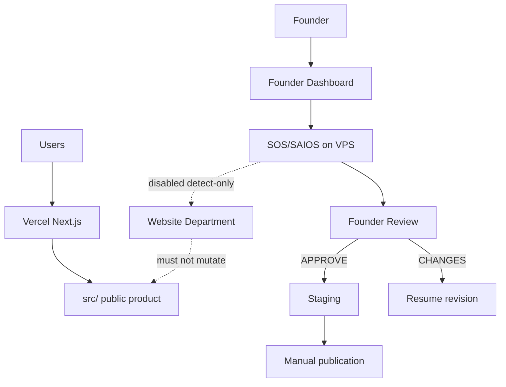

# StudiosisLab — Project Master

## 0. Document Authority

This file is the **canonical human-readable source of truth for the entire StudiosisLab project**.

It is not a department architecture document. It does not replace department masters or the machine checkpoint.

| Surface | Role |
|---|---|
| `SOS/STUDIOSISLAB_PROJECT_MASTER.md` | Human-readable project-wide truth (this file) |
| `SOS/RESUME_TEMPLATE_DEPARTMENT_MASTER.md` | Canonical deep master for the Resume Template Department |
| Other `SOS/*_DEPARTMENT_MASTER.md` | Created only when that department is active and needs one |
| `SOS/project-state.json` | Machine-readable current checkpoint |
| `AGENTS.md` | Cursor/agent operating rules (supporting; not the master) |
| Code + runtime evidence | Overrides stale prose |
| Historical reports, logs, fixtures | Immutable |

**Do not create a second project-wide master.** Do not turn `AGENTS.md` or `SOS/project-state.json` into the human master. Do not absorb department masters into this file.

### Required working protocol

**BEFORE any StudiosisLab task:**

1. Read this project-wide master.
2. Read the relevant department master, if one exists.
3. Read `SOS/project-state.json`.
4. Inspect the relevant current repository / runtime evidence.
5. State where the requested work sits in the global roadmap.
6. State whether the work advances the current authorized priority.
7. Only then plan or implement.

**AFTER every** audit, plan, implementation, commit, deploy, production proof, failure, Founder decision, architectural decision, or department status change — update the appropriate layer:

| Change kind | Update |
|---|---|
| Project-wide (roadmap, shared runtime, registry, priority) | This file + `SOS/project-state.json` |
| Department-specific | That department master + `SOS/project-state.json` |
| Cross-department | This file + affected department masters + `SOS/project-state.json` |
| Machine snapshot only (counts, history row, pending_actions) | `SOS/project-state.json`; also this file if the human narrative changed |

Every future Cursor Agent prompt must include:

> Read `SOS/STUDIOSISLAB_PROJECT_MASTER.md`, the relevant department master if one exists, and `SOS/project-state.json` before making any change, and update the appropriate documents before stopping.

Code and VPS evidence override this file when they disagree. Historical evidence is never mutated.

---

## 1. Executive Current State

Snapshot taken **2026-10-06T13:57:47+05:30** / **2026-10-06T08:27:47.000Z**.

| Field | Fresh value |
|---|---|
| LOCAL HEAD | runtime `81d2f4ab63e69543424ab0f94f212a1f9dc413c4` (`main`; compiler-dispatch deployed; this SoT record may sit one docs-follow commit above it) |
| ORIGIN HEAD | runtime `81d2f4ab63e69543424ab0f94f212a1f9dc413c4` |
| VPS HEAD | runtime `81d2f4ab63e69543424ab0f94f212a1f9dc413c4` (IR 1.4.5 + compiler-dispatch deployed; prior baseline `c1f253e`) |
| PUBLIC PRODUCT | Next.js SaaS at `studiosislab.com` (Vercel) |
| AIOS CONTROL PLANE | Hetzner VPS `/root/studiosislab.com`; dashboard `127.0.0.1:4310` `{ok:true,live:false}` |
| CURRENT PROJECT PRIORITY | **Website Analysis / QA / Development** — inspect existing repository/runtime state first |
| CURRENTLY ACTIVE DEPARTMENT | Website Analysis / QA / Development (priority only; runtime remains disabled / detect-only) |
| NEXT MAJOR PRODUCT DEPARTMENT | Website Analysis / QA / Development (current priority; not implemented in this maintenance run) |
| CORE FACTORY HISTORICAL GOAL | **MET** — do not erase |
| RESUME TEMPLATE STATUS | **`OPERATIONALLY_COMPLETE`** — C6 PASS; revision engineering `MAINTENANCE_REGRESSION_ONLY`; IR 1.4.5 deployed |
| PUBLICATION | Manual; `SOS_AIOS_PUBLICATION_AUTO_APPLY=0` |
| LIVE GENERATION | Guarded; `SOS_AIOS_LIVE=0` |
| PRIMARY BLOCKERS | **NONE** (Resume P0). Healthcare Administrator `revtask-adf420bb-a53` remains immutable `FAILED_COVERAGE`. Dental Hygienist `revtask-f67ce2e4-bb0` remains immutable `FAILED_COVERAGE`. Teaching Assistant `revtask-232a10da-349` remains immutable `FAILED_GATE`. Remaining Resume items are P1/P2 maintenance and do not reactivate the department. |
| NEXT AUTHORIZED STEP | **Resume Founder-to-public E2E business acceptance remains pending.** Do not retry `revtask-adf420bb-a53`, `revtask-f67ce2e4-bb0`, `revtask-232a10da-349`, or historical C5 tasks. `LIVE_RETRY_REQUIRED_AFTER_OFFLINE_PASS=NO`. `FOUNDER_E2E_BUSINESS_ACCEPTANCE_STATUS=PENDING_LIVE_E2E_PROOF`. Founder-directed successor after that E2E is SEO, not Website Department automation — do not start SEO or Website work in this stream. |

---

## 2. What StudiosisLab Is

StudiosisLab is a public SaaS website for resume building, template browsing, and related document tools, operated with an AIOS control plane.

**User-facing product (Vercel / `src/`):**

- Resume Hub and published template catalog
- Desktop and mobile Fabric.js editors
- Auth, save, PDF/PNG export
- SEO template landing pages
- E-sign tools (existing product surface; not a current department)
- Marketing, blog, games (lower priority)

**AIOS (Hetzner VPS / `SOS/SAIOS/`):**

- Autonomous Resume Template generation, Founder Review, revision, memory, staging, guarded publication
- Founder Dashboard
- Detect-only Website Department (installed, disabled)
- Shared notifications, cost ledger, evidence under `SOS/07_LOGS/saios/`

Founder vision (supporting): launch a real product strangers can find, edit, and download. Traffic before monetization. See `SOS/01_KNOWLEDGE/Founder_Vision.md`.

---

## 3. Product and Control-Plane Architecture

```
Internet users
    → Vercel → Next.js App Router (`src/`)
                 editor / hub / SEO pages / e-sign / marketing

Founder
    → Telegram / Dashboard
    → AIOS on Hetzner VPS (`SOS/SAIOS/`)
         generation → Founder Review → revision → memory
         staging → manual publication packages
         Website Department (disabled, detect-only)

Shared checkpoint: SOS/project-state.json
Public catalog apply: Founder / manual (AUTO_APPLY off)
```


```mermaid
flowchart TB
  Users[Users] --> Vercel[Vercel Next.js]
  Vercel --> Src[src/ public product]
  Founder[Founder] --> Dash[Founder Dashboard]
  Dash --> AIOS[SOS/SAIOS on VPS]
  AIOS --> Review[Founder Review]
  Review -->|APPROVE| Stage[Staging]
  Review -->|CHANGES| Rev[Resume revision]
  Stage --> Pub[Manual publication]
  AIOS -.->|disabled detect-only| WebDept[Website Department]
  WebDept -.->|must not mutate| Src
```

VPS must not serve `studiosislab.com` production traffic. Vercel must not run the AIOS control plane. Locked strategy: `SOS/SAIOS/AIOS_MODEL_AND_EXECUTION_STRATEGY.md`.

---

## 4. Technology and Runtime

Verified from `package.json` and current ops docs (2026-09-23):

| Layer | Current |
|---|---|
| Public app | Next.js `16.0.10`, React `19.2.1`, TypeScript, Tailwind `^4.1.18`, Fabric.js `^6.9.1`, Firebase `^12.8.0` |
| Hosting | Vercel (public site) |
| AIOS code | Node / tsx under `SOS/SAIOS/` |
| AIOS host | Hetzner VPS `root@178.104.94.0:/root/studiosislab.com` |
| Founder UI | Vite dashboard; systemd `aios-founder-dashboard.service` |
| Provider | Bounded OpenAI when authorized; `SOS_AIOS_LIVE=0` refuses live produce |
| Evidence | JSON / JSONL under `SOS/07_LOGS/saios/` (VPS authoritative for live counts) |
| Git | `main` → `origin` → VPS fast-forward only |

```
src/                                 Public website, editor, tools, e-sign
templates.manifest.json              Published catalog source
SOS/SAIOS/core/                      Resume generation / revision / memory / critic
SOS/SAIOS/dashboard                  Canonical Founder Dashboard
SOS/SAIOS/runtime/website-department Detect-only Website Department
SOS/SAIOS/runtime/*-department       Platform Notification / Security / Timeline
SOS/07_LOGS/saios/                   Immutable / operational evidence
SOS/project-state.json               Machine checkpoint
```

---

## 5. Department Registry

Derived from `AGENTS.md`, `SOS/project-state.json`, `SOS/SAIOS/infra/department-enablement.json`, and installed runtime folders. **SDK placeholders are not departments.**

### Product / roadmap departments

| Department | Status | Active now? | Canonical master | Primary locations | Notes |
|---|---|---|---|---|---|
| Resume Template | **OPERATIONALLY_COMPLETE** | No — maintenance/regression only | [RESUME_TEMPLATE_DEPARTMENT_MASTER.md](./RESUME_TEMPLATE_DEPARTMENT_MASTER.md) | `SOS/SAIOS/core/first-production-cycle`, `founder-revision`, `founder-memory`, `founder-review`, `resume-renderer`, `resume-critic`, `role-integrity`, `staging`, publication | Historical core factory goal **met**. C6 PASS. Do not reopen except for Founder-authorized maintenance after a real production failure. |
| Website Analysis / QA / Development | **DISABLED / PARTIAL** | **YES as project priority** (runtime still disabled) | None — do not create yet | `SOS/SAIOS/runtime/website-department`; public app `src/` | Phase 1 + 2A `LOCAL_VERIFIED` 2026-09-03. Phase 2B code present. `enabled=false`. Current authorized priority: inspect existing state first. |
| SEO | **PLANNED** | No | None | Product: `src/data/templateSeoContent.ts`, `src/lib/templateSeo.ts`, `/resume/[slug]`; Website checker `SEOHealthChecker.ts` | Not a department runtime. |
| Paid Ads / Traffic | **PLANNED** | No | None | No department directory | Roadmap item 4 only. |
| Revenue / Monetization | **PLANNED** | No | None | `src/components/AdSenseSlot.tsx`; `SOS/01_KNOWLEDGE/Revenue_Model.md` is TODO | Do not click live ads or invent impressions. |
| AIOS System Audit / Optimization | **DEFERRED** | No | None | Not established | E-sign / API / Firebase / unused-route findings. Do not reopen during Website work unless they block the authorized task. |

`department-enablement.json` currently lists only `resume` (enabled, dry-run flags stale vs live ops) and `website` (disabled). Treat enablement JSON as topology, not live Resume operational truth.

### Platform / supporting departments (not product roadmap)

| Department | Class | Status | Docs | Do not treat as |
|---|---|---|---|---|
| Notification | LEGACY / SUPPORTING | Installed; July 2026 dry-run last_run; later Resume Telegram failure alerts exist | `SOS/SAIOS/runtime/notification-department/README.md` | Current product priority |
| Security (AIOS health) | LEGACY / SUPPORTING | Installed; operational health, **not** product cybersecurity | `SOS/SAIOS/runtime/security-department/README.md` | System Audit department |
| Timeline | LEGACY / SUPPORTING | Installed; July 2026 last_run | `SOS/SAIOS/runtime/timeline-department/README.md` | Product department |

**Not departments:** Founder Dashboard, publication workflow, OpenAI provider, systemd, e-sign product surface, blog/games, Department SDK placeholders (`marketing`, `publisher`, `finance`, `support`, `hr`, `legal`), legacy `SOS/runtime` Commander/PM/Developer.

---

## 6. Global Roadmap

Founder-locked order (do not jump unless Founder changes priority):

1. **Resume Template Department** — historically factory-capable; **now `OPERATIONALLY_COMPLETE`**. Revision engineering is `MAINTENANCE_REGRESSION_ONLY`.
2. **Website Analysis / QA / Development** — current authorized project priority; detect-only until Founder enables. Inspect existing state before any continuation plan.
3. **SEO**
4. **Paid acquisition / campaigns**
5. **Ad placement and monetization**

Deferred parallel track (not in the numbered sequence above): **AIOS System Audit / Optimization**.

Current authorized position: **item 2**. Resume C1–C6 are complete. Website Phase 2B remains recorded; the next task is a repository-first / evidence-first inspect of the existing Website Department, not new architecture.

Resume was marked live `OPERATIONALLY_COMPLETE` only after C6 judged section 30 plus live/offline evidence sufficient. Isolated verifier PASS was not enough. Historical C5 FAIL / FALSE READY outcomes remain immutable.

---

## 7. Shared Systems and Dependencies

```
Resume Template ──uses──► Founder Dashboard, bounded OpenAI, Fabric renderer,
                          Founder Memory store, Telegram failure alerts,
                          staging / publication, project-state, VPS systemd

Website Dept ──inspects──► src/ public product (must not autonomously mutate or deploy)
Website Dept ──may alert──► Notification Department
Other depts ──request site work──► Website Department (engineering gateway)

Publication ──applies──► public catalog / Vercel site (manual; AUTO_APPLY=0)
SEO / Ads / Revenue ──will depend──► Website Department + public site
System Audit ──must not steal──► Website Department scope
```

| Shared system | Owner / location | Current posture |
|---|---|---|
| Founder Dashboard | `SOS/SAIOS/dashboard` | Active; read-only except Founder decisions |
| Bounded OpenAI | `SOS/SAIOS/core/providers/openai` | Do not call unless authorized |
| Cost ledger | `SOS/SAIOS/platform/cost-ledger` | Live spend tracked on VPS |
| Publication | publication-workflow + nightly timer | Plan/verify only; AUTO_APPLY off |
| Telegram | Notification adapter + Resume failure alerts | `NOTIFY_LIVE` used for failures; do not invent traffic |
| Git / GitHub | `origin/main` | FF-only production updates |
| Firebase | Public app auth/docs | No production mutations unless authorized |

---

## 8. Deployment and Runtime Posture

| Control | Current (2026-09-23T13:42Z unless noted) |
|---|---|
| `SOS_AIOS_LIVE` | `0` — correct guarded Resume posture; do not change casually |
| `SOS_AIOS_PUBLICATION_AUTO_APPLY` | `0` |
| Dashboard | Active since 2026-09-23 07:36:41 UTC (last Resume 6P deploy restart). Docs-only changes must not restart it. |
| Generation timers | Installed (08:50 / 17:50 Asia/Kolkata); standalone generation service disabled |
| Website Department | `enabled=false`, `scheduled_checks=false`, `autonomous_changes=false` |
| Public deploys | Vercel; not AIOS VPS |
| AIOS deploys | `git merge --ff-only origin/main` on VPS |
| Working tree | Local and VPS may contain unrelated dirty Website / e-sign / SOS files — **do not clean** |

Resume-specific queue / memory / revision counts belong in the Resume master. Last Resume ops snapshot: 2026-09-23T13:27:52.000Z.

---

## 9. Major Project-Wide Decisions

| Date (UTC) | Decision | Why | Reversible? |
|---|---|---|---|
| 2026-07-11 | VPS = AIOS control plane; Vercel = public site | Isolation of production traffic vs autonomous ops | Yes, Founder amendment |
| 2026-07-11 | Resume first; future departments default disabled | Quality before volume / later growth work | Yes, Founder priority change |
| 2026-09-02 | Historical Resume factory goal recorded met | Live generation + review + revision + memory + stage proven at that milestone | Historical fact — do not erase |
| 2026-09-03 | Website detect-only; no autonomous site mutation | Protect live user journeys | Policy |
| 2026-09-03 | E-sign/API/Firebase/unused-route findings deferred to System Audit | Keep Website scope bounded | Yes, Founder |
| 2026-09-23 | Resume live status = `CONSOLIDATION_REQUIRED` | Reconstruction audit: factory exists but department is not operationally complete | After real closure criteria |
| 2026-09-23 | One Resume department master | Human-readable department truth | No second Resume master |
| 2026-09-23 | One project-wide master (this file) | Cross-project truth without absorbing departments | No second project master |

---

## 10. Cross-Department Risks

| Risk | Why it matters | Current handling |
|---|---|---|
| Stale `OPERATIONALLY_COMPLETE` in `AGENTS.md`, historical project-state phases, and older reports | Agents may skip Resume consolidation or jump to Website | This file + live project-state keys are current; historical rows stay immutable |
| Resume compiler / completeness fragmentation (`revtask-5d933072-daf`) | Blocks truthful department closure | **C1 shipped offline**; do not retry that task; next is C4 |
| Founder Memory attached but poorly selected | Task-specific provisionals retrieved as layout law | **C3 shipped offline** (read-side learning class; JSONL intact) |
| Dirty local/VPS trees | Unrelated Website/e-sign work can be destroyed by broad git | Explicit staging only |
| Website enablement before Resume consolidation | Violates roadmap and current pending_actions | Website stays disabled |
| Treating SDK placeholders as real departments | Fake activation of SEO/Marketing/HR/Legal | Registry above is authoritative |
| Clicking live ads or generating impressions | Policy violation | Forbidden unless Founder authorizes |
| Using chat history as truth | Drift | Read this file, department master, project-state, then code |

---

## 11. Planned / Not Activated

Do **not** create department masters or enable these until Founder authorizes and repository evidence shows a real department:

- Website Department enablement / scheduled checks / production browser journeys
- SEO Department
- Paid Ads / Traffic Department
- Revenue / Monetization Department
- AIOS System Audit / Optimization Department

Website already has implementation and a README. That is **PARTIAL**, not activation, and not a reason to create `SOS/WEBSITE_DEPARTMENT_MASTER.md` in this baseline.

---

## 12. Legacy, Supporting, Historical Documentation

Preserve all of these. Do not delete, merge, or rewrite to make the hierarchy look clean.

| File / set | Class | Use |
|---|---|---|
| `AGENTS.md` | CURRENT SUPPORTING | Agent safety + protocol; must stay aligned with this file |
| `SOS/project-state.json` | CURRENT SUPPORTING | Machine checkpoint |
| `SOS/RESUME_TEMPLATE_DEPARTMENT_MASTER.md` | CURRENT | Resume depth |
| `SOS/SAIOS/AIOS_MODEL_AND_EXECUTION_STRATEGY.md` | SPECIALIZED | Locked VPS/Vercel/model decisions |
| `SOS/SAIOS/ARCHITECTURE.md` / `SOS/SAIOS/README.md` | SPECIALIZED / HISTORICAL | SAIOS v1 freeze; not live ops |
| `SOS/01_KNOWLEDGE/Founder_Vision.md` | CURRENT SUPPORTING | Launch values |
| `SOS/01_KNOWLEDGE/Launch_Strategy.md`, `Product_Priorities.md`, `StudiosisLab.md`, `StudiosisLab_Project_Map.md` | HISTORICAL / PARTIAL | Product intent; dates 2026-06 |
| `SOS/01_KNOWLEDGE/SAIOS_KNOWLEDGE_INDEX.md` | SPECIALIZED | Knowledge snapshot index |
| `SOS/01_KNOWLEDGE/Roadmap.md`, `Architecture.md`, `Revenue_Model.md` | STALE | TODO placeholders |
| `SOS/00_CONSTITUTION/*` | SPECIALIZED / INCOMPLETE | Mission/Vision still TODO |
| `SOS/PROJECT_STATUS.md` | HISTORICAL / STALE | Auto factory snapshot 2026-07-07 |
| `SOS/08_ROADMAP/MASTER_BACKLOG.md` | HISTORICAL | Name says MASTER; it is a 2026-06 backlog, not this file |
| `SOS/SAIOS/runtime/website-department/README.md` | CURRENT SUPPORTING | Website operator notes |
| Platform `*-department/README.md` | LEGACY / SUPPORTING | Notification / Security / Timeline |
| `SOS/09_REPORTS/**`, `SOS/SAIOS/AIOS_*_V1_REPORT.md` | HISTORICAL | Immutable phase reports |
| `SOS/07_LOGS/**` | HISTORICAL / IMMUTABLE | Evidence |
| Root `README.md` | STALE | create-next-app bootstrap |
| `.cursor/plans/*` | SPECIALIZED | Planning artifacts |

---

## 13. Current Next Authorized Work

**Exactly one authorized next major action:**

**Resume Founder-to-public E2E business acceptance remains pending.** Do not retry Healthcare, Dental, Teaching Assistant, or historical C5 tasks. Do not start Website automation or SEO in this stream. Website Analysis / QA / Development remains the recorded project priority after that E2E; inspect existing repository/runtime state first when that stream is authorized.

Resume Template Department is `OPERATIONALLY_COMPLETE` (C6 PASS, 2026-10-05). C1–C4 PASS. C5 remains six immutable live proofs: #1 FAIL, #2 FAIL, #3 FAIL, #4 FALSE READY, #5 FAIL, #6 FALSE READY. C6 pre-closure baseline was IR `founder-feedback-ir-1.4.3` at `37af692e0353878fd02e2bdabe0b948f58f3daf2` (historical). Prior deployed baseline was `c1f253e02fb0d6d730e6a55ee6e7c623ce21d154`. **Current deployed runtime** is `81d2f4ab63e69543424ab0f94f212a1f9dc413c4` with **deployed IR** `founder-feedback-ir-1.4.5` including Healthcare compiler-dispatch. `LIVE_RETRY_REQUIRED_AFTER_OFFLINE_PASS=NO`. Healthcare production `revtask-adf420bb-a53` remains immutable `FAILED_COVERAGE` with no child — do not retry. Dental `revtask-f67ce2e4-bb0` remains `FAILED_COVERAGE`. Teaching Assistant `revtask-232a10da-349` remains `FAILED_GATE`. False-READY children stay overlay `AUDIT_INVALID` / `NOT_DECISIONABLE`. Seventh C5 is not required. Remaining Resume P1/P2 items are maintenance backlog and do not reactivate the department. This run does not implement Website work, create a Website master, enable Website automation, or disturb dirty Website/e-sign files.

Deep record: [Resume Template Department Master](./RESUME_TEMPLATE_DEPARTMENT_MASTER.md) §29–§34.

---

## 14. Decision Register

| DATE/TIME | DECISION | WHY | EVIDENCE | ALTERNATIVES REJECTED | AFFECTED | REVERSIBLE? |
|---|---|---|---|---|---|---|
| 2026-09-23T19:12:41+05:30 | Create `SOS/STUDIOSISLAB_PROJECT_MASTER.md` as the only project-wide human master | Hierarchy audit: no existing Markdown was a living project index | Repo search; Resume master is department-only; `PROJECT_STATUS.md` / `MASTER_BACKLOG.md` / SAIOS README are stale or specialized | Reusing `PROJECT_STATUS.md` or `AGENTS.md`; absorbing Resume master | Project docs, project-state pointer, `AGENTS.md` protocol | Yes — keep file; do not fork a second master |
| 2026-09-23T19:12:41+05:30 | Do not create Website/SEO/Ads/Revenue masters now | Those departments are disabled or planned | `department-enablement.json`; Website `enabled=false`; no SEO/Ads/Revenue department runtime | Empty stub masters | Planned departments | Yes when a department is actually activated |
| 2026-09-29T15:22:52+05:30 | Resume next step = C1 Feedback Compiler IR; Website still not current | Planning pass complete; implementation not started | Resume master §29; VPS 5d933072 re-verified; HEAD `b1e07bb` | Starting C1 in this run; jumping to Website | Project priority | Yes |
| 2026-09-29T15:48:00+05:30 | Resume next step = C2 after C1 compiler ships; Website still not current | C1 offline proven; live 5d933072 not retried | C1 verifier + 6G–6P + 6L | Starting C2 in this run; jumping to Website | Project priority | Yes |
| 2026-09-29T15:56:26+05:30 | Resume next step = C3 after C2 geometry admission ships; Website still not current | C2 offline proven; generation and revision share one geometry kernel | C2 verifier + C1 + 5W + 6L + 6P | Starting C3 in this run; jumping to Website; enabling LIVE | Project priority | Yes |
| 2026-09-29T16:20:00+05:30 | Resume next step = C4 after C3 memory selection ships; Website still not current | C3 offline proven; read-side learning class; historical JSONL intact | C3 verifier + 6B/6C/6F + C1 + C2 | Starting C4 in this run; deleting provisionals; jumping to Website; enabling LIVE | Project priority | Yes |
| 2026-09-29T16:52:35+05:30 | Resume next step = C5 after C4 department harness ships; Website still not current | C4 offline proven; one harness calls production functions | C4 verifier + C1 + C2 + C3 + 6L | Starting C5 in this run; jumping to Website; enabling LIVE | Project priority | Yes |
| 2026-09-29T17:15:30+05:30 | C5 live proof FAIL; do not start C6; Website still not current | New Founder decision executed; canvas unchanged; C1 IR misclassified content+line requests | VPS task/IR/plan/coverage/canvas SHA identity | Approving the READY card; retrying the task; patching C1 in this run; starting C6 | Project priority | Yes |
| 2026-09-30T15:23:42+05:30 | Resume next step = Founder review of C1/C4 fulfillment correction, then one new live proof; Website still not current | C5 FAIL root cause corrected offline; historical C5 task immutable | C1+C2+C3+C4+6J PASS | Retrying C5; starting C6; jumping to Website; enabling LIVE | Project priority | Yes |
| 2026-09-30T15:48:31+05:30 | C5 live re-proof FAIL; do not retry; Website still not current | Decision hit historical C5 child; skills-stack not fulfilled; coverage fail-closed | VPS `fd-87ecc16c-f45` / `revtask-4a0c006c-507` | Retrying; patching IR; starting C6 | Project priority | Yes |
| 2026-09-30T16:58:00+05:30 | Second C5 offline correction; next is one fresh live proof if authorized; Website still not current | Audit-invalid READY stayed actionable; presentation compiled as verification | Overlay + IR 1.2.0 presentation; C1/C2/C3/C4/6O/actionability PASS | Candidate blacklist; retrying historical C5; C6 | Project priority + Resume architecture | Yes |
| 2026-09-30T17:42:00+05:30 | Third-C5 preflight not sufficient; close audit-invalid REJECT server hole; Website still not current | Server `decisionAllowedForValidity` still allowed crafted REJECT on NOT_DECISIONABLE | Generalized fail-closed ordinary decisions; actionability/identity/C1–C4 PASS | Admin-reject invention; candidate blacklist; rewriting historical READY; C6 | Founder Review actionability + dashboard server/UI | Yes |
| 2026-09-30T18:27:00+05:30 | Third C5 live proof FAIL; do not retry; Website still not current | Motion Designer Request Changes compiled as page-bottom extent; 32 alignment ops dropped; coverage fail-closed | VPS `fd-4e2c7c6a-eaa` / `revtask-3f5b2339-73e` | Retrying; patching IR; Approving; C6 | Project priority | Yes |
| 2026-10-01T15:06:31+05:30 | Post-third-C5 offline correction; fourth live proof not executed; Website still not current | IR could not represent range-scoped relational alignment; layout-only safety trials ran a false post-content-reflow baseline | IR 1.3.0 RELATIONAL_ALIGNMENT + group translation; dropUnsafe no-content baseline; C1/C2/C3/C4/6H/6O PASS | Phrase regex; Motion Designer special case; weakening overlap/OOB; provider-as-owner; C6 | Resume IR/fulfillment/pipeline/C4 | Yes |
| 2026-10-01T16:46:19+05:30 | Post-fourth-C5 offline correction; fifth live proof not executed; Website still not current | Categorical presentation IR + comma split + unsynced box + intra-box bypass produced false-positive READY | IR 1.4.0 structured presentation; atomic items; height sync; intra-box fulfillment; overlay on false-READY child; C1/C2/C3/C4/actionability PASS | Skills/Python/3 special cases; invented 3×N grid; rewriting historical READY; C6 | Resume IR/fulfillment/C4/overlay | Yes |
| 2026-10-01T18:30:42+05:30 | IR 1.4.1 material-constraint correction; fifth live proof not executed; Website still not current | IR 1.4 post-deploy: approximate cardinality made material beside/grouping optional; vertical bullets could still PASS | IR 1.4.1 cardinality vs material structure; unresolved material fail-closes overall fulfillment; real fourth-C5 parent replay; C1/C2/C3/C4/actionability PASS | Invented 3×N grid; phrase special cases; rewriting historical READY; C6 | Resume presentation/IR/fulfillment/C1/C4 | Yes |
| 2026-10-01T19:21:59+05:30 | Post-fifth-C5 bounded offline correction; sixth live proof not executed; Website still not current | Fifth C5 failed at pre-execution plan geometry on transient growth overlaps; header/Skills IR missed relation and presentation | IR 1.4.2 production-parity plan-geometry + relative placement + presentation precedence; C1/C2/C3/C4/6H/6O/6P/actionability PASS | Weakening C2; moving the gate later blindly; Skills/Campus Ambassador special cases; retrying fifth C5; C6 | Resume plan-geometry/IR/fulfillment/C1/C4 | Yes |
| 2026-10-05T15:13:32+05:30 | Final C5 offline safety closure after sixth false READY; no seventh live proof; Website still not current | Sixth C5 READY was false: header group/reference/preserve unfulfilled; generic rhythm addressed the item | Overlay on `…-revfb-fcfc81`; IR 1.4.3 group align+preserve + state-true coverage; C1/C2/C3/C4/6H/6O/6P/plan-geometry/actionability PASS | Seventh live proof; PT-ID/left=64 special cases; second English parser; rewriting historical READY; starting C6 in this run | Resume IR/fulfillment/coverage/C1/C4/overlay | Yes |
| 2026-10-05T15:36:00+05:30 | C6 Resume Template Department closure — mark `OPERATIONALLY_COMPLETE`; move project priority to Website | C6 audit found no true closure blocker; known silent safety bypass none; seventh C5 not required | C6 read-only audit vs production HEAD `37af692`; C1–C4 PASS; overlay containment; historical MM revision `revtask-94df0103-5c3` | Declaring closed without audit; seventh live proof; implementing Website or maintenance debt in this run; rewriting C5 history | Project priority + Resume status | Yes — remain closed unless a new real production failure reopens Resume |

---

## 15. Change Log

Append-only. Do not overwrite historical entries.

| DATE/TIME | PHASE/TASK | PURPOSE | BEFORE | CHANGE | FILES | TESTS | COMMIT | DEPLOY | LIVE PROOF | RESULT | NEW RISKS | NEXT STEP |
|---|---|---|---|---|---|---|---|---|---|---|---|---|
| 2026-09-23T19:12:41+05:30 | Project-wide master baseline | Establish one human project source of truth | No project-wide master; Resume master existed; `AGENTS.md` still said Resume `OPERATIONALLY_COMPLETE` | Added this file; project-state pointer; `AGENTS.md` now points here and records Resume `CONSOLIDATION_REQUIRED` | `SOS/STUDIOSISLAB_PROJECT_MASTER.md`, `SOS/project-state.json`, `AGENTS.md`, Resume master authority pointer | Docs/state only | *(filled after commit)* | FF-only if safe; no service restart | None | Project documentation hierarchy established | Agents may still read stale historical `OPERATIONALLY_COMPLETE` rows — those remain historical | Resume Template Department consolidation planning |
| 2026-09-29T15:22:52+05:30 | Resume consolidation plan | Record C1–C6; refresh stale SHA snapshot | Priority was consolidation planning; SHAs still showed `c6f143b` | Planning outcome + C1 as next implementation; no architecture code | This file; Resume master; project-state; `AGENTS.md` | Docs only | *(filled after commit)* | FF docs; no restart | None | Plan recorded; C1 not started | Agent may implement C1 without reading §29 | C1 Feedback Compiler IR |
| 2026-09-29T15:48:00+05:30 | C1 Feedback Compiler IR | One canonical Founder Request Changes interpretation | C1 not started; 6J preservation ledger | IR + mutation-only completeness; consumers migrated | Resume revision compiler files; this file; Resume master; project-state | C1 + 6G–6P + 6L | `6f97bb4` | FF + dashboard restart `20260929T101344Z` | None | C1 offline PASS | IR still regex-internal; live 5d933072 unchanged | C2 Shared geometry admission |
| 2026-09-29T15:56:26+05:30 | C2 Shared geometry admission | One deterministic geometry contract for generation + revision Founder Review admission | Generation used critic/readiness scores; revision used a separate overlap/OOB/page-fit mix | Shared kernel + generation gate + revision fail-closed reuse | Geometry admission module; critic-gate coupling; generation cycle; revision pipeline; this file; Resume master; project-state; `AGENTS.md` | C2 + C1 + 5W + 6L + 6P | `add19ab` | FF + dashboard restart `20260929T102935Z` | None | C2 offline PASS | False-positive page-fit; LIVE inflow may shrink | C3 Memory selection discipline |
| 2026-09-29T16:20:00+05:30 | C3 Memory selection discipline | Retrieve only scoped reusable Founder learning | Active/provisional task-specific rows injected as layout law | Read-side learning class; no JSONL rewrite; shared selector for generation/revision | Founder memory classifier/consumption/maturation; revision IR handoff; this file; Resume master; project-state; `AGENTS.md` | C3 + 6B/6C/6F + C1 + C2 | `baf3fe4` | FF + dashboard restart `20260929T105255Z` | None | C3 offline PASS | Over-filter of lookalike CONFIRMED text; parallel stores unused by selector | C4 Department production-parity harness |
| 2026-09-29T16:52:35+05:30 | C4 Department production-parity harness | One offline department workflow proof | Isolated verifiers; 6L revision-only | New harness calling production admission/revision/memory/staging functions | C4 harness; package.json; this file; Resume master; project-state; `AGENTS.md` | C4 + C1 + C2 + C3 + 6L | `5068ce3` | FF tests/docs; no restart | None | C4 offline PASS | Full generation persist not relocatable | C5 live Request Changes |
| 2026-09-29T17:15:30+05:30 | C5 One authorized live Request Changes | Prove C1–C4 on one new Founder decision | C5 preflight waiting; no new decision | Observed `fd-ef2226ce-0da` / `revtask-863f67a5-790` to READY; artifacts show unchanged canvas and C1 IR misclassification | This file; Resume master; project-state; `AGENTS.md` | Production evidence inspect only | docs dirty on `e58ef3f` | Docs only; no restart; no Approve | YES — FAIL | C5 FAIL; READY_FOR_C6=NO | C1 IR can send empty-plan READY | Founder reviews C5 failure |
| 2026-09-30T15:23:42+05:30 | C1/C4 semantic fulfillment correction | Stop false already-satisfied and content-add→layout ownership | C5 FAIL; IR 1.0.0 | IR 1.1.0 + canvas fulfillment predicates + strengthened C4 | Resume IR/fulfillment/coverage/pipeline; C4 harness; this file; Resume master; project-state; `AGENTS.md` | C1+C2+C3+C4+6J | `63d5278` | FF + dashboard restart | None | Offline correction PASS; READY_FOR_C6=NO | Unmodeled Founder phrasing on next live packet | Founder reviews correction; then one new live proof |
| 2026-09-30T15:48:31+05:30 | C5 live re-proof | Prove corrected IR on one new Founder decision | Correction deployed; Motion Designer preflight selected | Observed `fd-87ecc16c-f45` on historical C5 child, not Motion Designer; task FAILED_COVERAGE | This file; Resume master; project-state; `AGENTS.md` | Production evidence inspect | *(docs)* | FF docs; no restart; no Approve | YES — FAIL | C5 re-proof FAIL; READY_FOR_C6=NO | Skills-as-pointers still VERIFICATION; wrong review card | Founder reviews FAIL |
| 2026-09-30T16:58:00+05:30 | Second C5 bounded offline correction | Owner A actionability/identity + Owner B presentation semantics | Second C5 FAIL; IR 1.1.0; no audit-invalid overlay | IR 1.2.0 + overlay + identity bind + C4 presentation category | Resume review/revision files; this file; Resume master; project-state; `AGENTS.md` | C1+C2+C3+C4+6O+actionability | `fb6875f` | FF + dashboard restart | NO | Offline correction PASS; READY_FOR_C6=NO | side_by_side/columns not auto-applied; REJECT still server-allowed | One fresh live proof if authorized |
| 2026-09-30T17:42:00+05:30 | Audit-invalid server REJECT enforcement | Make UI and server agree: NOT_DECISIONABLE blocks all ordinary Founder decisions | Third-C5 preflight found crafted REJECT still allowed | `decisionAllowedForValidity` fail-closes all decisions; shared `evaluateFounderDecisionActionability`; UI copy aligned | Actionability module; dashboard server/UI; verifier; this file; Resume master; project-state; `AGENTS.md` | Actionability + identity + C1+C2+C3+C4 | `afc47be` | FF + dashboard restart | NO | Offline enforcement PASS; READY_FOR_C6=NO | Crafted POSTs to other non-review APIs | Motion Designer live Request Changes if authorized |
| 2026-09-30T18:27:00+05:30 | Third C5 live Request Changes | Prove IR 1.2 + actionability on one natural Motion Designer decision | Enforcement deployed at `afc47be`; Motion Designer waiting | Observed `fd-4e2c7c6a-eaa` / `revtask-3f5b2339-73e` FAILED_COVERAGE; canvas unchanged | This file; Resume master; project-state; `AGENTS.md` | Production evidence inspect | `46a237a` | FF docs; no restart; no Approve | YES — FAIL | Third C5 FAIL; READY_FOR_C6=NO | IR maps “till the bottom / align left” to page-bottom extent; `dropUnsafeGeometryOps` can zero an alignment plan | Read-only failure investigation |
| 2026-10-01T15:06:31+05:30 | Post-third-C5 bounded offline correction | Generalized range/group relational alignment + layout-only geometry trial baseline | Third C5 FAIL recorded; IR 1.2.0; heads snapshot still listed `afc47be` | IR 1.3.0 RELATIONAL_ALIGNMENT; deterministic group translation; provider IR contract; no-content reflow skipped in dropUnsafe; C4 extended | Resume IR/fulfillment/intent-scope/prompt/pipeline/C1/C4; this file; Resume master; project-state; `AGENTS.md` | C1+C2+C3+C4+6H+6O | `a0d6ad8` | FF + dashboard restart | NO | Offline correction PASS; fourth live proof NOT RUN; READY_FOR_C6=NO | Unmodeled relational phrasing; group translation is horizontal-only | Read-only fourth-C5 preflight if Founder authorizes |
| 2026-10-01T16:46:19+05:30 | Post-fourth-C5 bounded offline correction | Structured presentation contract + atomic items + measured text-box / intra-box usability | Fourth C5 FAIL / false-positive READY; IR 1.3.0 categorical presentation | IR 1.4.0 multi-constraint presentation; nest-aware items; height sync; intra-box fulfillment; overlay on `…-revfb-71bd11`; C4 extended | Resume presentation/IR/fulfillment/C1/C4/overlay; this file; Resume master; project-state; `AGENTS.md` | C1+C2+C3+C4+actionability | `b8cf882` | FF + dashboard restart | NO | Offline Owners 1–2 PASS; IR 1.4 did not itself pass the later material-constraint gate; fifth live proof NOT RUN; READY_FOR_C6=NO | Approximate cardinality still weakened material grouping | IR 1.4.1 material-constraint correction |
| 2026-10-01T18:30:42+05:30 | IR 1.4.1 material presentation constraint | Approximate cardinality must not make material structure optional | IR 1.4.0 at `b8cf882`; post-deploy gap + synthetic-fixture discrepancy | IR 1.4.1 `structure_material` / `unresolved_material`; real-parent STATE A/B/D; no invented grid | Resume presentation/IR/fulfillment/C1/C4/fixtures; this file; Resume master; project-state; `AGENTS.md` | C1+C2+C3+C4+actionability | `2b92243` | FF + dashboard restart | NO | Offline correction PASS; fifth live proof later FAIL; READY_FOR_C6=NO | Axis-ambiguous material grouping remains fail-closed; Motion Designer UI debt unresolved | Read-only fifth-C5 preflight if Founder authorizes |
| 2026-10-01T19:21:59+05:30 | Post-fifth-C5 bounded offline correction | Production-parity plan geometry + generalized relative/presentation IR | Fifth C5 FAIL at `2b92243`; transient plan-sim overlaps; header/Skills semantic miss | IR 1.4.2; plan-geometry reuses post-content reflow + normalize; future owner `plan_geometry`; relative below/above/beside + preserve; change-from-to presentation precedence | Resume plan-geometry/IR/fulfillment/presentation/C1/C4; this file; Resume master; project-state; `AGENTS.md` | C1+C2+C3+C4+6H+6O+6P+plan-geometry+actionability | `3cc75cd` | FF + dashboard restart | NO | Offline correction PASS; fifth C5 remains FAIL; sixth C5 later ran and was false READY | Combined Founder packets may still fail-closed after truthful layout; revision_failed UI debt unresolved | Sixth C5 later executed |
| 2026-10-05T15:13:32+05:30 | Final C5 offline safety closure | Header-group semantics + state-true coverage after sixth false READY | Deployed baseline `3cc75cd` / IR 1.4.2; sixth task READY; header L64 vs body L80 | Overlay on `…-revfb-fcfc81`; IR 1.4.3 group align+preserve; coverage consumes IR fulfillment before generic rhythm | Resume IR/fulfillment/coverage/C1/C4/overlay; this file; Resume master; project-state; `AGENTS.md` | C1+C2+C3+C4+6H+6O+6P+plan-geometry+actionability | `37af692` | FF + dashboard restart | NO seventh | Offline correction PASS; sixth remains false READY immutable; READY_FOR_SEVENTH_C5_LIVE_PROOF=NO; READY_FOR_C6_CLOSURE_AUDIT=YES; department not closed | Unmodeled group phrasing; revision_failed UI debt unresolved | C6 closure audit |
| 2026-10-05T15:36:00+05:30 | C6 administrative closure | Record C6 PASS and move project priority to Website | Resume `CONSOLIDATION_REQUIRED`; SoT HEADs still showed `3cc75cd`; IR 1.4.3 labelled offline; C6 pending | Status `OPERATIONALLY_COMPLETE`; revision `MAINTENANCE_REGRESSION_ONLY`; P0 none; Website is current priority; maintenance debt recorded not implemented | This file; Resume master; project-state; `AGENTS.md` | Docs/state only | `9e80736` | FF docs; no service restart | NO | C6 PASS recorded; department closed; Website inspect is next | Agents may still read stale historical `CONSOLIDATION_REQUIRED` rows — those remain historical | Website Department existing-state inspect |
| 2026-10-05T17:42:00+05:30 | TA post-C6 bounded revision maintenance | Full Founder-intent IR + shared post-execute layout world after Teaching Assistant `FAILED_GATE` | Production `fd-3eb58dc7-d08` / `revtask-232a10da-349` overlapped title onto contact after relational `below`; bold and named-pair IR fulfillment missing; plan-geometry skipped IR world | IR 1.4.4 `STYLE` + `SPACING_PAIR`; `applyStyleMutations`; intra-section cascade in `normalizeRevisionLayout`; `applyPostExecutionLayoutWorld` shared with plan-geometry | Resume IR/fulfillment/normalizer/pipeline/plan-geometry/C1/TA fixture+verifier; this file; Resume master; project-state; `AGENTS.md` | C1+C2+C3+C4+6H+6K+6O+6P+plan-geometry+role+preservation+actionability+TA full-intent | *(this maintenance; uncommitted)* | No deploy; no LIVE/AUTO_APPLY/publication change | NO live retry | Offline full-intent PASS; historical TA remains `FAILED_GATE`; C6 not rewritten; Website remains priority | Unmodeled style/spacing phrasing remains fail-closed; revision_failed UI debt unresolved | Website Department existing-state inspect |
| 2026-10-05T19:08:35+05:30 | Dental target-binding contract (IR 1.4.5 offline) | Ordinary-English target/reference/preserve binding + N named spacing pairs after Dental `FAILED_COVERAGE` | Production `fd-637ad355-ed7` / `revtask-f67ce2e4-bb0`; contact compiled as rail; Experience two gaps collapsed to one AMBIGUOUS pair | IR 1.4.5 contact-row vs graphical line; luminance header-band; keep-clause explicit preserve; N `SPACING_PAIR` | Resume IR/fulfillment/spacing/C1/TA/Dental fixture+verifier; this file; Resume master; project-state; `AGENTS.md` | Dental full-intent + negatives; TA; C1–C4; 6H/6K/6O/6P; plan-geometry; role; preservation; actionability | `3fe6a52` | FF + dashboard restart | NO live retry | Offline full-intent PASS then deployed; historical Dental remains `FAILED_COVERAGE`; TA remains `FAILED_GATE`; C6 not rewritten | Education two entries still share one textbox; unmodeled binding remains fail-closed | Resume Founder-to-public E2E |
| 2026-10-05T19:27:22+05:30 | IR 1.4.5 controlled production deploy | Record runtime SHA after FF deploy of target-binding + multi-pair IR | Offline IR 1.4.5 uncommitted; deployed HEAD `4eba44d` / IR 1.4.4 | Commit/push/FF `3fe6a52`; dashboard restart; SoT deploy record | This file; Resume master; project-state; `AGENTS.md` | Read/import deployed IR; dashboard health; historical immutability | docs-follow | FF docs; no extra restart | NO live retry | IR 1.4.5 live; Dental/TA/C5 unchanged; LIVE/AUTO_APPLY/PUBLICATION remain 0 | Unmodeled binding remains fail-closed | Resume Founder-to-public E2E |
| 2026-10-05T22:31:45+05:30 | Compiler-dispatch consolidation (post-Healthcare, offline) | Locative vs prepositional below; complete header-content-group; mutate-spacing vs content-preserve; pair-endpoint needles | Production `fd-9dc11ca5-443` / `revtask-adf420bb-a53` FAILED_COVERAGE; header compiled as `below`; Experience PRESERVE poisoned `SPACING_PAIR` | Same IR 1.4.5 owner; no schema bump; no second parser | Resume fulfillment/spacing-intent/spacing-relation/IR; Healthcare fixture+verifier; C1 negatives 1–12; this file; Resume master; project-state; `AGENTS.md` | Healthcare full-intent; Dental; TA; C1–C4; actionability; 6H; 6K unique; 6O; 6P; MM replay; plan-geometry; role; preservation | *(this maintenance; uncommitted)* | No deploy; no LIVE/AUTO_APPLY/publication change | NO live retry | Offline full-intent PASS; historical Healthcare/Dental/TA/C5 unchanged; C6 not rewritten | Unmodeled locative/pair phrasing remains fail-closed; worktree IR dispatch not on VPS | Resume Founder-to-public E2E |
| 2026-10-06T13:57:47+05:30 | Compiler-dispatch controlled production deploy | Record runtime SHA after FF deploy of Healthcare compiler-dispatch | Offline compiler-dispatch uncommitted; deployed HEAD `c1f253e` / IR 1.4.5 | Commit/push/FF `81d2f4a`; dashboard restart; SoT deploy record | This file; Resume master; project-state; `AGENTS.md` | Read/import deployed IR; dashboard health; historical immutability | docs-follow | FF docs; no extra restart | NO live retry | Compiler-dispatch live at `81d2f4a`; IR remains 1.4.5; Healthcare/Dental/TA/C5 unchanged; LIVE/AUTO_APPLY/PUBLICATION remain 0 | Unmodeled locative/pair phrasing remains fail-closed | Resume Founder-to-public E2E |

---

## 16. Documentation Hierarchy (summary)

```
SOS/STUDIOSISLAB_PROJECT_MASTER.md          ← this file
        ↓
SOS/RESUME_TEMPLATE_DEPARTMENT_MASTER.md    ← only existing department master
        ↓
SPECIALIZED / SUPPORTING / HISTORICAL docs

SOS/project-state.json                      ← machine checkpoint
  studiosislab_project_master_doc
  resume_template_department_master_doc
```
